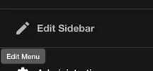
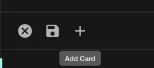
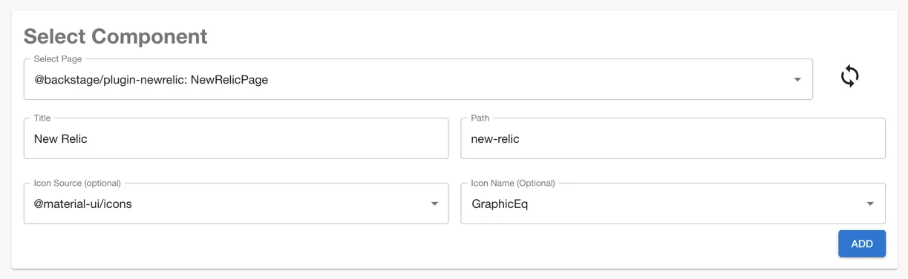
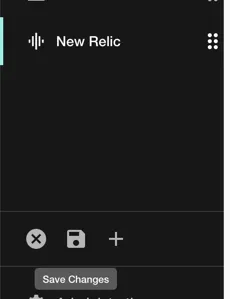

## At a Glance
| | |
|---: | --- |
| **Prerequisites** |  |
| **Considerations** |  |
| **Supported Environments** | ☐ Private Network via Broker   ☐ Internet Accessible via IP Whitelist   ☒ Cloud Hosted |

## Introduction

In order to make requests to the NewRelic API, you must provide Roadie with an API key. Roadie provides two different New Relic plugins within the installation, providing both page and individual entity page functionality. 

## Steps

### Configure New Relic secret and dashboard plugin

1. Go to https://one.newrelic.com/launcher/api-keys-ui.api-keys-launcher and follow the steps to create a user-api-key for NewRelic.

2. Give the token a name and click "Create a key".

3. Click the icon alongside the key you have created and click "Copy key"

4. Login to Roadie and Navigate to Administration -> New Relic Dashboard (https://\<tenant name\>.roadie.so/administration/newRelic-dashboard) page.

5. Click the pencil icon alongside the `NEW_RELIC_REST_API_KEY` and paste the API key you copied earlier.

6. Select the data region of your New Relic account. Click 'Save' and 'Apply'

7. It can take up to 2 minutes for the API key and configuration to be applied.

### Add New Relic plugin components to the application

1. Sidebar component
  *  Hover over the sidebar on the left and click the "Edit Sidebar" icon

  
   
  * Click "Add Card"

  

  * Select the option "@backstage/plugin-newrelic: NewRelicPage", pick a name for the menu item the path, and an Icon. Click Add.

  

  * You should see a new item in the sidebar for NewRelic, click the sidebar save button.

  

2. Card and Content Components
  * Navigate to Entity page in the catalog to add a Content or Card type components into your Roadie instance
  * You can find instructions how to add these components from the [Updating The UI guide](/docs/details/updating-the-ui/)
  * The available components are called `EntityNewRelicDashboardContent` for the tab component and `EntityNewRelicDashboardCard` for the Card component
  * Add an annotation to your entity in the format `newrelic.com/dashboard-guid: <dashboard_guid>`. You can find the `dashboard_guid` value from New Relic by looking at the metadata of your Dashboard.
