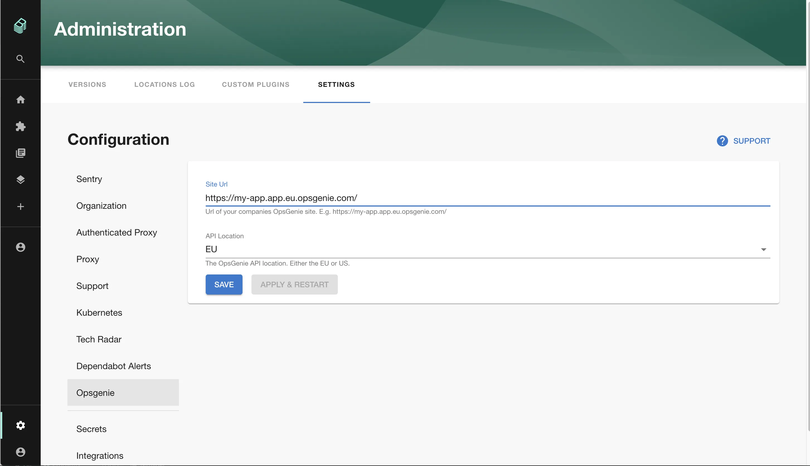

## Introduction

This page describes how to set up the Opsgenie plugin.

## At a Glance

|                            |                                                                                                  |
| -------------------------: | ------------------------------------------------------------------------------------------------ |
|          **Prerequisites** |                                                                                                  |
|         **Considerations** |                                                                                                  |
| **Supported Environments** | ☐ Private Network via Broker <br /> ☐ Internet Accessible via IP Whitelist <br /> ☒ Cloud Hosted |

## Steps

### Step 1: Create an API token

In order for the Backstage integration to work we must first generate our api key.

In order to create a key [create an Integration](https://support.atlassian.com/opsgenie/docs/create-a-default-api-integration/) of type API and copy the key displayed.

### Step 2: Store the credentials in Roadie

Visit `https://<tenant-name>.roadie.so/administration/opsgenie` and enter the key into the `OPSGENIE_API_KEY` secret.

### Step 3: Configure Roadie with your Opsgenie account details

In the Opsgenie settings page enter the following:

- The domain of your Opsgenie app (e.g. `https://my-app.app.eu.opsgenie.com/`)
- The API endpoint you use (e.g. US / EU )



### Step 4: Add the Opsgenie UI elements

The Opsgenie plugin provides two type of UI elements.

The card `EntityOpsgenieAlertsCard` displays alerts for particular components and can be [added to component dashboards](/docs/details/updating-the-ui/#updating-dashboards).

The overview page `OpsgeniePage` can be also be [added to the sidebar](/docs/getting-started/updating-the-ui#updating-the-sidebar).
You can override the default page size of 6 for the On-Call list by adding props to the sidebar component when adding it of:

```json
{
  "onCallListCardsCount": 48
}
```

## References

- [Opsgenie backstage plugin](https://github.com/K-Phoen/backstage-plugin-opsgenie)
