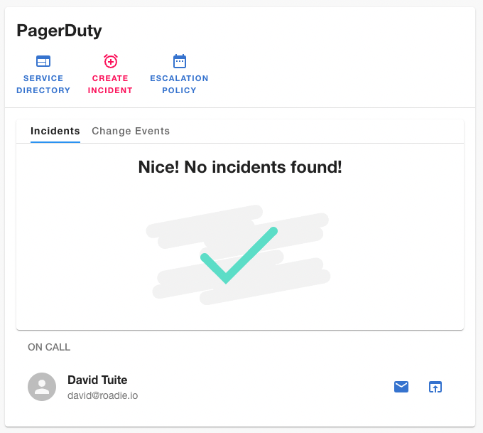
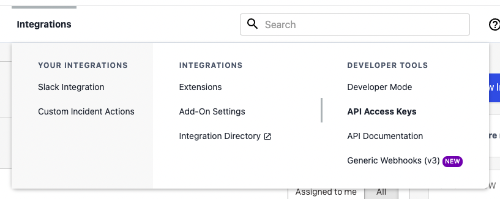
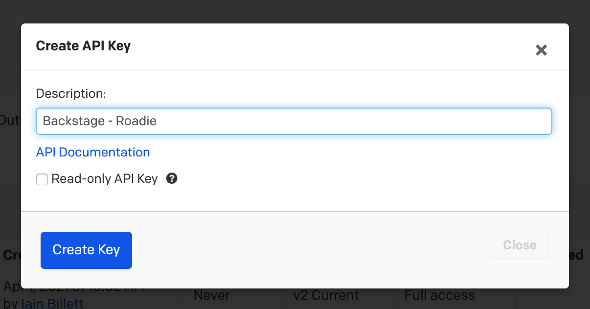
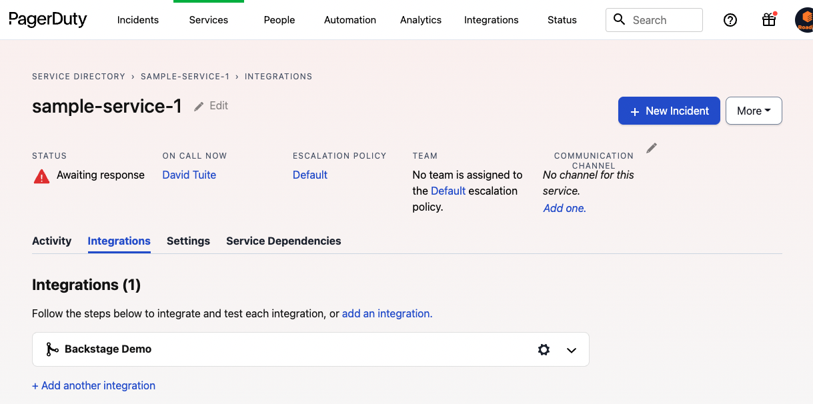
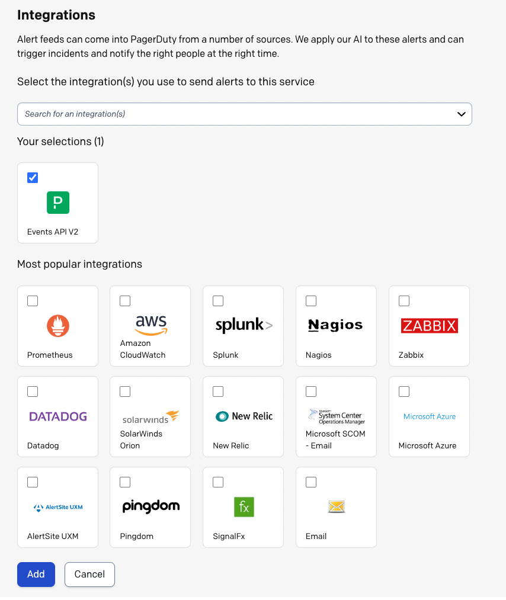
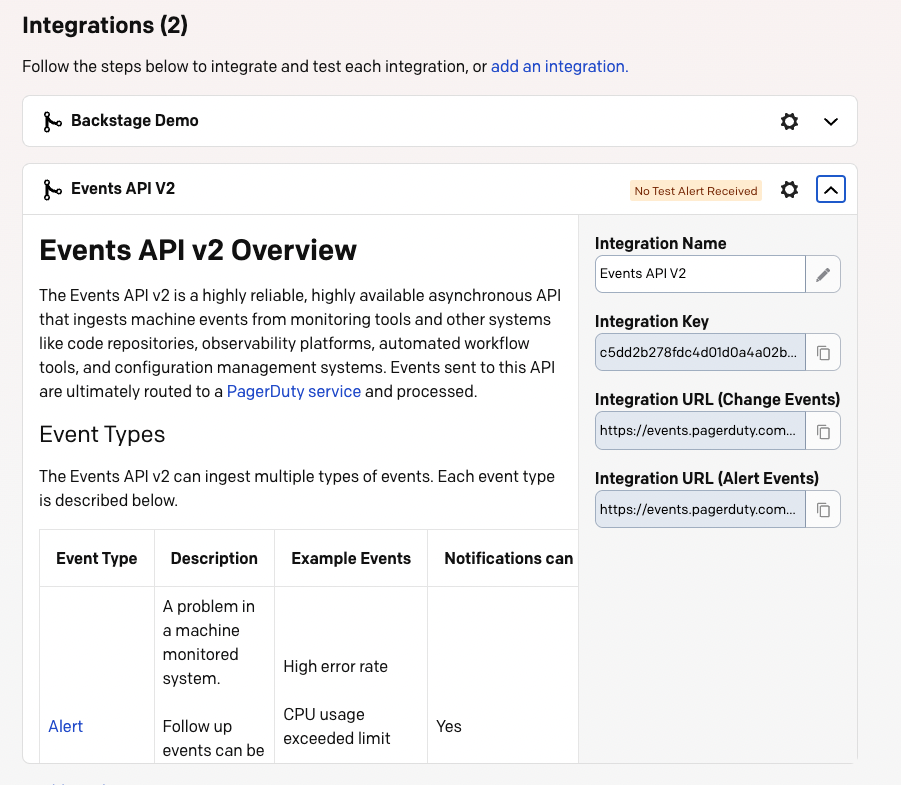

## Introduction

The PagerDuty Backstage plugin allows Roadie Backstage users to:

 1. See who is on call for a particular catalog Component.
 2. See if there are active incidents for a given catalog Component.
 3. Create new incidents from Backstage.



## Prerequisites

In order to use the PagerDuty plugin, Roadie needs an API token to communicate with it's APIs. 

### Setting up the plugin:

#### 1. Create an API token

Inside PagerDuty, access "API Access Keys" inside the "Integrations" menu.



On the API Access Keys page, click the "Create New API Key" button.


Set a sensible description and click "Create Key".



ℹ️  The PagerDuty Backstage plugin allows users to create PagerDuty incidents from within Backstage. For this reason, the API key needs both read and write permissions to function correctly.

Copy the key that is created to your clipboard.

#### 2. Store the credentials in Roadie

Visit the following URL and enter the API Key value from above into `PAGERDUTY_TOKEN`.

```text
https://<tenant-name>.roadie.so/administration/settings/secrets
```

ℹ️  Roadie accepts the token from PagerDuty unmodified. The configuration steps for the PagerDuty plugin in self-hosted Backstage are more complex, and will not work in Roadie.

#### 3. Add the PagerDuty annotation

Backstage requires a PagerDuty annotation on every component which will display the PagerDuty plugin. The plugin supports two different annotation keys:
1. `pagerduty.com/integration-key`
2. `pagerduty.com/service-id`

For Tech Insights usages, Roadie uses the `service-id` annotation to identify the linking between an entity and a PagerDuty service.

This example shows how it might look on a Backstage component:

```yaml
apiVersion: backstage.io/v1alpha1
kind: Component
metadata:
  name: sample-service
  title: Sample Service
  description: A sample service
  annotations:
    pagerduty.com/integration-key: <sample-service-integration-key>
    pagerduty.com/service-id: <sample-service-service-id>
spec:
  type: service
  owner: sample-team
  lifecycle: experimental
```

To generate the PagerDuty integration key, find a "Service" in the PagerDuty Service Directory and view the Integrations tab.



Click the Add an integration link. Choose Events API V2, and click the Add button.



You should now be redirected back to the Integrations tab, and a new integration should have been created. You can edit the integration name to indicate that this is a Roadie Backstage integration.



Copy the Integration Key and add it to the Component YAML.

```yaml
apiVersion: backstage.io/v1alpha1
kind: Component
metadata:
  name: sample-service
  title: Sample Service
  description: A sample service
  annotations:
    pagerduty.com/integration-key: <sample-service-integration-key>
    pagerduty.com/service-id: <sample-service-service-id>
spec:
  type: service
  owner: sample-team
  lifecycle: experimental
```

Commit and merge this change and the Roadie Backstage PagerDuty plugin should begin working shortly afterwards.

#### 4. Add the PagerDuty card

Navigate to the component you have added the annotation for and [add the PagerDuty card to the overview page](/docs/getting-started/configuring-backstage-plugins/#step-1-add-the-ui-component). 


## References

- [PagerDuty docs for creating API tokens](https://support.pagerduty.com/docs/generating-api-keys)
