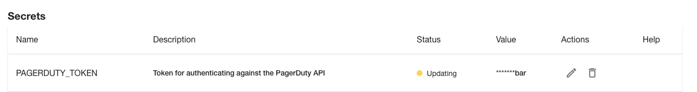

## Introduction

The PagerDuty Backstage plugin allows Roadie Backstage users to:

1.  See who is on call for a particular catalog Component.
2.  See if there are active incidents for a given catalog Component.
3.  Create new incidents from Backstage.


## At a Glance

| | |
|---: | --- |
| Prerequisites | **Configuration Data:** <ul><li>API Token or OAuth Client Id and Secret</li><li>PagerDuty subdomain and region</li></ul> **Component Annotations:** <ul><li>Integration Key</li><li>Service Id</li></ul> |
| Considerations |  |
| **Supported Environments** | ☒ Private Network via Broker <br /> ☒ Internet Accessible via IP Whitelist <br /> ☒ Cloud Hosted |

### Setting up the plugin:

#### 1. Create an API token or an OAuth application.

Please follow the offical [PagerDuty documentation](https://pagerduty.github.io/backstage-plugin-docs/getting-started/pagerduty/#:~:text=Events%20API.-,Setup%20API%20Authorization,-To%20use%20PagerDuty) to acquire the credentials that you would like to use:

ℹ️ The PagerDuty Backstage plugin allows users to create PagerDuty incidents from within Roadie. For this reason, the API key needs both read and write permissions to function correctly.

Copy the key that is created to your clipboard.

#### 2. Store the credentials in Roadie

##### API Token

- Go to your tenant's `administration/pagerduty` page
- Select `API Token` as your Auth type
- Save
- Apply & Restart


After the restart provide the `PAGERDUTY_TOKEN` secret just under the save buttons. Once these are set you can go to the next step.



ℹ️ Roadie accepts the token from PagerDuty unmodified.

##### OAuth application

Your subdomain and region can be found in your pagerduty url. e.g: `foo.eu.pagerduty.com`

- Go to your tenant's `administration/pagerduty` page.
- Select `OAuth` as your Auth type
- Fill in your application's subdomain
- Fill in your application's region
- Save
- Apply & Restart


After the restart provide the `PD_CLIENT_ID` and `PD_CLIENT_SECRET` secrets just under the save buttons. Once these are set you can go to the next step.


#### 3. Add the PagerDuty annotation

Backstage requires a PagerDuty annotation on every component which will display the PagerDuty plugin. The plugin supports two different annotation keys:

1. `pagerduty.com/integration-key`
2. `pagerduty.com/service-id`

For Tech Insights usages, Roadie uses the `service-id` annotation to identify the linking between an entity and a PagerDuty service.

This example shows how it might look on a Backstage component:

```yaml
apiVersion: backstage.io/v1alpha1
kind: Component
metadata:
  name: sample-service
  title: Sample Service
  description: A sample service
  annotations:
    pagerduty.com/integration-key: <sample-service-integration-key>
    pagerduty.com/service-id: <sample-service-service-id>
spec:
  type: service
  owner: sample-team
  lifecycle: experimental
```

To generate the PagerDuty integration key, find a "Service" in the PagerDuty Service Directory and view the Integrations tab.


Click the Add an integration link. Choose Events API V2, and click the Add button.


You should now be redirected back to the Integrations tab, and a new integration should have been created. You can edit the integration name to indicate that this is a Roadie Backstage integration.


Copy the Integration Key and add it to the Component YAML.

```yaml
apiVersion: backstage.io/v1alpha1
kind: Component
metadata:
  name: sample-service
  title: Sample Service
  description: A sample service
  annotations:
    pagerduty.com/integration-key: <sample-service-integration-key>
    pagerduty.com/service-id: <sample-service-service-id>
spec:
  type: service
  owner: sample-team
  lifecycle: experimental
```

Commit and merge this change and the Roadie Backstage PagerDuty plugin should begin working shortly afterwards.

#### 4. Add the PagerDuty card

Navigate to the component you have added the annotation for and [add the PagerDuty card to the overview page](/docs/getting-started/configuring-backstage-plugins/#step-1-add-the-ui-component).

#### 5. Card information

The PagerDuty Backstage plugin allows Roadie Backstage users to:

1. See who is on call for a particular catalog Component.
2. See if there are active incidents for a given catalog Component.
3. Create new incidents from Backstage.


#### 6. (Optional) Use the PagerDuty home page card

The PagerDuty plugin also exposes a card that can be configured to be used on you Roadie home page. This plugin card can be configured either with an integration key or a service id and it will display data for the chosen target. You can add the card in through the `cog` button on the home page and configure either the service id or integration key using the `wrench` button on the card itself.

## References

- [PagerDuty docs for creating API tokens](https://support.pagerduty.com/docs/generating-api-keys)
