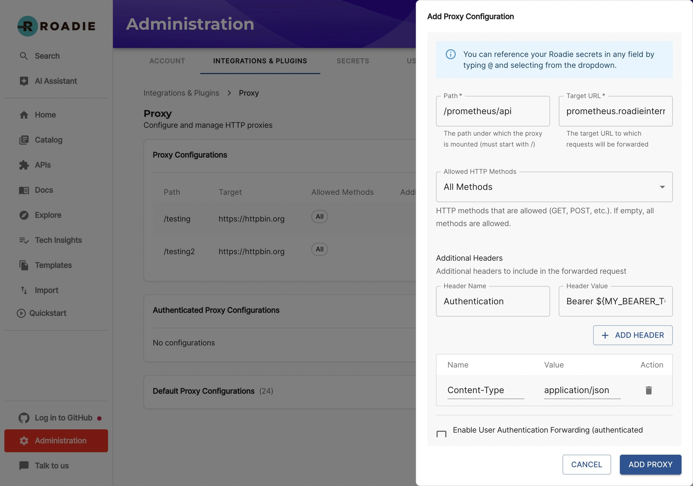

## Introduction

In order to use the Prometheus plugin, Roadie needs access to the Prometheus HTTP API. At the moment your Prometheus instance needs to be accessible from the internet so Roadie is able to make requests towards it.

This page describes how to set up a proxy for your Roadie instance to contact Prometheus.

## Proxy configuration

### Step 1: Create new proxy entry to point to your Prometheus instance

You must be an admin to be able to set up proxies.

To configure the URL of your Prometheus instance you need to create a proxy or authenticated proxy entry in your Roadie instance settings. You can find the configuration for proxies in this URL:
```text
https://<tenant-name>.roadie.so/administration/settings/proxy
```

Prometheus plugin is using the URL `/prometheus/api` so you need to put that as the path for the proxy. The target will be the URL of your Prometheus instance and the path to the API of it. Additionally, you can add headers to the request, depending how the authentication is implemented for your Prometheus instance.





Alternatively if you want to forward the headers used to authenticate with Roadie automatically to the Prometheus instance, you can do the same configuration as above in the _Authenticated Proxy_ configuration tab. This tab can be found from this URL:
```text
https://<tenant-name>.roadie.so/administration/settings/authenticatedProxy
```

### Step 2: Configure your entities with Prometheus annotations


The Prometheus plugin uses entity annotations to determine what data to display. There are two different annotations that can be used:
1. Rule annotation to visualize [Prometheus recording rules](https://prometheus.io/docs/prometheus/latest/configuration/recording_rules/) and queries
2. Alert annotation to display [Prometheus alerting rules](https://prometheus.io/docs/prometheus/latest/configuration/alerting_rules/) in a table format.

#### Graphs

##### `prometheus.io/rule`

The 'rule' annotation expects a comma separated list of queries or recording rules and grouping dimension tuples. Dimension is optional and can be omitted which leads to the first label found from the returned data set to be used as the key to group items with.

The annotation supports individual metrics, promQL queries or references to a name of a recording rule. For complex queries a recording rule is the preferred option, since annotation parsing prevents the usage of characters `,` and `|` in queries.

Example annotation:
```prometheus.io/rule: memUsage|component,node_memory_active_bytes|instance,sum by (instance) (node_cpu_seconds_total)```

Produces the following graphs:
1. `memUsage|component`
   (grouping by component, otherwise `__name__` would be the first item on this saved rule. Showed here as an area graph)
   

2. `node_memory_active_bytes|instance`
   (grouping by `instance`, image shows extra data on hover over a line.)
   

3. `sum by (instance) (node_cpu_seconds_total)`
   (`instance` is the grouper label defined in the query --> it is returned on the result set as the first label name, and is therefore used to group data with.)
   

#### Alerts

##### `prometheus.io/alert`

The 'alert' annotation expects a comma separated list of predefined alert names from the Prometheus server. These are iterated and displayed in a table, displaying state, value, labels, evaluation time and annotations. To display all alerts configured in Prometheus a magic annotation `prometheus.io/alert: all` can be used.

Example annotation:
```prometheus.io/alert: 'Excessive Memory Usage'```

Produces the following table.


### Step 3: Configure UI components for your Roadie instance

You must be an admin to edit the UI layout. You can follow [this guide](/docs/getting-started/updating-the-ui/) to add new Cards and Tabs into your Roadie instance. There are 3 different components available for you to configure. 

#### EntityPrometheusContent (Tab)

The `EntityPrometheusContent` is a tab that can be placed on the entity pages. It requires the `prometheus.io/rule` annotation to be set on the entity.

The tab has three optional parameters: `range`, `step` and `graphType`. e.g.

The follow options will give a line graph showing the last hour of data.

```json
{
   "step": 28,
   "range": {
      "hours": 1
   },
   "graphType": "line"
}
```

| Option               | Description            | Schema                                     | Default           | Example           |
|----------------------|------------------------|--------------------------------------------|-------------------|-------------------|
| step (optional)      | The graph step         | `number`                                   | `14`              | `28`              |
| range (optional)     | The range of the graph | ```{ hours?: number, minutes?: number }``` | `{ "hours": 1 }`  | `{ "hours": 2 }`  |
| graphType (optional) | Type of graph to use   | `'line' \| 'area'`                         | `line`            | `line`            |

#### EntityPrometheusAlertCard (Card)

The `EntityPrometheusAlertCard` is a card that can be placed on the entity pages and shows a list of alerts from prometheus. This card requires that the `prometheus.io/alert` annotation is set on the entity.

#### EntityPrometheusGraphCard (Card)

The `EntityPrometheusGraphCard` is a card that can be placed on the entity pages. The card can be configured to use an annotation on the entity `prometheus.io/rule` or a query configured on the card properties to show a graph from prometheus.

The tab has five optional parameters: `range`, `step`, `graphType`, `query`, and `enableQueryTemplating`. e.g.

The follow options will give a line graph showing the last hour of data.

```json
{
   "step": 28,
   "range": {
      "hours": 1
   },
   "graphType": "line"
}
```

| Option                           | Description                                 | Schema                                     | Default          | Example                           |
|----------------------------------|---------------------------------------------|--------------------------------------------|------------------|-----------------------------------|
| step (optional)                  | The graph step                              | `number`                                   | `14`             | `28`                              |
| range (optional)                 | The range of the graph                      | ```{ hours?: number, minutes?: number }``` | `{ "hours": 1 }` | `{ "hours": 2 }`                  |
| graphType (optional)             | Type of graph to use                        | `'line' \| 'area'`                         | `line`           | `line`                            |
| query (optional)                 | The query to use                            | `string`                                   | `undefined`      | `max by (host) (my_metric_name)`  |
| enableQueryTemplating (optional) | To enable query templating from entity data | `boolean`                                  | `false`          | `true`                            |

Query templating allows a query to be written that includes data from an entity. e.g. you can use the following options:

```json
{
   "enableQueryTemplating": true,
   "query": "max by (host) (my_metric{kuberenetes_namespace=\"{{ metadata.name }}\"})"
}
```


## References

- [Backstage Prometheus Plugin](https://roadie.io/backstage/plugins/prometheus/)
- [Prometheus](https://prometheus.io/docs/introduction/overview/)
- [Prometheus Recording Rules](https://prometheus.io/docs/prometheus/latest/configuration/recording_rules/)

