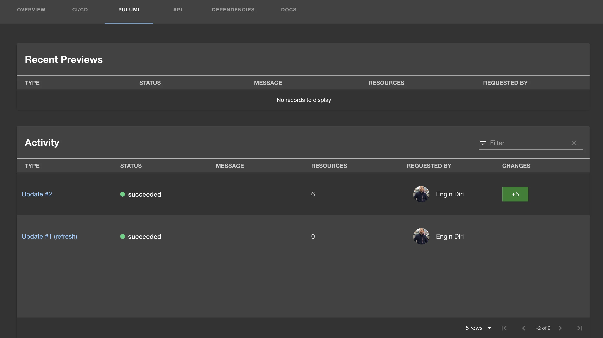
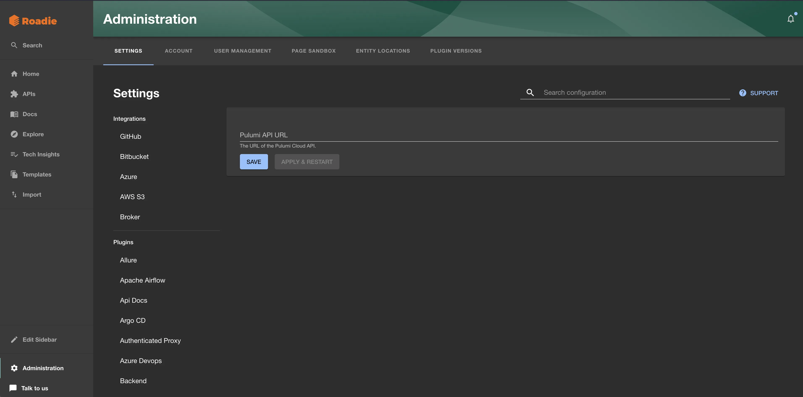
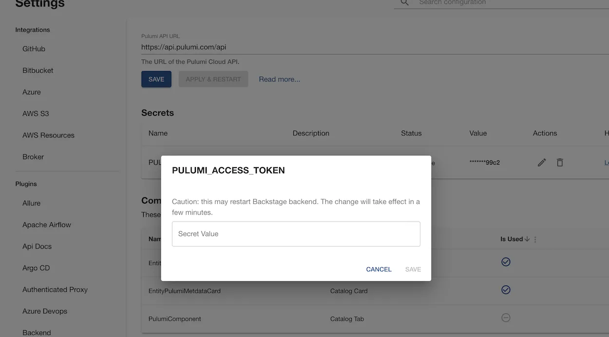
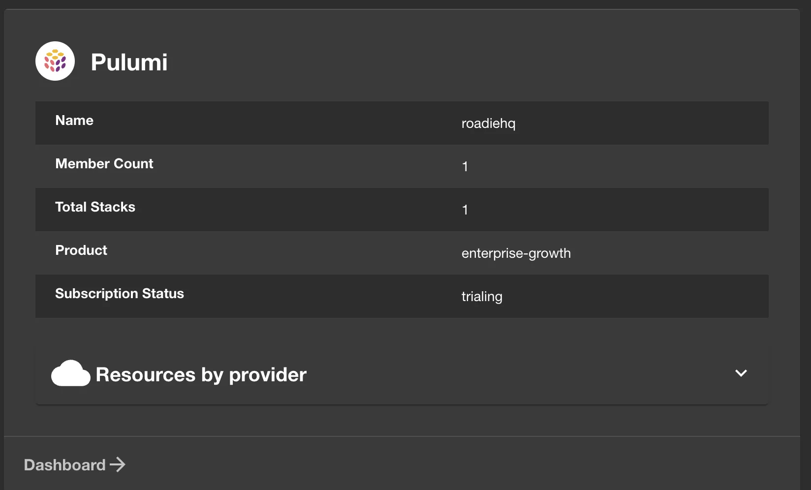
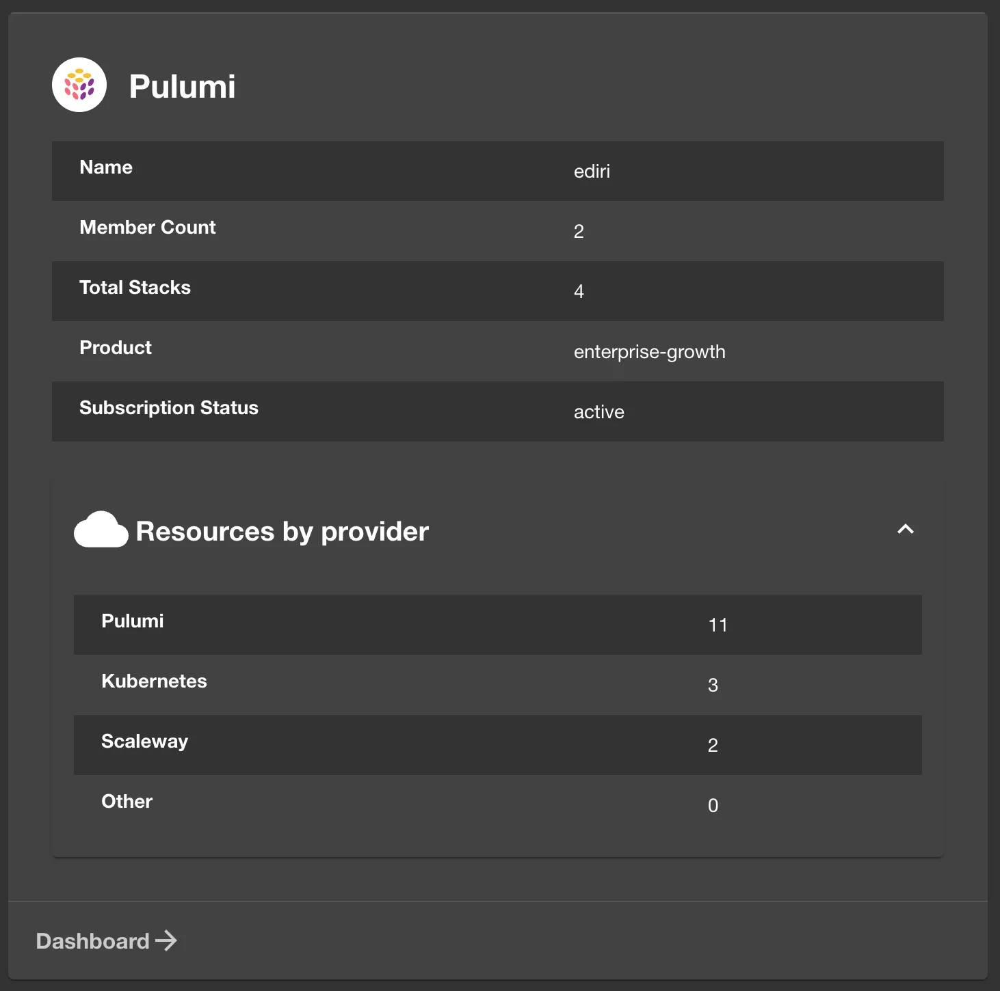

## Introduction

The [Backstage Pulumi plugin](https://github.com/pulumi/pulumi-backstage-plugin) integrates with Pulumi to display relevant entity information within Backstage.



## Prerequisites

You'll need a Pulumi access token generated by one of your Pulumi Organization admins and the URL of your Pulumi Cloud API (if different).

## Adding the plugin

### Configure the Pulumi Cloud API URL

Configure the pulumi API URL to use via `Administration -> Settings -> Pulumi`. If you're not using a custom API URL, it should be the same e.g. `https://api.pulumi.com/api`, which is already configured by default. If you're self-hosting
Pulumi Cloud yourself you'll need to specify a API URL to that instance.



### Add the Pulumi secret

First, add the `PULUMI_ACCESS_TOKEN` secret via `Administration -> Settings -> Plugins -> Pulumi`. Note you'll
need to wait for the secret to be marked as "Available" before you can use the Pulumi plugin.



### Add the plugin to the UI

The Pulumi plugin provides two components which can be added to the Roadie UI. You must be a Roadie admin to
add components to the UI.

The `EntityPulumiCard` and `EntityPulumiMetdataCard` components can be [added to catalog dashboards](/docs/details/updating-the-ui/#updating-dashboards). These
list Pulumi entity information and metadata.




You can also add the 'Pulumi Activity View' tab to the entity page by adding the `PulumiComponent` as a new tab.

### Set the Pulumi annotation on entities

The Pulumi plugin uses annotations to link each component/resource/system with it's Pulumi project/organization in order to get information for each entity.

Make a PR to the following to your catalog-info.yaml file, or add this annotation to your entity by decorating it in Roadie:

First, annotate your component/resource entity with the following:

```yaml
annotations:
  pulumi.com/project-slug: [Pulumi Cloud Name: org/stackname/stack]
```

And your system entity with the following:

```yaml
annotations:
  pulumi.com/orga-slug: [Pulumi Cloud: org]
```

## References

- [Backstage Pulumi Plugin](https://roadie.io/backstage/plugins/pulumi/)
- [Backstage Pulumi Plugin Github](https://github.com/pulumi/pulumi-backstage-plugin)
- [Pulumi](https://www.pulumi.com/)
