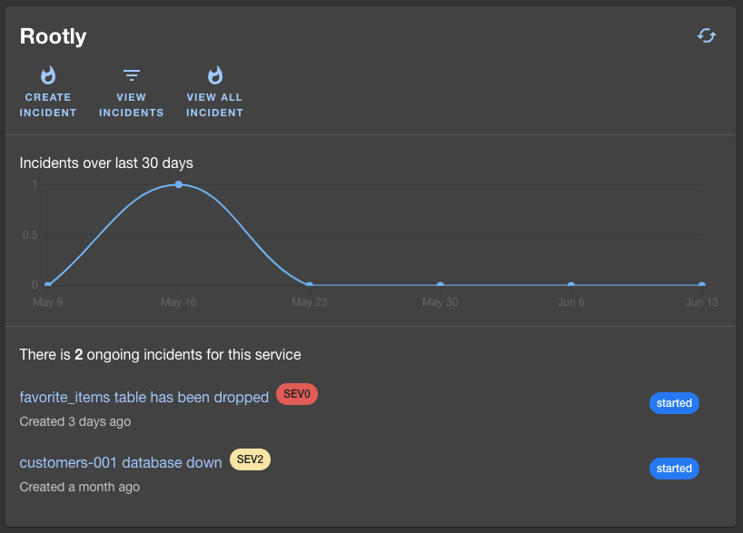

## Introduction

The Rootly backstage plugin is a frontend plugin that displays Rootly services, incidents in Backstage. The plugin includes three components that can be integrated into Backstage:

- The `RootlyPage` routable extension component which produces a standalone page with the following capabilities:
  - View and search a list of entities and import/link them to rootly services
  - View and search a list of services
  - View and search a list of incidents

- The `RootlyOverviewCard` component which produces a summary of your entity with incidents over last 30 days and ongoing incidents.

- The `RootlyIncidentsPage` component which produces a dedicated page within your entity with details about ongoing and past incidents.

## Installation

### Creating an Rootly API key

Because of the features provided by the plugin, an API key with full access to your Rootly domain is required.
- Read access on services is needed to list services, write access to link entities to services.
- Read access on incidents needed to list incidents.

1. Go to `Profile` -> `Manage API Keys`.

2. Click on `Generate New API Key` button.

3. Copy the key.

   

### Backstage Setup

Add the plugin to your frontend app:

```bash
cd packages/app && yarn add @rootly/backstage-plugin
```

Configure the plugin in `app-config.yaml`. The proxy endpoint described below will allow the frontend
to authenticate with Rootly without exposing your API key to users.

```yaml
# app-config.yaml
proxy:
  '/rootly/api':
    target: https://api.rootly.com
    headers:
      Authorization: Bearer ${ROOTLY_API_KEY}
```

### Global

#### `RootlyPage` component


Expose the Rootly global page:

```ts
// packages/app/src/App.tsx
import { RootlyPage } from '@rootly/backstage-plugin';

// ...
const AppRoutes = () => (
  <FlatRoutes>
    // ...
    <Route path="/Rootly" element={<RootlyPage />} />
    // ...
  </FlatRoutes>
);
```

Add a link to the sidebar:

```ts
// packages/app/src/components/Root/Root.tsx
import ExtensionIcon from '@material-ui/icons/ExtensionIcon';

export const Root = ({ children }: PropsWithChildren<{}>) => (
  <SidebarPage>
    <Sidebar>
      // ...
      <SidebarItem icon={ExtensionIcon} to="rootly" text="Rootly" />
      // ...
    </Sidebar>
  </SidebarPage>
);
```

### Entity

#### `RootlyOverviewCard` component



```ts
// packages/app/src/components/catalog/EntityPage.tsx
import { RootlyOverviewCard, isRootlyAvailable } from '@rootly/backstage-plugin';

// ...
const overviewContent = (
  <Grid container spacing={3} alignItems="stretch">
    // ...
    <EntitySwitch>
      <EntitySwitch.Case if={isRootlyAvailable}>
        <Grid item sm={6}>
          <RootlyOverviewCard />
        </Grid>
      </EntitySwitch.Case>
    </EntitySwitch>
    // ...
  </Grid>
);
```

#### `RootlyIncidentsPage` component


```ts
// packages/app/src/components/catalog/EntityPage.tsx
import { RootlyIncidentsPage } from '@rootly/backstage-plugin';

// ...
const websiteEntityPage = (
  <EntityLayout>
    <EntityLayout.Route path="/" title="Overview">
      {overviewContent}
    </EntityLayout.Route>

    // ...

    <EntityLayout.Route path="/docs" title="Docs">
      <EntityTechdocsContent />
    </EntityLayout.Route>

    <EntityLayout.Route path="/rootly" title="Rootly">
      <RootlyIncidentsPage />
    </EntityLayout.Route>
  </EntityLayout>
);

// ...
const serviceEntityPage = (
  <EntityLayout>
    <EntityLayout.Route path="/" title="Overview">
      {overviewContent}
    </EntityLayout.Route>

    // ...

    <EntityLayout.Route path="/docs" title="Docs">
      <EntityTechdocsContent />
    </EntityLayout.Route>

    <EntityLayout.Route path="/rootly" title="Rootly">
      <RootlyIncidentsPage />
    </EntityLayout.Route>
  </EntityLayout>
);
```