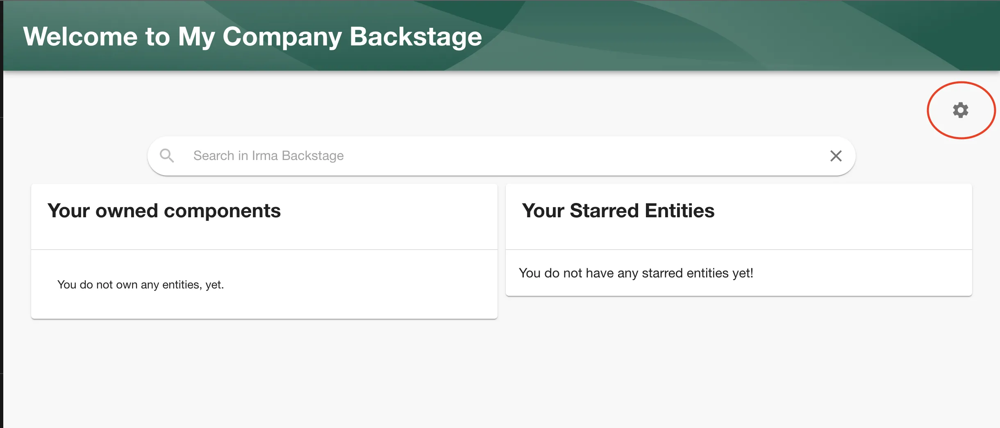
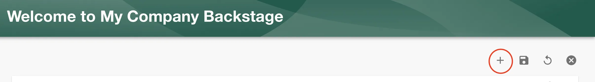
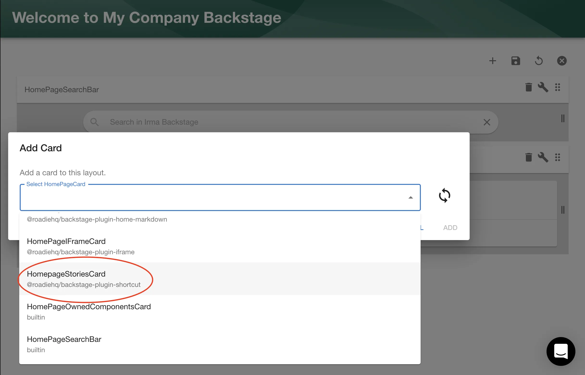
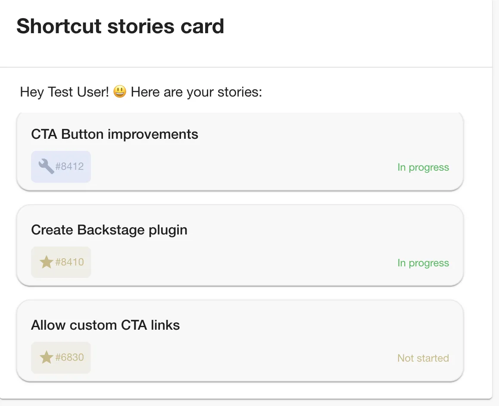

## Introduction

This plugin provides an overview of Shortcut user stories which are currently in progress. It can be added as a card for your Home page so you easily preview your ongoing stories.

## At a Glance
| | |
|---: | --- |
| **Prerequisites** |  |
| **Considerations** |  |
| **Supported Environments** | ☐ Private Network via Broker   ☐ Internet Accessible via IP Whitelist   ☒ Cloud Hosted |

## Authentication

The Shortcut API uses token-based authentication so in order to retrieve results you will need it. Follow the steps below in order to set it.

### Step 1: Generate an API token

To generate an API token, go to https://app.shortcut.com/settings/account/api-tokens.

Click on the "Generate token" button.

### Step 2: Store the token in Roadie

Visit `https://<tenant-name>.roadie.so/administration/shortcut` and enter the token value from above into `SHORTCUT_ACCESS_TOKEN`.

## Add Shortcut stories card to your HomePage

Now, when you added access token, you are ready to go. Follow the steps below in order to add the Shortcut plugin to your Homepage card.

### Setup

To use this plugin make sure you already have the [Backstage Home plugin](https://github.com/backstage/backstage/blob/master/plugins/home/README.md) enabled.

### Add Shortcut card to your homepage

1.  To enable this plugin go to your `Home` page via the sidebar.

    Once you are on the home page click on the cogwheel icon.

    

2.  Click the plus sign to add a new Card.
    

3.  Select `HomepageStoriesCard` from the list.
    

    Click add

    You should see card like this:
    
