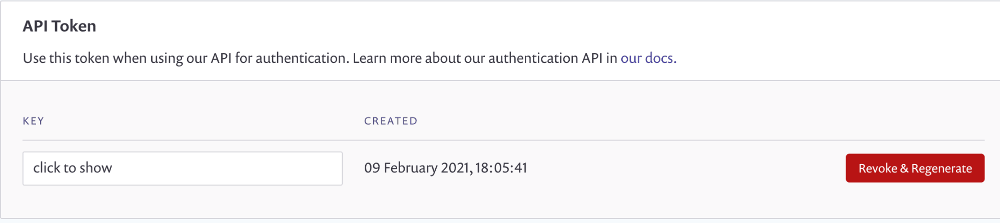
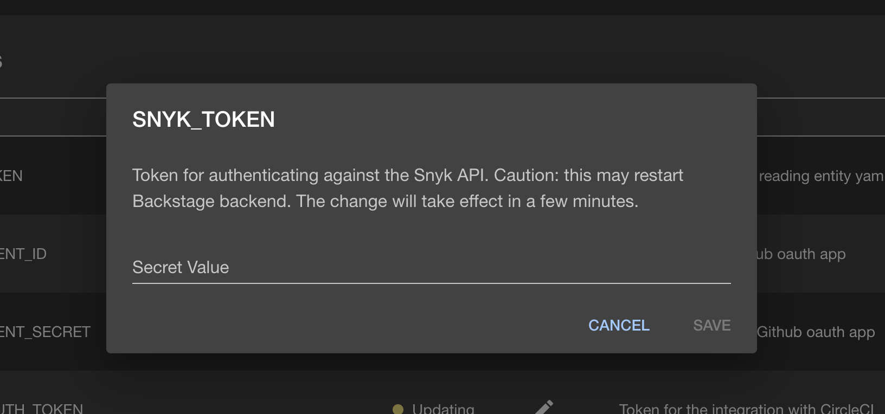

## Introduction

In order to use the Backstage Snyk plugin with Roadie, you must securely provide Roadie with an API token which it can use to access the Snyk API.

## Connect Roadie to Snyk

To get an API token, you need to sign up for a Snyk account. Within this account, you will need to obtain three things:

 * API token
 * Organization Id
 * (Optional) Target Id

#### API Token

This can be found by clicking your name in the top right-hand corner and going to General Settings.



#### Organization Id

This can be found under the settings page that is visible when you login to Snyk.


#### (Optional) Target Id

Snyk doesn't provide a UI currently to identify Target Ids easily. You find the target ids by inspecting the network requests on the Snyk Projects pages. This value is optional, because Snyk also supports using the `github.com/project-slug` to identify the correct Snyk project. 


### Step 1: Add the token to Roadie

Visit `https://your-company.roadie.so/administration/settings/secrets`.

Click the pencil icon beside `SNYK_TOKEN`. Enter it into the input in the dialog that pops up (See above for retrieving token).



Click Save.

Wait a few moments for the secret to be applied.

### Step 2: Add the relevant Snyk annotations to a component

To configure the Snyk plugin to target the correct entity, you need to configure few annotations to it.

The first one is `snyk.io/org-id` which identifies your Snyk organization. 

Additionally, the Snyk plugin uses `github.com/project-slug` annotation to automatically match projects from GitHub to their corresponding Snyk targets. For cases where it is not possible to use the GitHub, you can also use `snyk.io/target-id` annotation. To find the target id value, you can identify that using dev tools on Snyk page and investigating the returned payload on their project page.

Edit the `catalog-info.yaml` for the component you wish to associate with this Snyk project and add the `github.com/project-slug` and `snyk.io/target-id` annotation.

```yaml
apiVersion: backstage.io/v1alpha1
kind: Component
metadata:
  name: sample-service
  description: Sample service
  annotations:
    snyk.io/org-id: <You Snyk organization id>
    github.com/project-slug: <Your GitHub repository>
    snyk.io/target-id: <Your Target ID>
```

Commit and push this change and Roadie should pick it up within a few minutes.

## References

1. [Snyk integration docs](https://snyk.io/blog/backstage-integration-with-the-snyk-api/)
