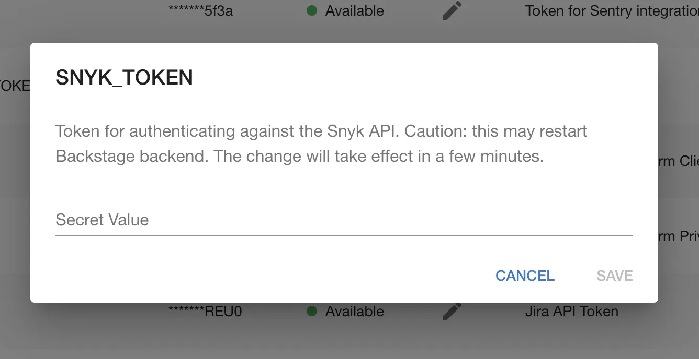

## Introduction

In order to use the Backstage Snyk plugin with Roadie, you must securely provide Roadie with an API token which it can use to access the Snyk API.

## At a Glance

|                            |                                                                                                  |
| -------------------------: | ------------------------------------------------------------------------------------------------ |
|          **Prerequisites** |                                                                                                  |
|         **Considerations** |                                                                                                  |
| **Supported Environments** | ☐ Private Network via Broker <br /> ☐ Internet Accessible via IP Whitelist <br /> ☒ Cloud Hosted |

## Connect Roadie to Snyk

To get an API token, you need to sign up for a Snyk account. Within this account, you will need to obtain the following:

- API token
- Organization Name

#### API Token

This can be found by clicking your name in the top right-hand corner and going to General Settings.


#### Organization Name

This can be found under the settings page that is visible when you login to Snyk.


### Step 1: Add the token to Roadie

Visit `https://<tenant-name>.roadie.so/administration/secrets`.

Click the pencil icon beside `SNYK_TOKEN`. Enter it into the input in the dialog that pops up (See above for retrieving token).



Click Save.

Wait a few moments for the secret to be applied.

### Step 2: Add the Organization name to Roadie

Components need `snyk.io/org-id` annotation set in order to work properly. Setting the correct organisation name will automatically retrieve organization id and use it as a value for this annotation.
This means you will not have to add a `snyk.io/org-id` annotation manually for each component but it will be internally retrieved by Roadie using your organisation name.

You can set this up in Settings page:

Visit `https://<tenant-name>.roadie.so/administration/settings/snyk`.


### Step 3: Add the relevant Snyk annotations to a component

To configure the Snyk plugin to target the correct entity, you need to configure few annotations to it.

The first one is `snyk.io/org-id` which identifies your Snyk organization. As described in the Step 2, if you add organisation name, you will not need to add this annotation manually to the files. However, you can also find this value under the settings page that is visible when you login to Snyk.


Additionally, the Snyk plugin uses `github.com/project-slug` annotation to automatically match projects from GitHub to their corresponding Snyk targets.

For cases where it is not possible to use the GitHub, you can also use `snyk.io/target-id` annotation. Unfortunately, Snyk doesn't provide a UI currently to identify Target Ids but you can find them by inspecting the network requests on the Snyk Projects pages.

Edit the `catalog-info.yaml` for the component you wish to associate with this Snyk project and add the `github.com/project-slug` and `snyk.io/target-id` annotation.

```yaml
apiVersion: backstage.io/v1alpha1
kind: Component
metadata:
  name: sample-service
  description: Sample service
  annotations:
    snyk.io/org-id: <You Snyk organization id>
    github.com/project-slug: <Your GitHub repository>
    snyk.io/target-id: <Your Target ID>
```

Commit and push this change and Roadie should pick it up within a few minutes.

## References

1. [Snyk integration docs](https://snyk.io/blog/backstage-integration-with-the-snyk-api/)
