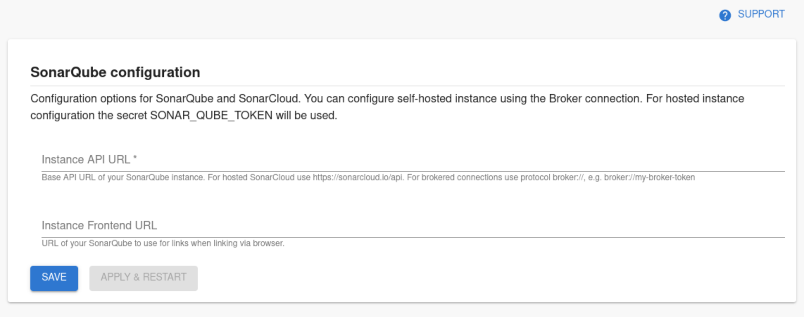

## Introduction

Roadie supports both SonarCloud hosted and self-hosted SonarQube instances. To access SonarQube secured in private networks you are able to use the [Broker connection](/docs/integrations/broker) for secure communication between Roadie and SonarQube instance.
In order to use the SonarQube plugin, Roadie needs an API token to communicate with SonarQube's APIs. 

If you are using hosted SonarCloud as your SonarQube provider you only need set a secret token value into `SONARCLOUD_API_TOKEN` secret. These are set within backstage at the following url: `https://<tenant-name>.roadie.so/administration/settings/secrets`. You can generate the token from URL https://sonarcloud.io/account/security. 


If you are using self-hosted SonarQube plugin or want more control over the SonarQube plugin you can use the SonarQube settings page to set up needed configurations.


## SonarQube entity configuration

### Step 1: Add the Sonar Card

Add the EntitySonarQubeCard component [to the catalog](/docs/getting-started/updating-the-ui).

### Step 2: Annotate your entities

Add the following annotation to entities to link a project to the entity:

```yaml
metadata:
  annotations:
    sonarqube.org/project-key: [YOUR_PROJECT_KEY]
```


## Connection Configuration Steps

### Step 1: Create an API token

In order for the Backstage integration to work we must first generate our api key. For SonarQube you can generate this from your profile page under security.

### Step 2: Store the credentials and SonarQube URL in Roadie
Visit `https://<tenant-name>.roadie.so/administration/settings/secrets` and enter the token value from above into `SONARQUBE_TOKEN`. Note that the secret name is different from default, no-config setup of hosted SonarCloud. If you are using a brokered connection to your self-hosted and secure SonarQube instance, you can input a placeholder value to the secret, since it will be overridden on the broker client.


### Step 3: Configure SonarQube URLs
Visit `https://<tenant-name>.roadie.so/administration/settings/sonarqube` and configured the base URL of you SonarQube instance and (optionally) the frontend URL so proper linking can be generated by the plugin. If you are using a brokered connection to your self-hosted and secure SonarQube instance you can use protocol `broker://` to point to the correct endpoint, e.g. `broker://my-broker-token`. The frontend URL should be pointing to the actual URL of the instance, e.g. `https://mysonarqube.internaldomain.com`.


### Step 4: (Optional, for brokered connections) Setup Broker client configuration
If you are contacting SonarQube via a brokered connection, you need to use the `accept.json` configuration file contents visible below:


<details>

<Summary>Show accept.json</Summary>

```JSON
{
  "private": [
    {
      "method": "GET",
      "path": "/api/components/show",
      "origin": "${SONARQUBE_INSTANCE_URL}",
      "auth": {
        "scheme": "basic",
        "token": "${SONARQUBE_TOKEN}:"
      }
    },
    {
      "method": "GET",
      "path": "/api/metrics/search",
      "origin": "${SONARQUBE_INSTANCE_URL}",
      "auth": {
        "scheme": "basic",
        "token": "${SONARQUBE_TOKEN}:"
      }
    },
    {
      "method": "GET",
      "path": "/api/measures/component",
      "origin": "${SONARQUBE_INSTANCE_URL}",
      "auth": {
        "scheme": "basic",
        "token": "${SONARQUBE_TOKEN}:"
      }
    }
  ],
  "public": [
    {
      "method": "any",
      "path": "/*"
    }
  ]
}
```
</details>  
  
The expected environment variables with this configuration are:
* Standard broker env vars.
* `SONARQUBE_INSTANCE_URL`: The URL as it is visible to your deployed Broker client service
* `SONARQUBE_TOKEN`: SonarQube token generated in Step 1 above.

For more information how to set up the Broker client and how to use configuration files, take a look at [Broker documentation](/docs/integrations/broker).


## References

- [SonarQube backstage plugin](https://www.npmjs.com/package/@backstage/plugin-sonarqube/)
- [Broker documentation](/docs/integrations/broker)
