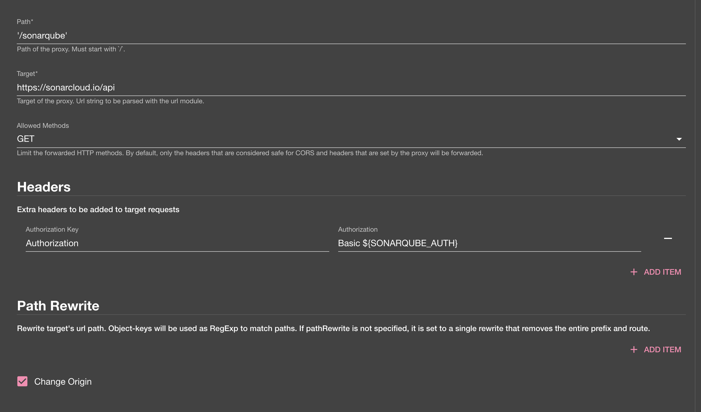

## Introduction

In order to use the SonarQube plugin, Roadie needs an API token to communicate with SonarQube's APIs.


These are set within backstage at the following url:

```text
https://<tenant-name>.roadie.so/administration/settings/secrets
```

This page describes how to create and set up the API token.

## Steps

### Step 1: Create an API token

In order for the backstage integration to work we must first generate our api key. These can be found from:
 * [Sonarcloud](https://sonarcloud.io/account/security) for your sonarcloud plugin
 * [SonarQube](https://docs.sonarqube.org/latest/user-guide/user-token/) for your sonarqube plugin

### Step 2: Base64 encode the credentials 
It is always important to base encode our tokens.

``` bash
$ export SONARQUBE_AUTH=$(base64 <<< "<YOUR_SONARQUBE_TOKEN>:") # Note it is important to keep the trailing ':'
$ echo $SONARQUBE_AUTH
````

### Step 3: Store the credentials and SonarQube URL in Roadie
Visit `https://<tenant-name>.roadie.so/administration/settings/secrets` and enter the base64 encoded and prefixed token value from above into `SONARQUBE_AUTH`.

### Step 4: Set SonarQube proxy in the settings

Visit `https://<tenant-name>.roadie.so/administration/settings/proxy` and create a new proxy.

For non cloud based configurations:
``` yaml
proxy:
  '/sonarqube':
    target: https://sonarcloud.io/api
    allowedMethods: ['GET']
    headers:
      Authorization: Basic ${SONARQUBE_AUTH}

```


For cloud based configurations:
``` yaml
proxy:
  '/sonarqube':
    target: https://your.sonarqube.instance.com/api
    allowedMethods: ['GET']
    headers:
      Authorization: Basic ${SONARQUBE_AUTH}

```


## References

- [SonarQube backstage plugin](https://www.npmjs.com/package/@backstage/plugin-sonarqube/)
