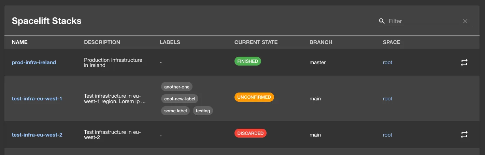
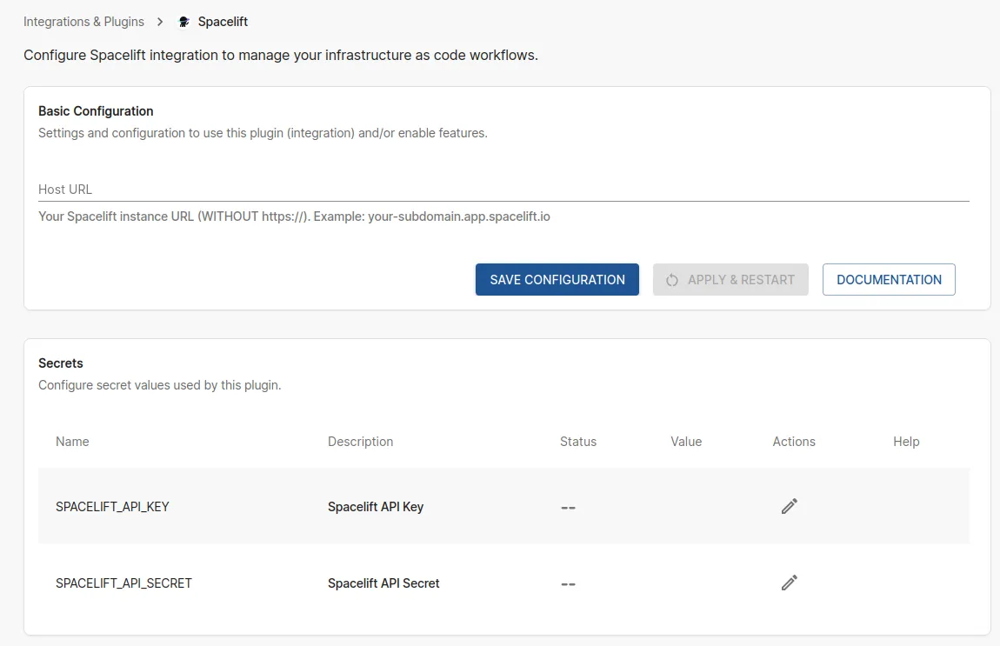

## Introduction

The Spacelift plugin allows you to view and interact with your Spacelift stacks and runs directly within Roadie. The plugin provides a dedicated Spacelift page within Roadie where you can monitor your infrastructure stacks, view recent runs, and access detailed information about your Spacelift resources.

## At a Glance

|                            |                                                                                                                            |
|---------------------------:|----------------------------------------------------------------------------------------------------------------------------|
|          **Prerequisites** | **Configuration Data:** <ul><li>Spacelift Host URL</li><li>Spacelift API Key ID</li><li>Spacelift API Key Secret</li></ul> |
|         **Considerations** | Uses API key permissions for access control.                                                                               |
| **Supported Environments** | ☐ Private Network via Broker   ☐ Internet Accessible via IP Whitelist   ☒ Cloud Hosted                           |

## Configuration Steps

### Step 1: Configure Spacelift Connection

Visit `https://<tenant-name>.roadie.so/administration/spacelift` to configure your Spacelift connection.

Configure the the Spacelift **Host URL**. The URL should point to your Spacelift instance URL without `https://` (e.g., `your-subdomain.app.spacelift.io`).

### Step 2: Obtain Spacelift API Credentials

To get your Spacelift API credentials:

1. Log in to your Spacelift account
2. Navigate to your profile settings
3. Go to the "API Keys" section
4. Create a new API key or use an existing one
5. Copy the API Key ID and API Key Secret
6. Store the copied values to Roadie secrets `SPACELIFT_API_KEY` and `SPACELIFT_API_SECRET`

**Important**: The API key should have appropriate permissions to read stack information and run details that you want to display in Backstage.

## References

- [Spacelift Backend Plugin on npm](https://www.npmjs.com/package/@spacelift-io/backstage-integration-backend)
- [Spacelift Frontend Plugin on npm](https://www.npmjs.com/package/@spacelift-io/backstage-integration-frontend)
- [Spacelift Plugin GitHub Repository](https://github.com/spacelift-io/backstage-plugins)
- [Official Spacelift Documentation](https://docs.spacelift.io/)
- [Spacelift Backstage Integration Guide](https://docs.spacelift.io/integrations/external-integrations/backstage)