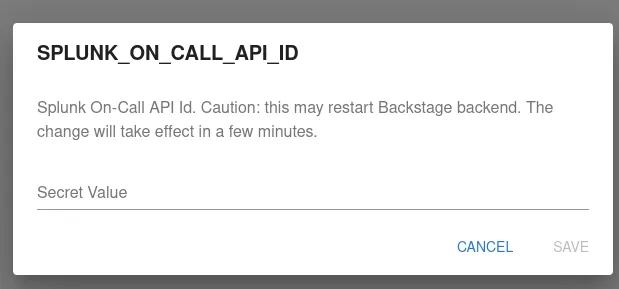
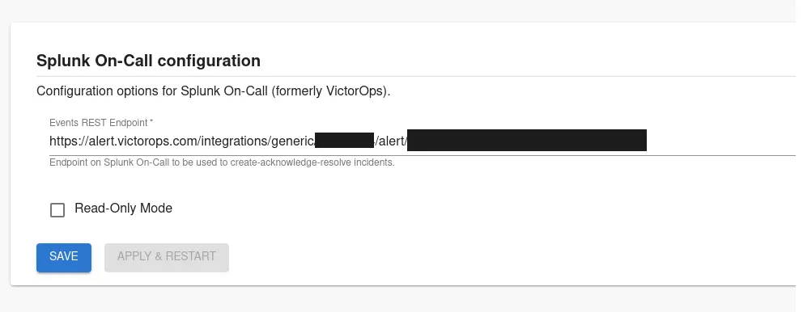

## Introduction

This page describes how to set up Splunk On-Call plugin.

## Steps

### Step 1: Create an API token

In order for the Backstage integration to work we must first generate our api key.

In order to create a key, create an integration in your Splunk On-Call account by navigating to URL `https://portal.victorops.com/dash/<your-organization>#/api-management`. In there you can copy the API id and the existing key, or create a new key for Roadie integration purposes. 

### Step 2: Store the credentials in Roadie

Visit `https://<tenant-name>.roadie.so/administration/splunk` and enter the copied values into  `SPLUNK_ON_CALL_API_ID` & `SPLUNK_ON_CALL_API_KEY` secrets.



### Step 3: Configure Roadie with your Splunk On-Call account details


In order to be able to perform certain actions (create-acknowledge-resolve an action), you need to provide a REST Endpoint for the plugin.

To enable the REST Endpoint integration you can go on https://portal.victorops.com/ inside Integrations > 3rd Party Integrations > REST – Generic. You can now copy the URL to notify: <SPLUNK_ON_CALL_REST_ENDPOINT>/$routing_key

Visit `https://<tenant-name>.roadie.so/administration/settings/splunk-on-cal` and enter the REST endpoint for the configuration.
In case you don't want to enable incident management via the Roadie application, you can check the "Read Only" checkbox to configure the plugin to only show incidents. 



### Step 4: Add the Splunk On-Call UI elements

The Splunk On-Call plugin provides two type of UI elements. 

The card `EntitySplunkOnCallCard` is a card component and can be [added to component dashboards](/docs/details/updating-the-ui/#updating-dashboards).
The tab `SplunkOnCallPage` is a content component which can be added as a separate tab to entity pages.

### Step 5: Add needed annotations to your entities

The information displayed for each entity is based on either an associated team name or an associated routing key.
To use this plugin for an entity, the entity must be labeled with either a `splunk.com/on-call-team` or a `splunk.com/on-call-routing-key` annotation.

For example, by specifying a splunk.com/on-call-team, the plugin displays Splunk On-Call data associated with the specified team:

```yaml
annotations:
    splunk.com/on-call-team: <SPLUNK_ON_CALL_TEAM_NAME>
```

Alternatively, by specifying a splunk.com/on-call-routing-key, the plugin displays Splunk On-Call data associated with each of the teams associated with the specified routing key:
```yaml
annotations:
  splunk.com/on-call-routing-key: <SPLUNK_ON_CALL_ROUTING_KEY>
```

## References

- [Splunk On-Call Backstage plugin](https://github.com/backstage/community-plugins/tree/main/workspaces/splunk/plugins/splunk-on-call)
- [Splunk On-Call portal](https://portal.victorops.com)

