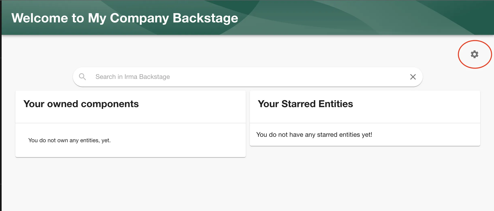
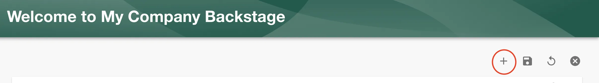
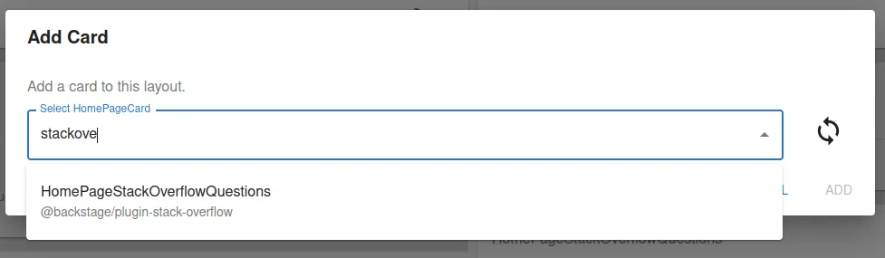
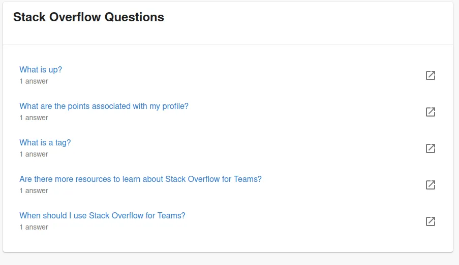

## Introduction

Roadie provides integration to display public and private Stackoverflow questions and answers on the homepage. To configure this plugin for a private Stackoverflow Teams subscription, you need to be able to generate an API key for Stackoverflow. To have the possibility to generate an API key, you will need to have at least 'Basic' level subscription to Stackoverflow Teams.

## At a Glance
| | |
|---: | --- |
| **Prerequisites** |  |
| **Considerations** |  |
| **Supported Environments** | ☐ Private Network via Broker <br /> ☐ Internet Accessible via IP Whitelist <br /> ☑ Cloud Hosted |

## Authentication

The Stackoverflow API uses a Personal Access Token to authenticate so in order to retrieve results you will need it. Follow the steps below in order to set it.

### Step 1: Generate a PAT API token

To generate an PAT token, follow the instruction outlined in [the official documentation for Stackoverflow teams](https://stackoverflow.help/en/articles/4385859-stack-overflow-for-teams-api).

Click on the "Generate token" button.

### Step 2: Store the token in Roadie

Visit `https://<tenant-name>.roadie.so/administration/stackoverflow` and enter the API key value from above into `STACKOVERFLOW_API_KEY`.

### Step 3: Enable private or public Stackoverflow configuration

Visit `https://<tenant-name>.roadie.so/administration/stackoverflow` and select the private checkbox for private Stackoverflow Teams, leave it unselected for public Stackoverflow instance. You also need to set up the base API URL for Stackoverflow. The URL in most cases, including private Teams integration, will be `https://api.stackexchange.com/2.3`

## Add Stackoverflow card to your HomePage

Now, when you added access token, you are ready to go. Follow the steps below in order to add the Stackoverflow plugin to your Homepage card.

### Setup

To use this plugin make sure you already have the [Backstage Home plugin](https://github.com/backstage/backstage/blob/master/plugins/home/README.md) enabled.

### Add Stackoverflow card to your homepage

#### 1.  To enable this plugin go to your `Home` page via the sidebar.

Once you are on the home page click on the cogwheel icon.



#### 2.  Click the plus sign to add a new Card.


#### 3.  Select `HomePageStackOverflowQuestions` from the list.


#### 4. Set up correct props for your Stackoverflow card.
    
The Stackoverflow Homepage card makes heavy use of custom props to set up correct queries and what to display.
For a private Stackoverflow instance you need to add the name of your Stackoverflow Team like so:
```json
{ "requestParams": { "team": "team-name" } }
```

You can also optionally append filters to the query like `"tagged": "backstage"` to display only questions that have a tag `backstage`. For public Stackoverflow instances the team name can be omitted.

After you have set up props for your homepage card you should see card like this:



## References

- [Backstage Stackoverflow Plugin](https://github.com/backstage/community-plugins/tree/main/workspaces/stack-overflow/plugins/stack-overflow)
- [Official API token generation instructions](https://stackoverflow.help/en/articles/4385859-stack-overflow-for-teams-api)
- [Stackoverflow API explorer docs](https://api.stackexchange.com/docs/)

