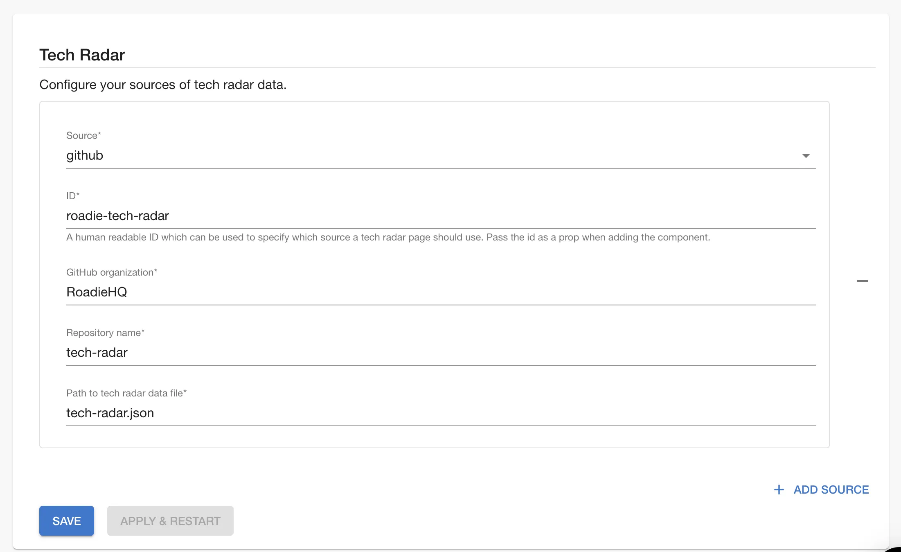
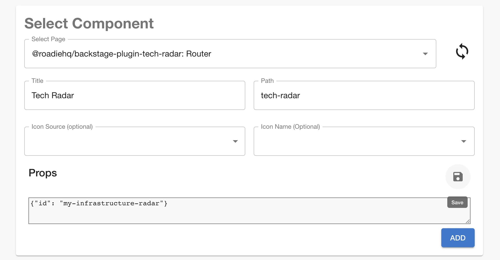
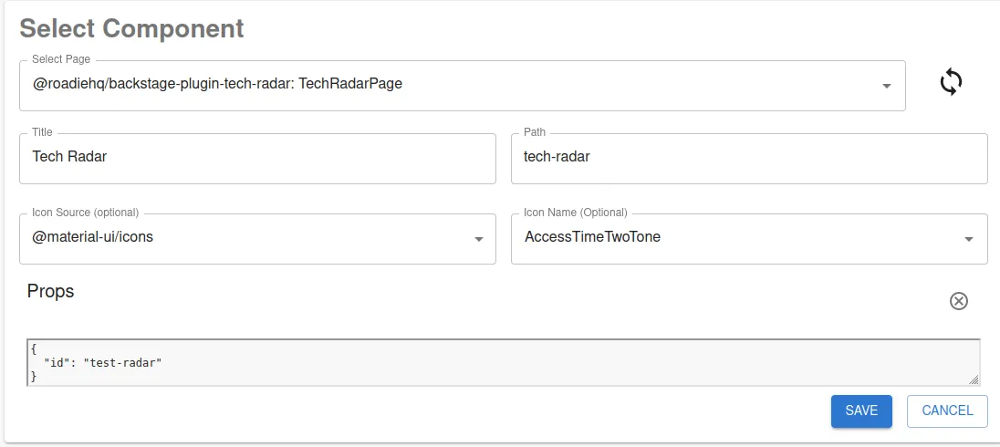

## Introduction

If you want to use Tech Radar on your Roadie instance you can add it as a page using the steps defined in [this guide](/docs/details/updating-the-ui/#updating-the-sidebar).

## At a Glance

|   |   |
|----:|---|
| **Prerequisites** | **Configuration Data:** <ul><li>GitHub - OAuth Token</li><li>Bitbucket - OAuth Token, Client Id, and Secret</li><li>Azure DevOps - Access Token</li></ul> |
| **Considerations** | GitHub and Bitbucket, Azure DevOps only.  |
| **Supported Environments** | ☐ Private Network via Broker <br /> ☐ Internet Accessible via IP Whitelist <br /> ☒ Cloud Hosted |


## Step 1: Configuration

The configuration for Tech Radar data can be defined at the following url:
```text
https://<tenant-name>.roadie.so/administration/settings/tech-radar
```



Roadie currently supports fetching tech radar data directly from GitHub and Bitbucket. Both CSV and JSON data files are supported, as long as they conform to the specified format which are explained below.

In the configuration you need to tell your Roadie instance the repository name, organization/user and path to the actual 
tech radar data file within the repository. The ID field is used to distinguish between sources if multiple sources are 
configured and can have any value though it may help for it to be meaningful. 

The Tech Radar uses OAuth to retrieve data files from sources. For GitHub OAuth token can be generated from the installed GitHub app but for Bitbucket configuration you need to additionally define secrets for OAuth client id and secret.

### (Optional) Step 1.b Bitbucket OAuth credentials

To add Bitbucket Cloud authentication, you must create an OAuth Consumer in Bitbucket.

Go to https://bitbucket.org/<your-project-name>/workspace/settings/api .

Click Add Consumer.

Needed settings:
* Application name: Roadie
* Callback URL: https://<tenant-name>.roadie.so/api/auth/bitbucket
* (IMPORTANT) Permissions: Account - Read, Workspace membership - Read, Repository - Read

The credentials from the created Bitbucket OAuth consumer can be stored in the secrets section of the settings page, inputting values to `AUTH_BITBUCKET_CLIENT_ID` and `AUTH_BITBUCKET_CLIENT_SECRET`.


### (Optional) Step 1.c Azure DevOps credentials

To add Azure DevOps  authentication, you must create a token in Azure DevOps.

In your Azure DevOps navigate to the User Settings > Tokens page in `https://dev.azure.com/<your-organization>/_usersSettings/tokens`. Within this page you can generate a token to grant Roadie access to read your Tech Radar file contents.

The value from the created Azure DevOps token can be stored in the secrets section of the settings page, inputting value to `AZURE_TOKEN`.

## Step 2: Adding the tech radar page

The tech radar plugin provides a `TechRadarPage` page component which can be added to the sidebar. For more details on adding pages to the
UI read [this guide](/docs/details/updating-the-ui/#updating-the-sidebar). 

If you're adding a second tech radar you'll need to pass the `id` of the tech radar source in step one as a prop. To edit props
click the edit pencil icon and pass your props as JSON and click the save icon. Then click the "Add" button to save the page.   



## Data formats

Roadie Tech Radar supports two different data types, JSON and CSV. JSON gives user more control over the specified radar configuration. CSV provides a somewhat simpler but more restricted option.
Tech radar has the following terminology:

* Entries: Technologies you wish to place on your radar
* Quadrants: Broad catagories that entries fit into e.g. Languages, Platforms, Techniques, Tools.
* Rings: Represent a scale by which you compare entries. E.g. Adopt, Trial, Assess, Hold


#### Valid values

Both JSON and CSV format use similar set of values. Mandatory values and their types are as follows:
```
title: text to display as the entry title
quadrant: reference to quadrant id
ringId/ring: reference to ring id. ringId is used for JSON format, ring for CSV
```

For more information you can also define more descriptive, optional values:


```
description: longer description text for the entry
url: link for more information about the entry
moved: number, where negative value indicates movement down in the radar, 0 indicates that the entry has not moved, and a positive value indicates movement upwards in the radar.
```

### JSON

With JSON format you can set up Tech Radar rings and quadrants as well as the data. An example JSON file would look like this:

```json
{
  "rings": [
    {
      "id": "use",
      "name": "USE",
      "color": "#93c47d"
    }
  ],
  "quadrants": [
    {
      "id": "languages",
      "name": "Languages"
    }
  ],
  "entries": [
    {
      "timeline": [
        {
          "moved": 0,
          "ringId": "use",
          "date": "2020-08-06T00:00:00.000Z",
          "description": "Lorem ipsum dolor sit amet, consectetur adipiscing elit, sed do eiusmod tempor incididunt ut labore et dolore magna aliqua"
        }
      ],
      "url": "#",
      "key": "javascript",
      "id": "javascript",
      "title": "JavaScript",
      "quadrant": "languages"
    }
  ]
}
```

In the rings section you can define names for rings in the tech radar and their corresponding colors. For quadrants naming of them is modifiable. Note that both rings and quadrants contain an `id` field which should be matched in the entries themselves to get them positioned in the correct location within the tech radar.    

In the entries section an individual entry should contain values for `title`, `quadrant` and `timeline`. Timeline should contain at least one object itself that should have values for `moved` and `ringId`. Additionally you can define `description` and `url` for the entry which would be displayed as a pop-up info box when the entry is clicked in the tech radar user interface.   

The order of `rings` and `quadrants` define their position on the tech radar.


### CSV

With CSV format you can define your tech radar as a comma separated file. The order of appearance for rings and quadrants define the order they are displayed on the radar. The colors for rings in the radar are defined and can be modified using CSV format. 

An example CSV file would look like this:
```csv
title,ring,quadrant,moved,description,url,date
Managed Backstage,use,infrastructure,1,"Zero config approach to Backstage developer portal",https://roadie.io,2023-06-23
React,assess,frameworks,-1,"A JavaScript library for building user interfaces",https://reactjs.org/,2022-06-17
TypeScript,trial,languages,0,"TypeScript is JavaScript with syntax for types.",https://www.typescriptlang.org/,2021-06-08
Scrum,hold,processes,-1,"Framework utilizing an agile mindset for developing, delivering, and sustaining products",https://www.scrum.org/,2023-02-13
```

With this example file the tech radar will be constructed to have rings `use`, `assess`, `trial` and `hold`. Quadrants will be `infrastructure`, `frameworks`, `languages` and `processes`.


## Testing and Previewing Tech Radars

The Roadie Tech Radar implementation contains a locally hostable testing and previewing option to construct Tech Radars before publishing them to GitHub. This functionality is enabled for Administrators that have the possibility to modify 'props' values on Tech Radar pages. 

### Marking Tech Radar page as preview radar

To enable preview mode for your Tech Radar you need to identify the radar as `test-radar` in your Tech Radar page props. You can do this either by adding a new radar or editing an existing one to contain the needed props.


This will indicate Roadie to use a local source for the content of the tech radar. 


### Expose your Tech Radar from your local environment

On preview mode the Roadie Tech Radar fetches radar data from a `localhost` hosted URL. Available URLs are limited to two options, depending which file format you would like to use for your Radar. The preview Tech Radar is using one of two files, in order of preference:
1. `radar.json`
2. `radar.csv`

Setting up a local server consist of the following steps:
1. Create a new empty folder to use as a testing ground
2. Create either one of the above files within it with the Tech Radar data you want to include in your radar
3. Start a local webserver on port `7328` to serve either one of the above files from the root path
   1. If you have Node.js and NPM installed locally, the easiest way to achieve this is to run a HTTP server on the folder where the files are located: `npx live-server --port=7328 --cors`
4. Navigate to your preview Tech Radar page to see results.

## Troubleshooting

- Error: `Failed to load TechRadar content ... from github. Resource protected by organisation SAML enforcement. You must grant your OAuth token access to an organization within this business.`
   - Cause (likely): Something was changed in your organization's security settings which requires a fresh token to be generated.
   - Fix: Sign out of Github at `/Account/identity-providers`in Roadie, refresh and then sign in again. 

## More information

[Backstage Tech Radar plugin documentation](https://github.com/backstage/community-plugins/tree/main/workspaces/tech-radar/plugins/tech-radar/README.md)
