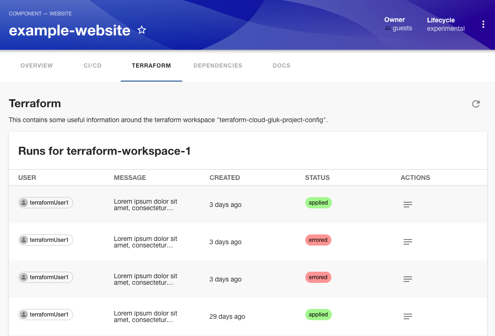

## Introduction

The Terraform plugin integrates [Terraform](https://www.terraform.io/) with Roadie, allowing you to visualize, track, and manage your infrastructure as code directly from your Backstage instance. This plugin helps platform teams and developers to gain visibility into their infrastructure resources, track changes, and understand dependencies between different components.

## At a Glance

|                            |                                                                                                  |
| -------------------------: | ------------------------------------------------------------------------------------------------ |
|          **Prerequisites** |                                                                                                  |
|         **Considerations** |                                                                                                  |
| **Supported Environments** | ☐ Private Network via Broker <br /> ☐ Internet Accessible via IP Whitelist <br /> ☒ Cloud Hosted |

## Overview

The Terraform plugin for Roadie provides the following capabilities:

1. Visualize your Terraform-managed infrastructure
2. Track the state of your infrastructure resources
3. View resource dependencies and relationships
4. Monitor deployment history and changes
5. Link infrastructure resources to your software catalog entities

## Configuration

### Plugin Configuration

The Terraform plugin can be configured through the Roadie UI. Navigate to `Administration > Settings > Terraform` to set up the plugin.


## Using the Terraform Plugin

### Terraform Resources Tab

The plugin can be added as a tab to entity pages that have Terraform resources associated with them. This tab displays:

- Resource inventory
- Current state information
- Dependency graphs
- Recent changes



### Terraform Workspace Health card

The plugin also exposes a health dashboard which can be used to identify the overall health of Terraform deployments within the workspace.


### Linking Catalog Entities to Terraform Resources

To associate Terraform resources with your catalog entities, you can add annotations to your entity's YAML file:

```yaml
# ...
metadata:
  name: example-service
  annotations:
    terraform.io/resource: 'aws_lambda_function.example_service'
    terraform.io/workspace: 'example-environment'
  # ...
```

## Additional Information

- For specific information about the Terraform plugin for Backstage, see the [plugin repository](https://github.com/globallogicuki/globallogic-backstage-plugins/tree/main/plugins/terraform).
