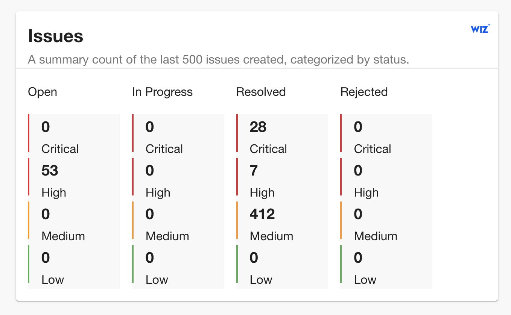
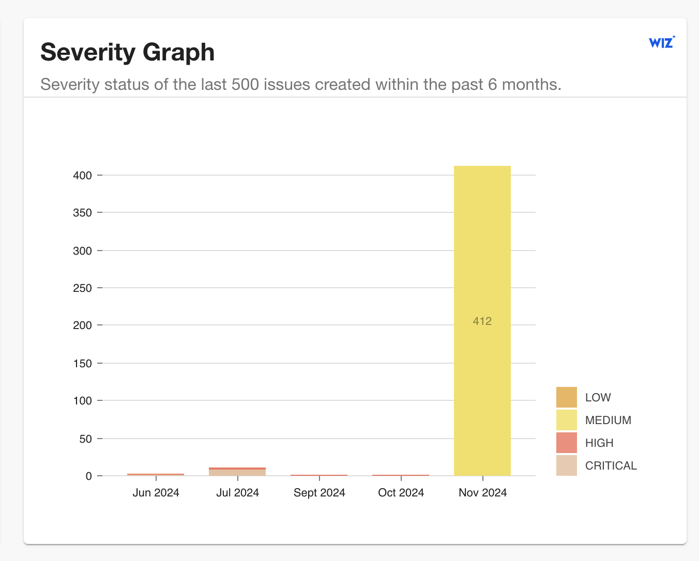
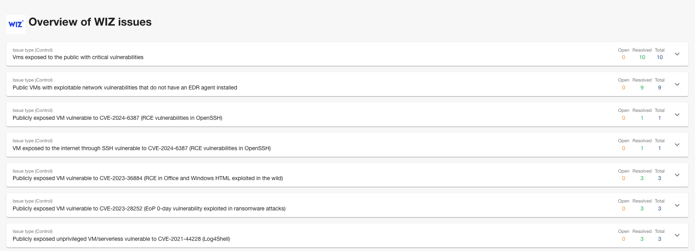

## Introduction

If you want to use Wiz plugin, you will need the following parameters:

- Wiz API URL (API Endpoint URL)
- Wiz Token URL
- Client ID and Client Secret

In order to retrieve those, you can read official documentation (https://win.wiz.io/reference/prerequisites) where it is described how to obtain the values.

## At a Glance

|                            |                                                                                                                                                                                                                                                                                                      |
| -------------------------: | ---------------------------------------------------------------------------------------------------------------------------------------------------------------------------------------------------------------------------------------------------------------------------------------------------- |
|          **Prerequisites** | **Configuration Data:** <ul><li>Wiz API URL (API Endpoint URL)</li><li>Wiz Token URL</li><li>Client ID and Client Secret</li></ul><br />In order to retrieve those, you can read official documentation (https://win.wiz.io/reference/prerequisites) where it is described how to obtain the values. |
|         **Considerations** |                                                                                                                                                                                                                                                                                                      |
| **Supported Environments** | ☐ Private Network via Broker <br /> ☐ Internet Accessible via IP Whitelist <br /> ☒ Cloud Hosted                                                                                                                                                                                                     |

## Certified Plugin

This plugin is [certified by Wiz](https://www.wiz.io/integrations?q=roadie).


### Setting up the plugin:

#### 1: Store the credentials in Roadie.

Visit `https://<tenant-name>.roadie.so/administration/secrets` and enter the Client ID value from above into `WIZ_CLIENT_ID`.

Enter Client Secret into `WIZ_CLIENT_SECRET` on the same page.

These will be used to make API call for generating API Token needed for other API calls.

#### 2: Configure the plugin.

Visit `https://<tenant-name>.roadie.so/administration/wiz` and add required parameters.

You will be required to enter Wiz API URL and Wiz Token URL.

Wiz link is optional and will be used in to navigate to your Wiz instance in EntityIssuesWidget card, which will be described below.

#### 3: Add the annotation to Backstage Component

Add following annotations to relevant catalog-info.yaml files.

```
wiz.io/project-id: <project_id>
```

Project id can be found in Wiz projects dashboard.

### 4. Add Wiz plugin widgest/cards to your Overview page

Navigate to the component you have added the annotation and proceed to [add the new cards to the Overview page](/docs/getting-started/configuring-backstage-plugins/#step-1-add-the-ui-component).

Select card you would like to add to your page from the list


Currently you can select from these cards:

<b>EntityIssuesWidget</b> which shows the information about number of different severity Open and Resolved issues.



<b>EntityIssuesChart</b> which provides graphical representation of resolved vs open issues over last 6 months.


<b>EntitySeverityChart</b> which provides graphical representation of all issues over last 6 months, indicated by severity.



### 5. Add Wiz plugin tab to your component

Clicking plus icon from the tab will open a form in which you will have an option to select Wiz from the dropdown as shown below


Click 'Save and reload layout'.

This will add following Wiz content as a tab



Expanding the view will open more details about specific Control


## References

- [Wiz API docs](https://win.wiz.io/reference/prerequisites)
