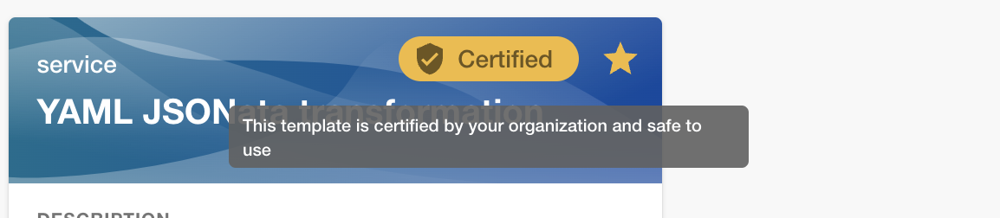

## Overview

Certified templates are templates that got an approval from the owner of the template. They get a certification chip rendered on their template card when you visit the `/create` page.

The certification chip can be shown on your templates by adding the `roadie.io/certified: "true"` annotation to the template.

```yaml
apiVersion: scaffolder.backstage.io/v1beta3
kind: Template
metadata:
...
  annotations:
    roadie.io/certified: "true"
spec:
...
```



## Usage

The best practice is to certify your templates that are in a mature state and you are not working on them actively. This way your engineers can safely run all of the certified templates without worrying which template is the one that they should run.
