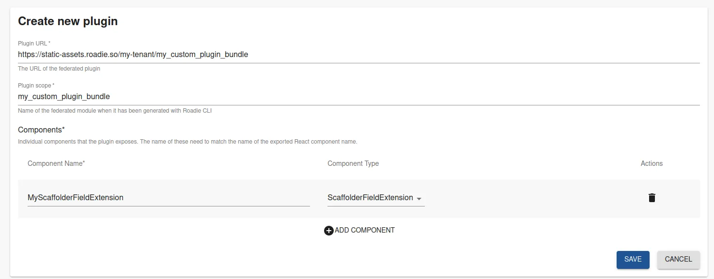

You can extend and customize the available Scaffolder functionality by using [Roadie Custom Plugins](/docs/custom-plugins/overview/). You can use the same workflow and development experience to build your own Custom Scaffolder Parameters as any other plugin, using the Roadie CLI. To see more information on how to develop custom plugins navigate to the Custom Plugins Documentation.

To see more information on how to develop custom plugins. It is recommended to navigate to the [Custom Plugins Documentation](/docs/custom-plugins/getting-started/).

### Constructing React components for your Field Extension

To construct the correct type of React components that are compatible to be registered as Scaffolder Parameters, the recommended approach is to [follow the tutorial on the Open Source Backstage documentation page.](https://backstage.io/docs/features/software-templates/writing-custom-field-extensions/)

### Registering your Parameter

Scaffolder Parameter are automatically registered to be usable within Scaffolder Templates, once they have been registered as a Custom Plugin component to the Roadie application. You can do this by navigating to the `Administration` -> `Custom Plugins` page and registering your Custom Plugin bundle, including a component of type `ScaffolderFieldExtension`.

## Additional Resources

- [Roadie CLI](https://www.npmjs.com/package/@roadiehq/roadie-cli)
- [Backstage Open Source project documentation about field Extensions](https://backstage.io/docs/features/software-templates/writing-custom-field-extensions/)
