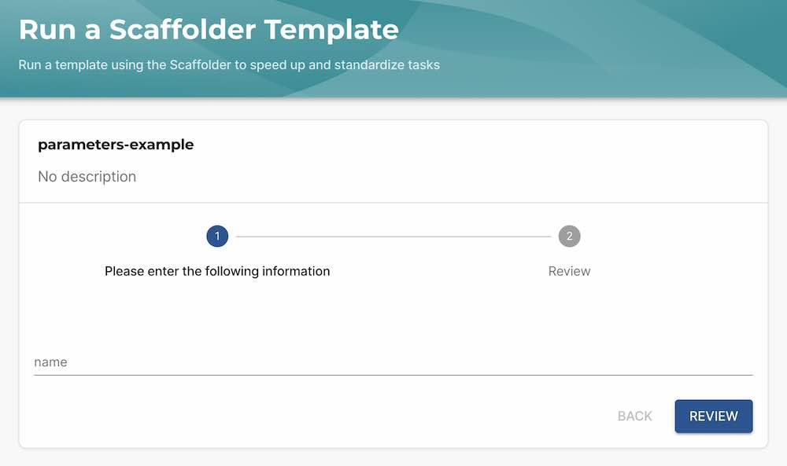
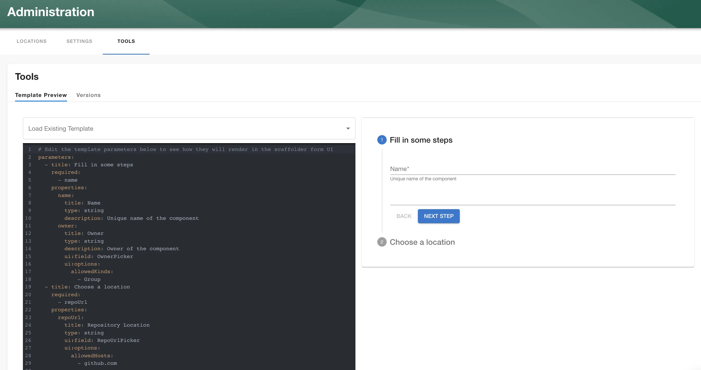

Parameters are how you get input data from users of Backstage Scaffolder templates. Parameters are defined in YAML alongside your template definition and rendered in a form when you run a template.

Here is the most basic example of a single parameter form field in a template:

```yaml
---
apiVersion: scaffolder.backstage.io/v1beta3
kind: Template
metadata:
  name: parameters-example
spec:
  owner: roadiehq
  type: example
  parameters:
    properties:
      name:
        type: string
  steps:
    - id: log-message
      action: debug:log
      input:
        message: 'Hello ${{ parameters.name }}'
```



The parameters YAML is based on [react-jsonschema-form](https://rjsf-team.github.io/react-jsonschema-form/). You can find the available base syntax options [there](https://rjsf-team.github.io/react-jsonschema-form/) and [YAML examples here](https://backstage.io/docs/features/software-templates/input-examples/).

This page lists some examples from React Json Schema Form in YAML format for how to configure parameter forms in the Backstage Scaffolder.

### Testing and iterating

You can test the core RJSF parameters live in Roadie at `/create/tools` -> `Template Form Preview`. 



**NB:** This tool does not work with complex form fields and some syntax that will work in the real Scaffolder like a single page form structured as an object.

### Field types

Each parameter can be one of a few types: `string`, `number`, `array` or `object`.

#### `string`

```yaml
parameters:
  properties:
    name:
      type: string
```

NB: You can **validate strings** using a regex with the `pattern` parameter. See [Field Validation](#field-validation) below.

#### `number`

You can allow the user to enter a number using the `number` type:

```yaml
parameters:
  properties:
    size:
      type: number
```

#### `object`

The `object` allows the collection of more complex types of data from the user. It contains the `properties` option to add variables to the object as follows:

```yaml
parameters:
  properties:
    person:
      type: object
      properties:
        name:
          type: string
        age:
          type: number
```

You may choose to make an object property to be mandatory using the `required` property.

```yaml
parameters:
  properties:
    person:
      type: object
      required:
        - name
      properties:
        name:
          type: string
        age:
          type: number
```

#### `array`

You can prompt for an array of properties using the array option. The `items` option can be any type: `array`, `object`, `string` or `number` as you like.

```yaml
parameters:
  properties:
    languages:
      type: array
      items:
        type: string
```

#### `enums`

Enums values can be provided for all these types like so:

```yaml
properties:
  name:
    title: Name
    type: string
    enum: ['Tom', 'Bob']
```

Enums render by default with a select dropdown. 

##### Radio and Checkboxes
You can use a radio or checkbox by adding the widget field:

```yaml
properties:
  name:
    title: Name
    type: string
    enum: ['Tom', 'Bob']
    ui:widget: "RadioWidget"
```

```yaml
properties:
  name:
    title: Name
    type: string
    enum: ['Tom', 'Bob']
    ui:widget: "CheckboxesWidget"
```

##### Multi select
Multi select can be achieved using the array type:

```yaml
properties:
  names:
    title: Names
    type: array
    ui:widget: "CheckboxesWidget"
    uniqueItems: true
    items:
      enum: 
        - Tom
        - Bob
```

##### Enum Display Names

You can render a different name for your enum values using `enumNames`:

```yaml
properties:
  city:
    title: City
    type: string
    enumNames: 
      - New York
      - Amsterdam
      - Hong Kong
    enum:
      - nyc
      - ams
      - hk
```

This is particularly useful for encoding additional hidden data in your enum values that can be used in later template steps:

```yaml
properties:
  city:
    title: City
    type: string
    enumNames: 
      - New York
      - Amsterdam
      - Hong Kong
    enum:
      - name: 'New York'
        lat: 40
        lon: 74
      - name: Amsterdam
        lat: 52
        lon: 5
      - name: 'Hong Kong'
        lat: 22
        lon: 114

steps:
  - id: log-message
    name: Log Message
    action: debug:log
    input:
      message: 'The city ${{ parameters.city.name }} is at ${{ parameters.city.lat }},${{ parameters.city.lon }}'
```

### Field Validation

You can use [react-jsonschema-form](https://rjsf-team.github.io/react-jsonschema-form/) to perform validation on input fields using a regex in the `pattern` filed or character counts using `maxLength` and `minLength`.

```yaml
parameters:
  properties:
    name:
      title: Simple text input
      type: string
      description: Description about input
      maxLength: 8
      pattern: '^([a-zA-Z][a-zA-Z0-9]*)(-[a-zA-Z0-9]+)*$'
      ui:autofocus: true
      ui:help: 'Hint: additional description...'
    errorMessage:
      properties:
        name: '1-8 alphanumeric tokens (first starts with letter) delimited by -'
```


### Multi Page Forms

You can choose to break up the parameters into form pages or collect all the parameters in one single page.

**Single Page:**
```yaml
parameters:
  properties:
    name:
      title: Name
      type: string
    email:
      title: Email
      type: string
      maxLength: 8
      pattern: '^[^\s@]+@([^\s@.,]+\.)+[^\s@.,]{2,}$'
    role:
      title: Role
      type: string
    company:
      title: Company Name
      type: string
```

**Multi Page:**
```yaml
parameters:
  - title: Provide some info about yourself
    required:
      - name
      - email
    properties:
      name:
        title: Name
        type: string
      email:
        title: Email
        type: string
        maxLength: 8
        pattern: '^[^\s@]+@([^\s@.,]+\.)+[^\s@.,]{2,}$'
  - title: Provide some info about your occupation
    properties:
      role:
        title: Role
        type: string
      company:
        title: Company Name
        type: string
```

In a multipage form, each parameter page must contain `title` and `properties`


### Complex Form Fields (Builtin Custom Fields)

The following items are enhanced form fields that can be used out of the box to build richer forms for your templates. 

Roadie allows you to [create your own custom React form components](#adding-custom-parameters) and use them in the same way if you have special use cases. 

#### Entity picker

You can prompt the user with a list of catalog entities using the `ui:field: EntityPicker` option as follows:

```yaml
parameters:
  properties:
    entity:
      type: string
      ui:field: EntityPicker
```

#### Owned entity picker

Alternatively if you would like the user to only select entities that they already own, you might want to use the OwnedEntityPicker.

```yaml
parameters:
  properties:
    ownedEntity:
      type: string
      ui:field: OwnedEntityPicker
```

#### Entity name picker

If you would like a little validation when the user enters an Entity name, you can use the EntityNamePicker. It will prevent the user from entering an entity name that is not an acceptable entity name.

```yaml
parameters:
  properties:
    ownedEntity:
      type: string
      ui:field: EntityNamePicker
```

#### Repository picker

The respository picker can allow the user to select the name and location of a new repository. The picker restricts the target location of the repository to make it a little easier for the user to select a target location.

The following example, will only allow the user to enter a new repository name targeting the GitHub using the AcmeInc organization.

```yaml
parameters:
  properties:
    repoUrl:
      type: string
      ui:field: RepoUrlPicker
      ui:options:
        allowedHosts:
          - github.com
        allowedOwners:
          - AcmeInc
```

The `RepoUrlPicker` uses the `allowedHosts` to decide how to build the repo url output value. If you use `bitbucket.org` it will output a valid repo url for Bitbucket.

```yaml
parameters:
  properties:
    repoUrl:
      type: string
      ui:field: RepoUrlPicker
      ui:options:
        allowedHosts:
          - bitbucket.org
```

#### Owner picker

The owner picker, allows the user to select a user / group in the Backstage catalog. e.g.

```yaml
parameters:
  properties:
    owner:
      type: string
      ui:field: OwnerPicker
```

This returns a variable in the format `group:<namespace>/<group-or-user-name>`. You can extract the entity name using replace when you refer to the parameter like so: `${{ parameters.owner | replace(\"group:.*/\", \"\") }}`

#### Picker from external API source

This custom scaffolder field, makes an API call to the Backstage backend and allows the result to be rendered to a list.

```yaml
parameters:
  properties:
    custom:
      title: custom
      type: string
      description: Custom field from external API

      # Use `SelectFieldFromApi` to configure the select field for the entry.
      ui:field: SelectFieldFromApi

      ui:options:
        # The Path on the Backstage API and the parameters to fetch the data for the dropdown
        path: 'catalog/entity-facets'
        params:
          facet: 'kind'

        # This selects the array element from the API fetch response. It finds the array with the name kind
        # under the facets object
        arraySelector: 'facets.kind'

        # (Optional) This selects the field in the array to use for the value of each select item. If its not specified
        # it will use the value of the item directly.
        valueSelector: 'count'
        # (Optional) This selects the field in the array to use for the label of each select item.
        labelSelector: 'value'
```

Some of the `SelectFieldFromApi` options allow using parameters from earlier parameter pages to be used to template the options. The templated options are `params`, `path`, `valueSelector` and `labelSelector`. e.g.

```yaml
parameters:
  - title: Select an Entity kind
    required:
      - kind
    properties:
      kind:
        title: Kind
        type: string
        enum:
          - template
          - location
        default: template
        ui:autofocus: true
        ui:options:
          rows: 5
  - title: Select the specific entity you want
    properties:
      obj:
        title: custom
        type: string
        description: Entity Selector
        ui:field: SelectFieldFromApi
        ui:options:
          path: "catalog/entities"
          params:
            filter: "kind={{ parameters.kind }}"
          valueSelector: "metadata.name"
          labelSelector: "metadata.description"
```

### Integration and Plugin specific parameters

#### GitOps Manifest Updater (Crossplane)

This parameter field takes no input and only supports Crossplane manifest files at this time.

The GitOps Manifest Updater field extension allows you to update Kubernetes manifests stored in Git repositories directly from your Backstage templates. It automatically generates forms based on the OpenAPI schema of Kubernetes CRDs, letting you update GitOps-managed resources with a user-friendly interface.

```yaml
parameters:
  properties:
    manifest:
      title: Update GitOps Manifest
      type: string
      description: Update Kubernetes manifest in Git repository
      ui:field: GitOpsManifestUpdater
      ui:options:
        # You can either use an entity annotation to provide the manifest URL
        # or allow the user to input it directly in the form
        manifestSourceType: "entityAnnotation" # or "manualInput"
        
        # If using entityAnnotation, specify which annotation contains the URL
        sourceAnnotation: "terasky.backstage.io/source-manifest-url"
        
        # Alternatively, provide a default URL when using manualInput
        defaultManifestUrl: "https://github.com/example/repo/path/to/manifest.yaml"
```

You can find a [full example here](https://github.com/TeraSky-OSS/backstage-plugins/blob/main/plugins/gitops-manifest-updater/templates/sample.yaml)

This field extension is particularly useful for:

- Updating Crossplane claims and other Kubernetes CRDs stored in Git repositories
- Implementing day-2 operations for GitOps-managed resources
- Creating pull requests to modify existing Kubernetes manifests with schema validation

The plugin generates a dynamic form based on the OpenAPI schema of the resource, populates it with current values from the Git repository, and creates a PR with the changes when submitted.


## Adding custom parameters

You can extend and customize the available Scaffolder functionality by using [Roadie Custom Plugins](/docs/custom-plugins/overview/) and creating a `Field extension`.

You can find more information on how this is done [in the tutorial on the Open Source Backstage documentation page.](https://backstage.io/docs/features/software-templates/writing-custom-field-extensions/)

Field extensions are react form components that can be imported dynamically into the Roadie Scaffolder. You can use the same workflow and development experience to build your own custom Scaffolder Field Extensions as any other plugin, using the Roadie CLI.

### Registering your Field Extension

Scaffolder Field Extensions are automatically registered to be usable within Scaffolder Templates, once they have been registered as a [Custom Plugin component](/docs/custom-plugins/overview/) in the Roadie application. You can do this by navigating to the `Administration` -> `Custom Plugins` page and registering your Custom Plugin bundle, including a component of type `ScaffolderFieldExtension`.


## Re-using Parameter Pages

You can create re-usable form pages using the `placeholders` feature like so:

```yaml
---
apiVersion: scaffolder.backstage.io/v1beta3
kind: Template
metadata:
  name: global-param-example
  title: Example of sourcing params from a constant
spec:
  owner: roadie
  type: service

  parameters:
    - $yaml: ./constants/products.yaml

  steps:
    - id: log-message
      name: List selected product
      action: debug:log
      input:
        message: 'Selected product: ${{ parameters.product }}'
```


./constants/products.yaml
```yaml
title: Select Product
properties:
  product:
    title: Product
    type: string
    enum: ["Search", "CRM", "Onboarding"]
```

**NB:** This only works for top level parameters objects and not for sections within a form page. 


### Using Parameters In Actions

Parameters can be retrieved later on by action steps using parameter outputs. Here is an example of a parameter `name` being used by a `debug:log` step.

```yaml
parameters:
  properties:
    name:
      type: string
steps:
  - id: log-message
    name: Log Message
    action: debug:log
    input:
      message: 'Hello, ${{ parameters.name }}!'
```

If you need to reference elements of an array parameter you can refer to them using the following syntax:

```yaml
steps:
  - id: log-message
    name: Log Message
    action: debug:log
    input:
      message: 'Hello, ${{ parameters.names[0] }}!'
```

An `object` parameter values can be reference in the way you might expect. Keys with special characters can be accessed via square bracket notation like so `${{ parameters["something-else"] }}`

```yaml
steps:
  - id: log-message
    name: Log Message
    action: debug:log
    input:
      message: 'Hello, ${{ parameters.person.name }}!'
```

#### Using logic in Parameter references

Inliine logic can be used in these references also via pipe functions using [Nunjucks templating syntax](https://mozilla.github.io/nunjucks/templating.html#builtin-filters). 

i.e.
```yaml
steps:
  - id: log-message
    name: Log Message
    action: debug:log
    input:
      message: "Hello, ${{ parameters.name | replace('Mr', 'Mrs') | capitalize }}! You have lived at the following addresses: ${{ parameters.addresses | join(", ") }}"
```

Available filters are listed in [Nunjucks documentation here](https://mozilla.github.io/nunjucks/templating.html#builtin-filters).


### Default values

If you would like to default the value of a field you can use the `default` option:

```yaml
parameters:
  properties:
    name:
      type: string
      default: 'world!'
```

### Field display options
You can display a more human description to a field value by using `title` and `description`

```yaml
parameters:
  properties:
    name:
      type: string
      title: 'Name'
      description: 'Name to say hello to'
```

## Links
- [React Json Schema Form](https://rjsf-team.github.io/react-jsonschema-form/
- [Official Backstage docs](https://backstage.io/docs/features/software-templates/writing-templates).
- [Nunjucks templating docs](https://mozilla.github.io/nunjucks/templating.html)

