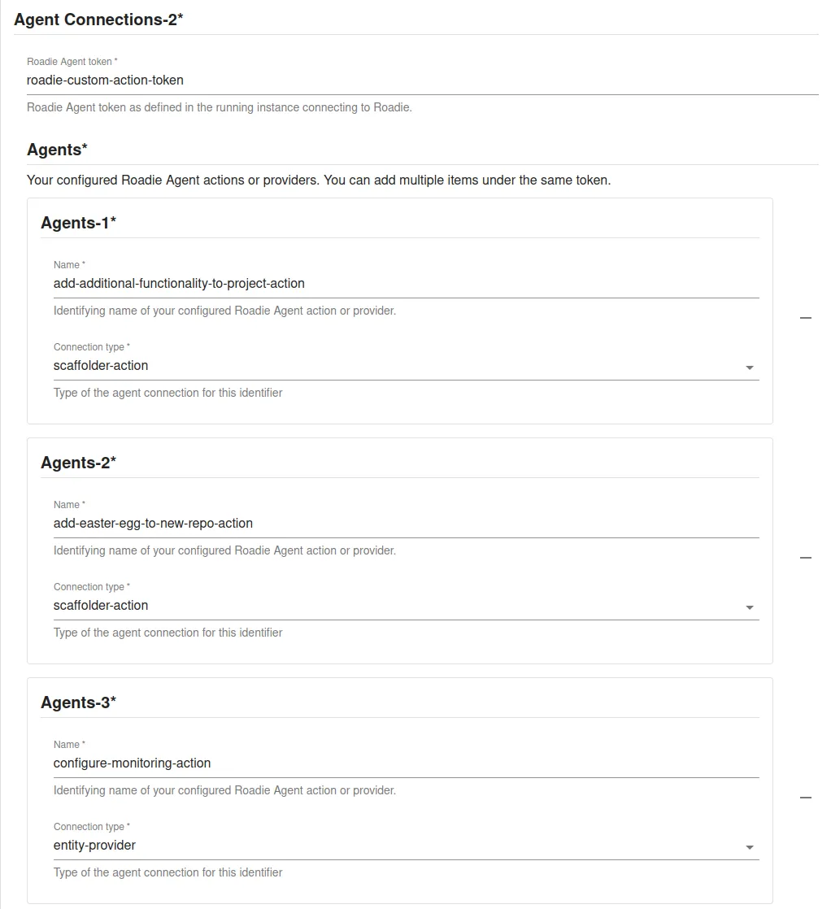
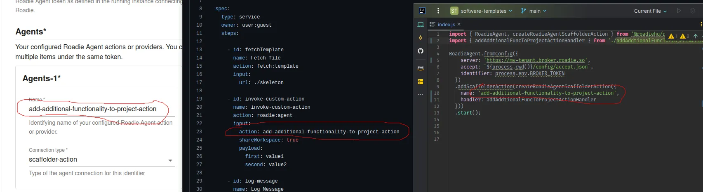

# Custom Scaffolder Actions


Roadie provides the possibility to run self-hosted, custom scaffolder actions as part of your scaffolder template. These actions can be written using the Roadie Agent Javascript/Typescript library. You can find the library and it's configuration options from its [NPM repository](https://www.npmjs.com/package/@roadiehq/roadie-agent). This documentation shows you how to configure your self-hosted actions to Roadie and write templates that use those actions.


## Prerequisites

The scaffolder actions will need connectivity back to the Roadie infrastructure in order to share files, output etc. As such you will need to ensure that the following hosts are accessible:

```
<tenant-name>.broker.roadie.so
roadie-scaffolder-shared-workspace.s3.eu-west-1.amazonaws.com
```


## Getting started

### Installing the agent library

#### Option 1 - Using a scaffolder template

Roadie has developed a scaffolder template that allows you to bootstrap a node.js monorepo, which allows you to start developing, building and deploying custom scaffolder actions. You can find the Scaffolder template to get started with from here: https://github.com/roadie-demo/scaffolder-examples/blob/main/roadie-agent-scaffolder-action/template.yaml. 

#### Option 2 - Installing the library manually

The Roadie Agent package can be included in any Node.js application and incorporated to existing projects if preferred. The library allows you to run multiple scaffolder actions and custom entity providers from within your own infrastructure. To get started, you need to add the Node.js library `@roadiehq/roadie-agent` as a dependency into your project and implement your wanted actions or entity providers using the instructions in the repository. To use the manual installation path, please follow the configuration instructions defined in the package documentation: https://www.npmjs.com/package/@roadiehq/roadie-agent.  

### Writing your first action

The agent library is written in Typescript and thus custom actions can be written in either Javascript or Typescript, it can also act as a bridge to trigger other commands on the host system. 

To get started, you need to define your configurations on your Roadie instance. This enables the communication between your self-hosted action and the Roadie backend. The underlying communication pattern used for this secure connection is using the [Broker Library](https://github.com/snyk/broker) developed by security company Snyk. You can read more about the broker [in the dedicated documentation section](/docs/integrations/broker/). 

An example custom action, using the repository bootstrapped by the Scaffolder template mentioned above, would look something like below.

First an index file configuring the agent and some actions for it:

```javascript
// src/index.js
import { RoadieAgent, createRoadieAgentScaffolderAction } from '@roadiehq/roadie-agent';
import { helloWorldActionHandler } from './helloWorldActionHandler.js';
import { addAddtionalFuncToProjectActionHandler } from './addAddtionalFuncToProjectActionHandler.js';
import { configureMonitoringActionHandler } from './configureMonitoringActionHandler.js';

RoadieAgent.fromConfig({
  server: 'https://my-tenant.broker.roadie.so',
  accept: `${process.cwd()}/config/accept.json`,
  identifier: process.env.BROKER_TOKEN // given that you have exported and env variable called BROKER_TOKEN
})
  .addScaffolderAction(createRoadieAgentScaffolderAction({
    name: 'hello-world',
    handler: helloWorldActionHandler
  }))    
  .addScaffolderAction(createRoadieAgentScaffolderAction({
    name: 'add-additional-functionality-to-project-action',
    handler: addAddtionalFuncToProjectActionHandler
  }))  
  .addScaffolderAction(createRoadieAgentScaffolderAction({
    name: 'configure-monitoring-action',
    handler: configureMonitoringActionHandler
  }))
  .start();
```

An example of an individual action:

```javascript
// src/helloWorldActionHandler.js
import { writeFileSync } from "fs";

export const helloWorldActionHandler = async (context) => {
  try {
    const greeting = `Hello, ${context.payload.body.name || 'world!'}`
    await context.log(greeting);
    writeFileSync(`${context.workspacePath}/greeting.txt`, greeting);
  } catch (e) {
    console.log('An error occurred');
  }
}
```


### Configuring your action in Roadie

To configure your action in Roadie, you need to add new configuration within `Administration` -> `Settings` -> `Roadie Agent`. 



The identifiers used for these configurations need to match the identifiers used within the implemented custom Scaffolder action code. Note that you can configure multiple actions or providers per Roadie Agent connection.

### Writing a template using custom actions


Roadie exposes a Scaffolder Action called `roadie:agent` which allows you to delegate the action logic to your custom self-hosted scaffolder actions. The action has one mandatory and two optional inputs that can be used.

| name           | Title           | Description                                                                                                                                                         | Type    |
|----------------|-----------------|---------------------------------------------------------------------------------------------------------------------------------------------------------------------|---------|
| action         | Action          | The action to be executed. This is a mandatory input. Should match the action configured in Roadie and name of the action registered to the Roadie Agent library    | string  |
| shareWorkspace | Share Workspace | This input is optional and specifies whether to share the workspace or not. Allows the custom action to modify the workspace created by other steps in the template | boolean |
| payload        | Payload         | This input is optional. An object consisting of any additional parameters that need to be passed into the custom action.                                            | object  |


```yaml
apiVersion: scaffolder.backstage.io/v1beta3
kind: Template
metadata:
  name: custom-action-with-workspace
  title: Custom Scaffolder Action with Shared Workspace
  description: Custom Scaffolder Action using a shared workspace.

spec:
  type: service
  owner: engineering
  steps:

    - id: fetchTemplate
      name: Fetch file
      action: fetch:template
      input:
        url: ./skeleton

    - id: invoke-custom-action
      name: invoke-custom-action
      action: roadie:agent
      input:
        action: hello-world
        shareWorkspace: true
        payload:
          name: Roadie

    - id: log-message
      name: Log Message
      action: debug:log
      input:
        listWorkspace: true       
```

The scaffolder template defined above would invoke the `hello-world` action that is configured to run as a custom scaffolder action in your Roadie instance.


## FAQ / Troubleshooting

### My custom action is not connecting to the Roadie instance

The Roadie Agent library uses a Broker connection to communicate with Roadie. This means that to be able to establish connection, you need to allow list the IP addresses where this connection would be initiated from. You can achieve this by navigating to the settings page in `Administration` -> `Settings` -> `Broker` and adding the CIDR ranges for the host where your custom actions are running.


### My custom action is not found/not triggering

Make sure that the configuration for the custom action matches in all three configuration places. You need to use the same name in your _template_, your _Roadie configuration_ and as a _name of your action registered to the library_.




## References

- [Roadie Agent Library](https://www.npmjs.com/package/@roadiehq/roadie-agent)
- [Custom Action monorepo template](https://github.com/roadie-demo/scaffolder-examples/blob/main/roadie-agent-scaffolder-action/template.yaml)
- [Broker Documentation](/docs/integrations/broker/)
