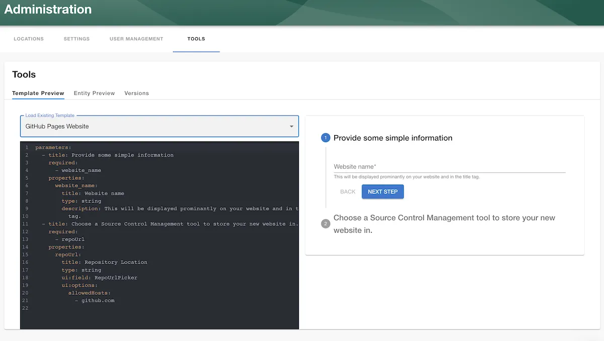

Scaffolder templates are a powerful tool to create software, configurations and modify existing services. Below we have listed common error scenarios that we have encountered when building complex Scaffolder templates using the available actions.

## Testing

Testing of templates is not well supported in Backstage currently, mostly due to the fact that many Scaffolder actions perform side-effects.

A limited set of functionality exists to preview and edit parameters in a sandbox, and dry-run templates (skipping steps that perform mutations).

You can find these features at `/create/tools`.

It is also possible to test templates by changing the name and namespace of the template to indicate that it is a preview or test version, then adding it to the catalog via `/import/entity` using the version on a published feature branch.
This preview template will show up in the list of templates however so it is important to remove the entity after testing to avoid duplication, and also to make sure the title/description indicates that it is a temporary test.

## Troubleshooting

Writing templates can be a little cumbersome at times. We have compiled a list of errors that we have seen in the past, that might help you determine the cause of your issue.

Template YAML input forms can also be tested at `/create/tools` using a live template preview viewer which speeds up the testing cycle.



### Resource not accessible by integration

This error is referring to actions that interact with GitHub. It means that the Roadie GitHub app is unable to read, create or update the resource/s that are being touched by the Scaffolder step.
There can be multiple different reasons for this generic error message that GitHub responds with. Unfortunately the errors returned from GitHub don't provide a lot more information about the specific resources that are being access but below are some cases where it is common to encounter this message.

#### Attempting to create/amend a repository and add collaborators/owners

GitHub expects a specific format for the teams/users that are added to be owners or collaborators on a repository. This format is in conflict with the result value of the OwnerPicker Scaffolder UI component that Backstage provides. There may be some string manipulation needed if that value is wanted to be passed directly as an input to GitHub actions like `publish:github`. The following code snippet will give an example how to modify the OwnerPicker result to match what GitHub is expecting:

```yaml
- id: publish
  name: Publish
  action: publish:github
  input:
    description: ${{parameters.description}}
    repoUrl: ${{parameters.repoUrl}}
    defaultBranch: main
    access: roadiehq/${{ parameters.owner | parseEntityRef | pick('name') }}
    deleteBranchOnMerge: true
    collaborators:
      - user: 'Xantier'
        access: admin
      - team: 'marketing'
        access: pull
      - team: roadiehq/${{ parameters.owner | parseEntityRef | pick('name') }}
        access: admin
```

Within this scaffolder template snippet we see 3 different approaches on adding users and teams into a repository. The GitHub API expects a user to be a plain string, identifying the username in GitHub. The team can be either a plain string to a GitHub team, that is in the same organization as the GitHub App is installed in, or a `prefix/team-name` format where the prefix is the name of the organization. Note that the GitHub app _needs_ to have access to these users/teams, so it is not possible to assign teams from arbitrary organizations to be collaborators to your repositories.

If using the OwnerPicker result directly, you can use the snippet `${{ parameters.owner | parseEntityRef | pick('name') }}` to grab the plain team name only from the picked OwnerPicker result.

#### Lacking permissions on the approved GitHub app/GitHub Token

You may encounter this error when you are trying to create/modify resources in GitHub that is not on the allowed permission list that your organization GitHub Admin has approved for the Roadie GitHub App. The same scenario is also possible to happen if you are using a GitHub token. To identify the culprit of the missing permission and which specific Scaffolder action is causing this, you can slim down your action inputs to the minimal possible reproduction. After identifying the offending action or action input, you can contact Roadie for additional assistance to identify which specific permissions would need to be added/modified.

### Pull request creation failed; caused by HttpError: You have exceeded a secondary rate limit - `publish:github:pull-request`

Full error message: `Pull request creation failed; caused by HttpError: You have exceeded a secondary rate limit. Please wait a few minutes before you try again. If you reach out to GitHub Support for help, please include the request ID`

This happens when you try to make a PR to Github with too many files in the PR, triggering a Secondary rate limit in Github's api. This is currently an issue with the open source action [explained in detail here](https://github.com/backstage/backstage/issues/17188).

This often happens when using the action in combination with a preceding `fetch:plain` action that pulls a full existing repository down, so that some files can be changed.

The way around this is, if you know the specific files you want to be contained in the pull request, you should move those files into a subdirectory using the `fs:rename` step after the `fetch:plain` step.
i.e.

```
steps:
  - id: fetch-catalog-manifest
    name: Fetch Catalog manifest file
    action: fetch:plain
    input:
      url: "${{ steps['backstage_request'].output.body.metadata.annotations['backstage.io/managed-by-origin-location'] | replace('url:', '') | replace('catalog-info.yaml', '') }}"
      targetPath: 'fetch-folder'

  - id: move-manifest-to-workbench
    name: Move files to a workbench location
    action: fs:rename
    input:
      files:
        - from: 'fetch-folder/file1'
          to: './workbench-folder/file1'
        - from: 'fetch-folder/folder1'
          to: './manifest-folder/folder1'

  ... snip ... do manipulations ...

  - id: create-pr
    name: Create a pull request
    action: publish:github:pull-request
    input:
      sourcePath: ./workbench-folder/
      targetPath: ./
      repoUrl: github.com?repo=my-repo&owner=my-owner
      branchName: my-brach-${{ '' | now }}
      title: Updating some files
      description: This is a PR created by Roadie Scaffolder.
```

This then creates a PR with only the changed files rather than the full duplicated repo.
