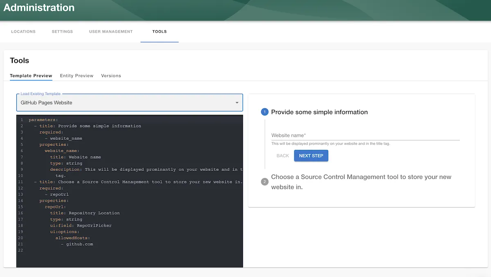

## Overview

The Roadie Backstage scaffolder is a feature that allows you to define software templates to create new software projects, update existing ones or simply perform repeated tasks in a consistent manner.

Scaffolder templates are defined in YAML files and loaded into the Backstage catalog in the same way that other entities are loaded into Backstage. A template contains one or more `steps` which run sequentially during execution.

A Scaffolder template is then run on demand by the users of Backstage to execute the software template. Roadie will execute the software template in an ephemeral container that is destroyed after the execution completes.

You can find a step by step guide to adding templates in Roadie [here](/docs/getting-started/scaffolding-components/)

<div class="docs-cta">
  <h4 class="docs-cta__title">See the Backstage Scaffolder in action</h4>
  <a href="/request-demo/?utm_source=roadie-docs&utm_campaign=scaffolder-docs" target="_blank" class="docs-cta__button">
    Request a Roadie demo
  </a>
</div>

## Components of a Template

A Scaffolder template is a configurable process that will run one or more Scaffolder `steps`. The template will be run when a user visits the "Create Component" page in Backstage. `https://<tenant-name>.roadie.so/create`.


Templates are defined by a Backstage Entity YAML file with a `Template` kind and imported into the Backstage catalog. You can create multiple templates, each of which can perform a different set of steps. For example, you can have one template that creates a React application, and another that creates a serverless app.

Template YAML input forms can be tested at `/templates/edit` using a live template preview viewer.



Here is an example of a very basic Scaffolder template that prompts the user for a name, and then prints back the text "Hello, name!"

```yaml
apiVersion: scaffolder.backstage.io/v1beta3
kind: Template
metadata:
  name: hello-world-template
  title: Hello World
  description: Says Hello to a specified name.
spec:
  owner: backstage/techdocs-core
  type: service

  parameters:
    - title: You are about to say hello to your first Backstage Template
      required:
        - name
      properties:
        name:
          type: string

  steps:
    - id: log-message
      name: Log Message
      action: debug:log
      input:
        message: 'Hello, ${{ parameters.name }}!'
```

## Header Section

The header section is required for every `template` and contains information to configure the task and show details about the task on the "Create Component" page.

```yaml
apiVersion: scaffolder.backstage.io/v1beta3
kind: Template
metadata:
  name: hello-world-template
  title: Hello World
  description: Says Hello to a specified name.
spec:
  owner: default/engineering
  type: service
```

## `apiVersion`

This is a required field and should be set to `scaffolder.backstage.io/v1beta3`

## `kind`

A Scaffolder template is also an Entity in Backstage. In order to configure this entity as a template you must set the kind to `Template`

## `metadata`

The metadata field contains some data that appears on the template card that appears on the "Create Component" page.

## `spec`

The spec field contains `owner` and `type`. Owner refers to the Backstage group or user that owns the Scaffolder task e.g. `default/engineering`. Type refers to the type of template. It can be set to anything and appears on the scaffolder template card in the "Create Component" page.

## `parameters`

The parameters property is a list of parameters that can be prompted from the user when they run a template. Each array element contains the configuration for a single page of items to be filled by the user running the template. The parameter pages must contain `title`, `required` and `properties`.

The parameters yaml is based on [react-jsonschema-form](https://rjsf-team.github.io/react-jsonschema-form/). You can find the available syntax options there and [examples here](https://backstage.io/docs/features/software-templates/input-examples/).

You can choose to break up the parameter prompting into `form steps` or collect all the parameters in one single step.
Each parameter can be one of a few types: `string`, `number`, `array` or `object`.

Here is the most basic example:

```yaml
parameters:
  properties:
    name:
      type: string
```


## `steps`

Steps define the actions that are taken by the scaffolder template when it is run as a task. The scaffolder initially creates a temporary directory referred to as the _workspace_, in which files are downloaded, generated, updated and pushed to some external system. Each step that is defined is run in order.

### Step Inputs

#### Parameter Values

You can refer to the value of a parameter using the syntax `${{ parameters["name"] }}`

e.g.

```yaml
steps:
  - id: log-message
    name: Log Message
    action: debug:log
    input:
      message: 'Hello, ${{ parameters["name"] }}'
```

If the parameter id does not contain a special character you can also refer to it using the dot syntax `${{ parameters.name }}`

#### Outputs from previous steps
You can refer to the output of a previous step using the following syntax:

```yaml
${{ steps["publish-step-id"].output.repoContentsUrl }}
```

If the step id does not contain a special character you can also refer to it using the dot syntax.

```yaml
${{ steps.publish.output.repoContentsUrl }}
```

#### Looping

You can use array type form inputs or step outputs to repeat action steps multiple times. e.g.

```yaml
    - id: log-description
      name: Log Message
      each: ['Brian', 'Ian']
      action: debug:log
      input:
        message: 'Hello, ${{ each.value }}!'
```

#### Accessing the logged in user

You can refer to the user entity reference for the logged in user using the following syntax:

```yaml
${{ user.ref }}
```

If this entity reference [exists in the Backstage Catalog](/docs/getting-started/teams/), you can also make use of the details contained within the users entity by using the following:

```yaml
${{ user.entity.metadata.name }}
```

or access the details contained within the user's profile.

```yaml
${{ user.entity.spec.profile.email }}
```

### Actions

You can find all the available actions to your Roadie instance by visiting the following page from within Roadie:

`https://<tenant-name>.roadie.so/create/actions`


### Conditional Steps

You can conditionally execute a scaffolder action based on an input parameter.

```yaml
steps:
  - action: debug:log
    id: debug-log
    if: ${{ parameters.name }}
    name: Log Hello World
    input:
      message: 'Hello, ${{ parameters.name }}!'
```

## Advanced

### Calling an internal API

If you need a scaffolder step to contact a custom authenticated service or any public API for that matter that is not currently supported by a built-in action, you can do that using a combination of the `http:backstage:request` action and a [backstage proxy configuration](/docs/custom-plugins/connectivity/proxy/).

Start by creating a proxy configuration as described in [this page](/docs/custom-plugins/connectivity/proxy/)

Then you can add a step to call that API using the `http:backstage:request` action as follows:

```yaml
steps:
  - action: http:backstage:request
    id: http-request
    name: Create a thing on the acme service
    input:
      method: POST
      path: "/api/proxy/acme/thing"
  - action: debug:log
    id: log-result
    name: Log the result of creating the thing
    input:
      message: "The response code was ${{ steps["http-request"].output.code }}'
```

### Escaping syntax

If you need to pass variable substitution syntax through without it being interpreted you can escape the syntax by wrapping it like so `${{ '${{ parameters.something }}' }}`.

### Creating re-usable snippets

You can inject in re-usable snippets of yaml into a template using the `$yaml` operator like so:

`templates/debug-step.yaml`

```yaml
- name: Debug log 2
  id: debug_log_2
  action: 'debug:log'
  input:
    message: Second log
```

`logging-template.yaml`

```yaml
apiVersion: scaffolder.backstage.io/v1beta3
kind: Template
metadata:
  name: placeholder-example
  title: Demonstrating the placeholder usage
  description: Shows how to inject in a single re-usable step
spec:
  owner: default/engineering
  type: service
  steps:
    - name: Debug log 1
      id: debug_log_1
      action: 'debug:log'
      input:
        message: First log

      $yaml: https://github.com/yourOrg/some-repo/blob/templates/debug-step.yaml
```

NB: This can only be done for a single step as the re-usable section must be valid yaml.


### Using a user's Github Token to execute template steps

You can use the user that runs the scaffolder template to open a PR or other Github based actions rather than opening it on behalf of the Roadie Github App by specifying the token field.
The token must first be injected via the parameters by the RepoUrlPicker parameter as documented [here](https://backstage.io/docs/features/software-templates/writing-templates#using-the-users-oauth-token)

```yaml
parameters:
  - title: Choose a location
    required:
      - repoUrl
    properties:
      repoUrl:
        title: Repository Location
        type: string
        ui:field: RepoUrlPicker
        ui:options:
          # Here's the option you can pass to the RepoUrlPicker
          requestUserCredentials:
            secretsKey: USER_OAUTH_TOKEN
            additionalScopes:
              github:
                - workflow
          allowedHosts:
            - github.com
steps:
  - action: publish:github:pull-request
    id: create-pull-request
    name: Create a pull request
    input:
      repoUrl: 'github.com?repo=reponame&owner=AcmeInc'
      branchName: ticketNumber-123
      title: 'Make some changes to the files'
      description: 'This pull request makes changes to the files in the reponame repository in the AcmeInc organization'
      # here's where the secret can be used
      token: ${{ secrets.USER_OAUTH_TOKEN }}
```
