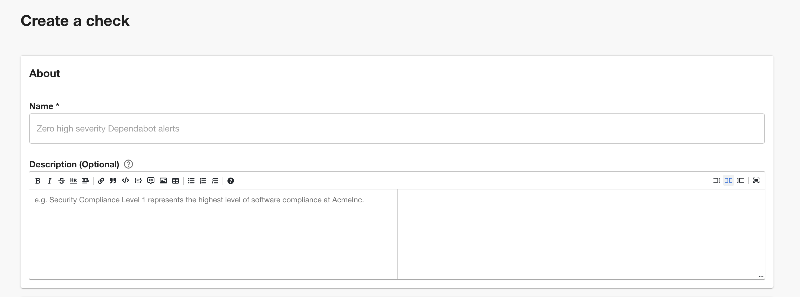
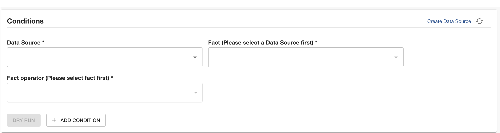
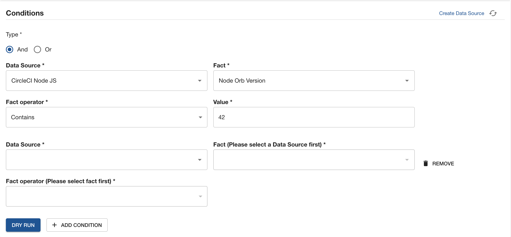
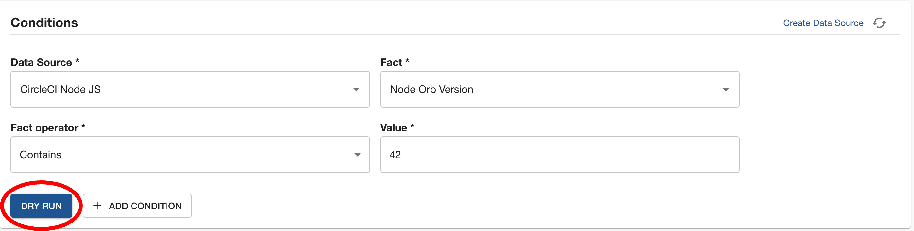
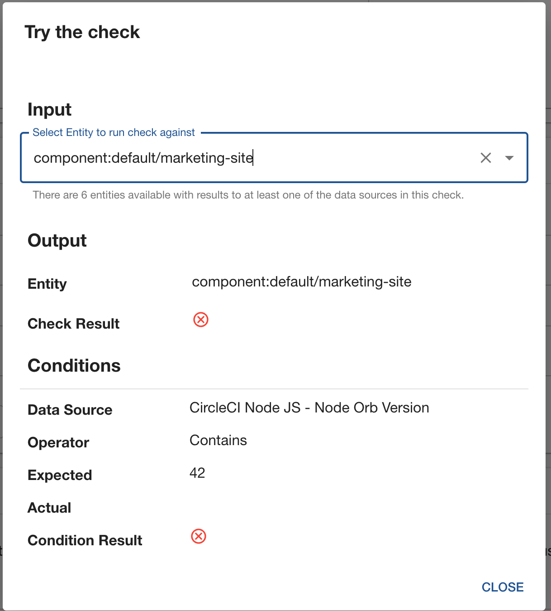
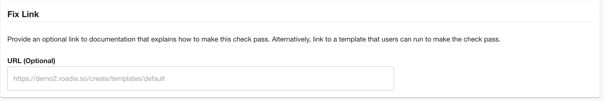
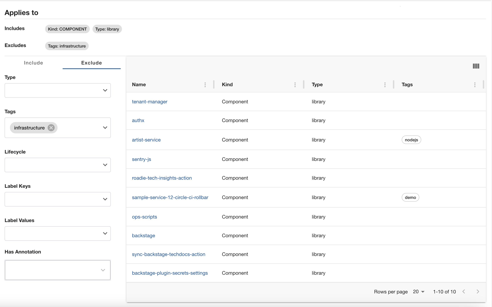
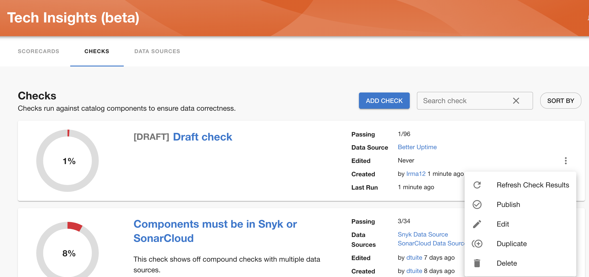
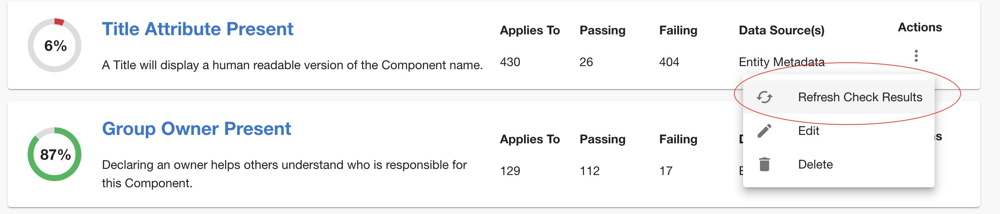

After navigating to Tech Insights→ Checks page and clicking ‘Add check’ button, you’ll be asked to describe your Check as below:

### About

- Give a unique name to your check
- Give a proper description about this check. This input accepts markdown

### Conditions

- Select your data source from the `Data Source` select field.
- Select your `Fact` from the `Fact` select field.
- Choose an operator
- Fill in the value for the selected operator

You can add multiple conditions to your check by clicking the `+ ADD CONDITION` button.

- Select the logic between your conditions from the radio buttons
- Fill in your check the same way as in the previous step

You can test out your check by clicking the `Dry Run` button

Select an entity that you want to test your check against.

### Fix Link

You can provide an optional link to some documentation that explains to your users how to make this check pass

### Applies to

You can define filters to target which entities should this check run against
In the Applies to section you can select which entites will be included in this check and which entities will be excluded.

The above configuration means the Check will run against components with type library that does not have the tag infrastructure

Providing multiple selection in a single input results in an `OR` relation between the selections.
Selecting from multiple input fields end up with a relation `AND` between the fields.

For example:
Selecting `type: service, tags: infrastructure` will exclude every enetity Which has type service `AND` contains an infrastructure tag. However it won't exclude services which does not contain the tag, or components that contain only the tag but they are not services.

### Save

If you are still uncertain if you want to publish the check, you can save it as a draft an publish it later.

Publishing a check based on [Draft Data Source](../data-sources/) will publish that Data Source as well and vice versa.

After you have added the check, make sure to refresh check results so it is taken into calculation from that moment on.

