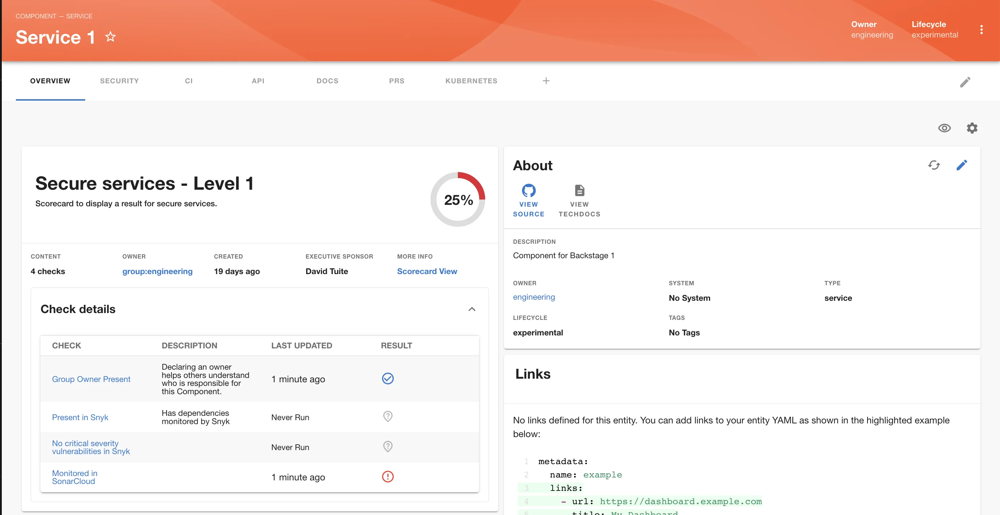
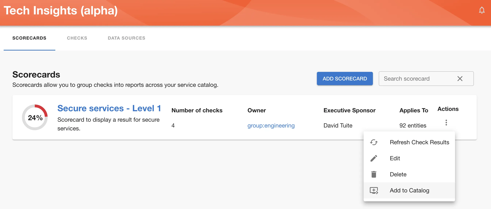
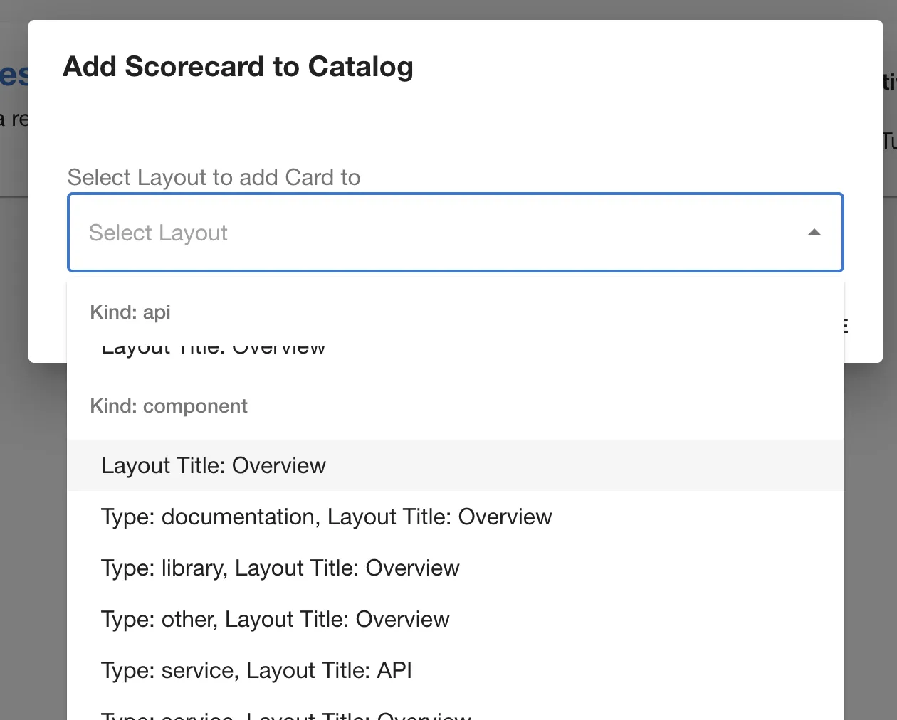

In order to show a Scorecard in the Catalog Entity page, as shown below, you’ll have to define it from the Tech Insights → Scorecards page.



Once you’re in Tech Insights → Scorecards, find a Scorecard you wish to add. From kebab menu select ‘Add to Catalog’



Then select option which best applies to your use case.



Scorecard should now be visible under the layout page you have selected.

### Adding a Scorecard to the Catalog - the hard way

You can also add a Scorecard in the normal way as a widget on a Component Overview page or as a tab.

You will need to add a prop to the widget to tell it which Scorecard to show for the component using the `scorecardId` field like so:

```json
{
  "scorecardId": "0e9cf72e-a279-4aa7-8296-9a0f5752ca9c"
}
```

You can find the id for the Scorecard in the url when viewing the Scorecard you want to display i.e. `/tech-insights/scorecards/1beea874-fa64-4bc1-b04d-977f8c6a071b`.
