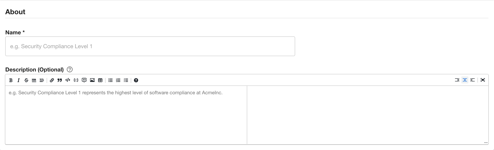
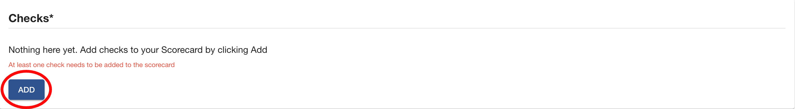
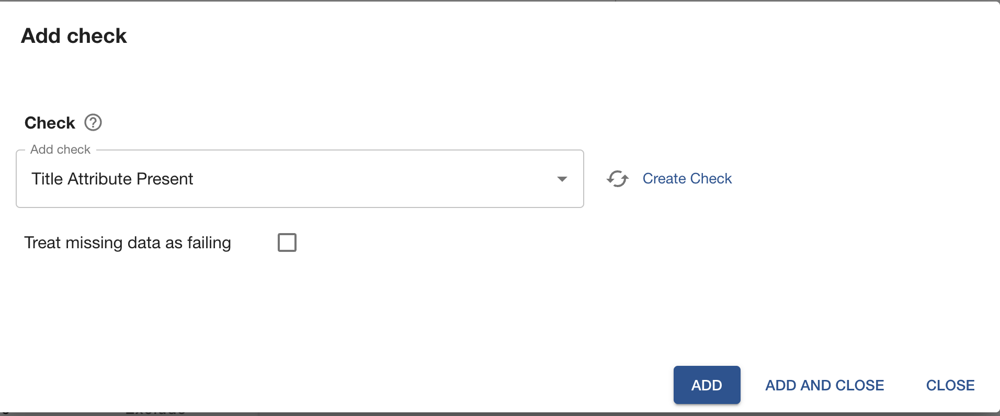
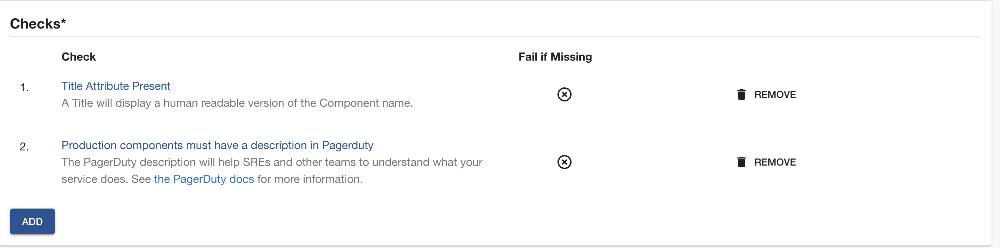
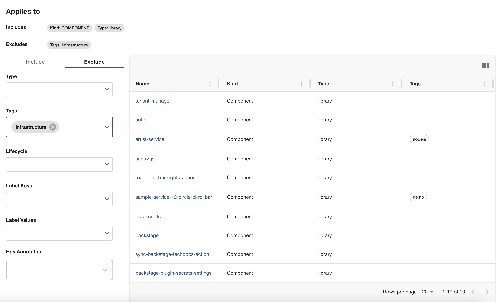
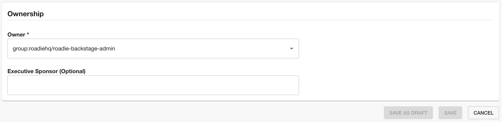
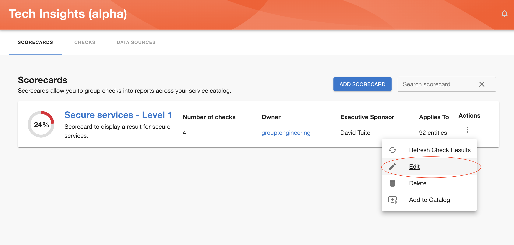

Once you click the “Add Scorecard” button, you’ll be prompted to fill in the details about the Scorecard, including the Checks you want to include and to which entities to apply it to, as shown below:

### About section

- Give a unique name to your Scorecard
- Give a proper description about this Scorecard. This input accepts markdown

### Checks

Click the `Add` button to open the add checks modal

- Select the checks you would like to add to your scorecard
- Close the modal once you added all of the checks you would want in your scorecard

### Applies to

You can define filters to target which entities should this scorecard run against
In the `Applies to` section you can select which entites will be included in this scorecard and which entities will be excluded.

The above configuration means the scorecard will run against components with type library that does not have the tag infrastructure

### Ownership

- Select the owner of the scorecard
- (optional) Give an executive sponsor to your scorecard

## Edit

3 - Select which kind and type of components this scorecard applies to.

4 - Owner which can be either a user or a group.

Once you are happy with the created scorecard, save it and you should be able to see it in overview screen.

Same as for the [Data Source](../data-sources/) [Checks](../checks/), you can save a scorecard as a draft until you are completely happy with it and certaing you want to publish it.

** Note that publishing a draft scorecard will publish all draft Checks and Data Source it is based on.**
