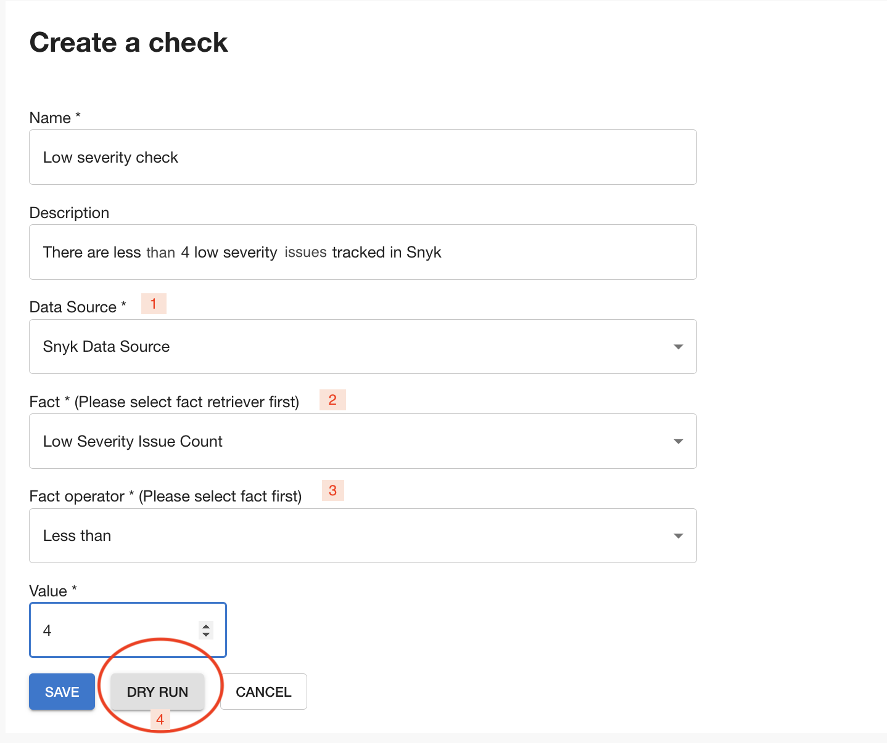
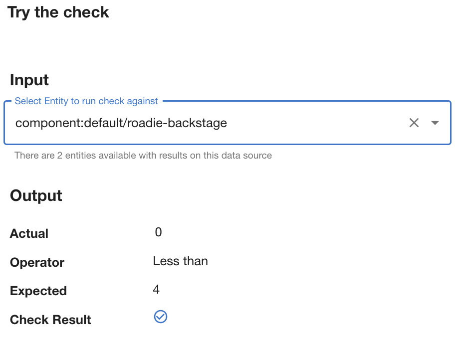
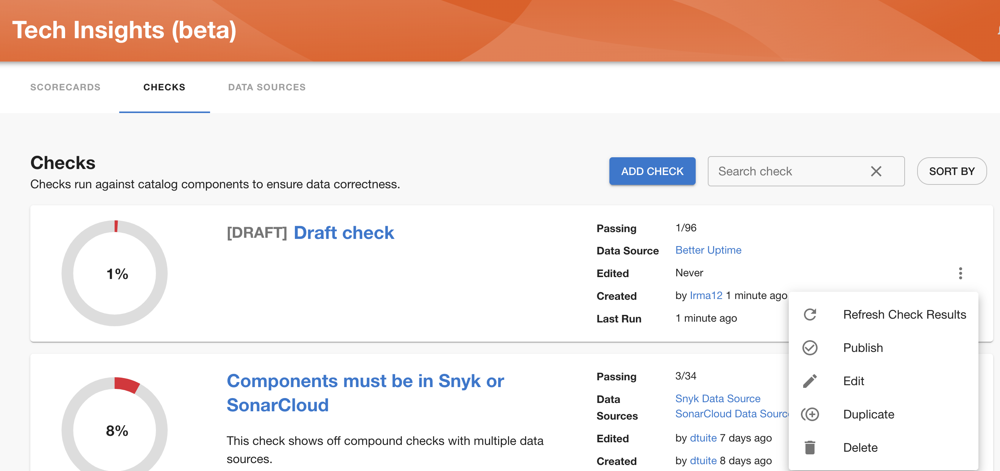

## Adding a new check

After navigating to Tech Insights→ Checks page and clicking ‘Add check’ button, you’ll be asked to describe your Check as below:

1 - After filling in Name and Description, select the Data Source that you want to use for this Check.

2 - Select the Fact that you want to use. Note that the list of Facts come from the selected Data Source.

3 - Select a Fact operator and specify a target value. The underlying implementation (`json-rules-engine`, see below) supports a limited [number of built-in operators](https://github.com/CacheControl/json-rules-engine/blob/master/docs/rules.md#operators) that can be used in conditions.

Checks are constructed using[json-rules-engine](https://github.com/CacheControl/json-rules-engine/blob/master/docs/rules.md#conditions) so you will make sure facts, operators and value align to those rules .

4 - You can try out your Check with the Dry Run button.

If you are still uncertain if you want to publish the check, you can save it as a draft an publish it later.

Publishing a check based on [Draft Data Source](../data-sources/) will publish that Data Source as well and vice versa.

After you have added the check, make sure to refresh check results so it is taken into calculation from that moment on.

