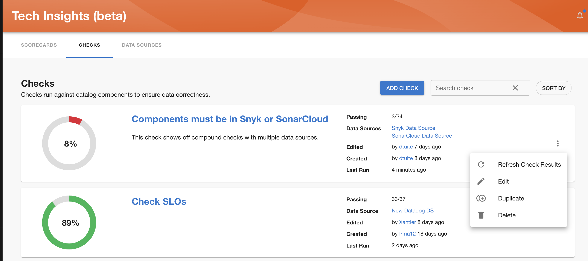
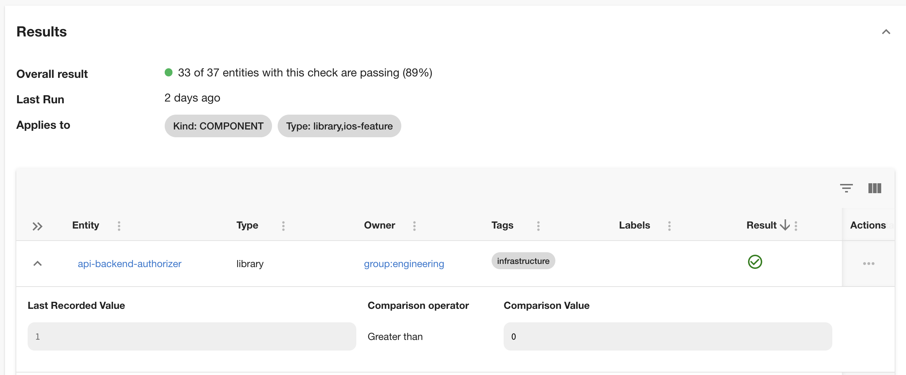
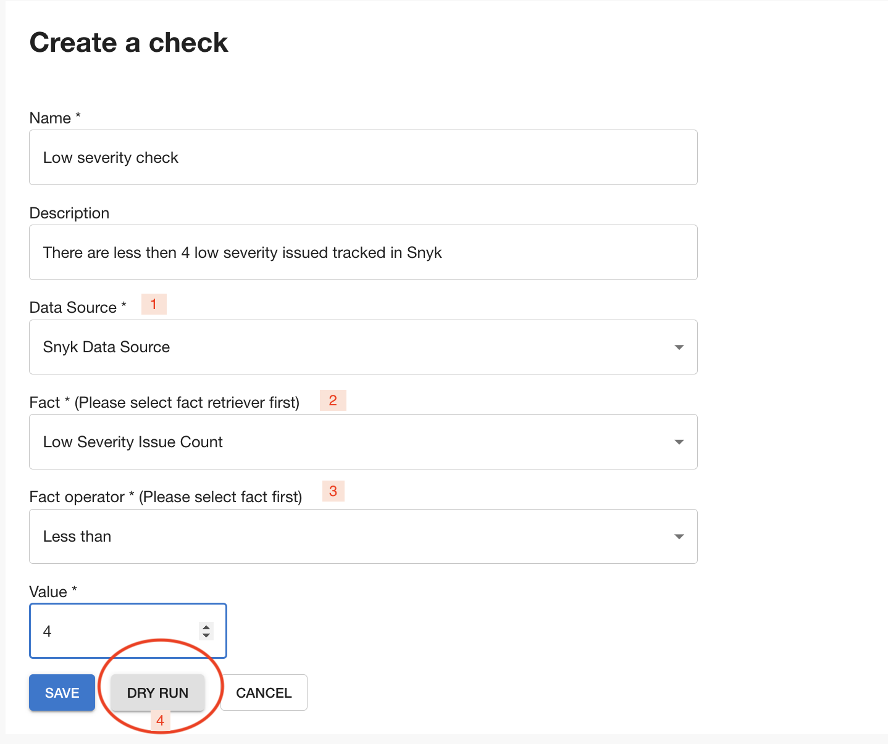
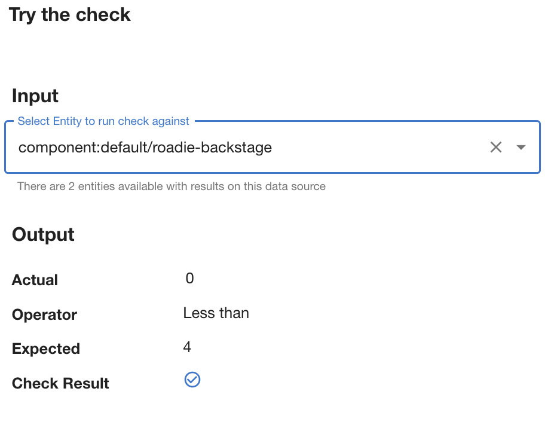
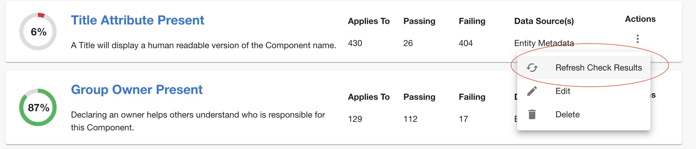

## Defining **Checks**

A Check is a rule which a service either does or does not satisfy. Checks are defined by evaluating a Fact from a Data Source against a logical operation, such as checking if services have less than 4 Low Severity Issues from Snyk.

To manage Checks, go to Tech Insights → Checks page. In this page you can view and edit or duplicate existing Checks, as well as adding a new one.

Clicking a specific Check title will show you details and results of the Check for all components. Please not that if you select a wider scope of components in entity filter when creating a check, than the scope for Data Source which Check is based on, you will be seeing components without any result as well. In these cases default value will be taken into consideration and result of the check will be calculated based on those.

### Adding a new check

After navigating to Tech Insights→ Checks page and clicking ‘Add check’ button, you’ll be asked to describe your Check as below:

1 - After filling in Name and Description, select the Data Source that you want to use for this Check.

2 - Select the Fact that you want to use. Note that the list of Facts come from the selected Data Source.

3 - Select a Fact operator and specify a target value. The underlying implementation (`json-rules-engine`, see below) supports a limited [number of built-in operators](https://github.com/CacheControl/json-rules-engine/blob/master/docs/rules.md#operators) that can be used in conditions.

Checks are constructed using[json-rules-engine](https://github.com/CacheControl/json-rules-engine/blob/master/docs/rules.md#conditions) so you will make sure facts, operators and value align to those rules .

4 - You can try out your Check with the Dry Run button.

If you are still uncertain if you want to publish the check, you can save it as a draft an publish it later.

Publishing a check based on [Draft Data Source](../data-sources/) will publish that Data Source as well and vice versa.

After you have added the check, make sure to refresh check results so it is taken into calculation from that moment on.

## Next steps

Now that you have added both Data Source and Checks, based on that Data Source, you can proceed and create a new [Scorecard](../scorecards/) which will include this check or include it in existing Scorecards.
