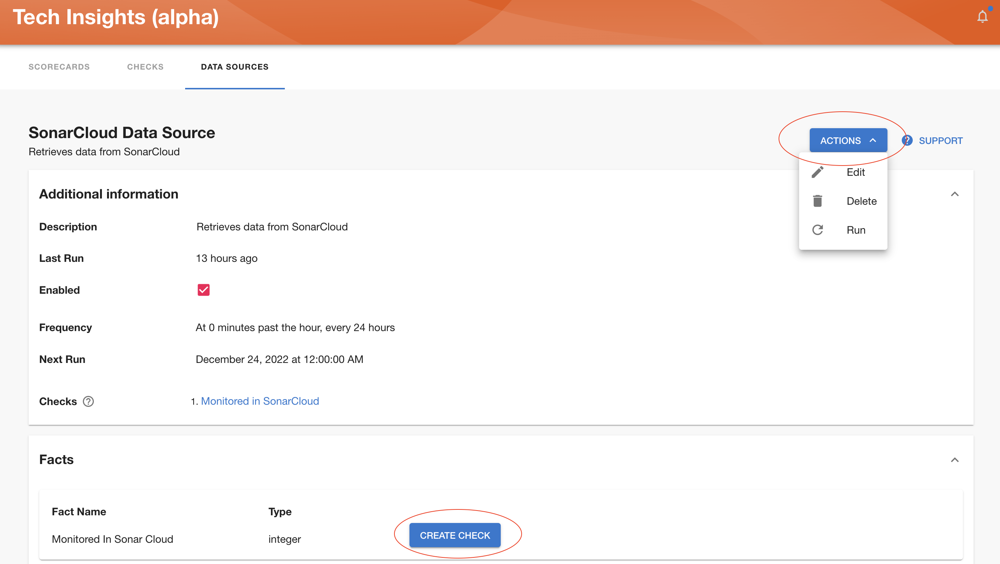
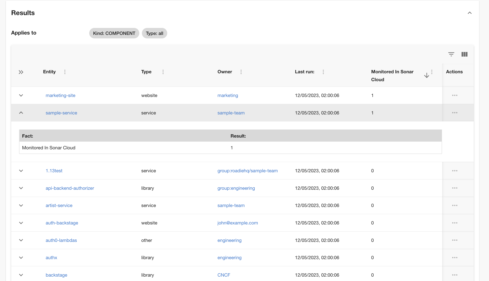

Once you have Data Sources set and running, click on the Data Source title in the Data Sources overview page, in order to access details page.

This page provides 'Actions' button, which holds actions such as 'Edit', 'Delete' and 'Run'.

In addition to these actions, you can see which facts are part of this Data Source and create checks based on those facts.

Results section holds information about each entity results for facts defined in the Data Source.

