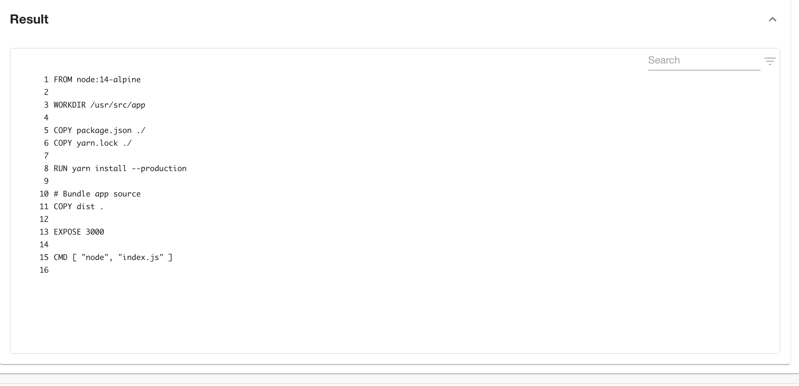
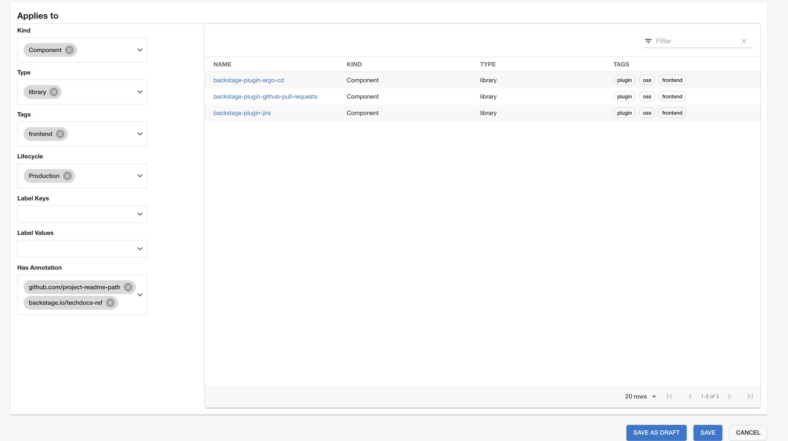

## Introduction

Data Sources periodically collect Facts about your services from third-party vendors or arbitrary APIs. The Facts collected by Data Sources are used for defining Checks. Roadie comes with a handful of built-in Data Sources with predefined Facts that you can use without any setup. You can also define your own Data Sources, which are typically APIs or files in a repository.

To manage Data Sources, go to Tech Insights → Data Sources.

### Using Built-in Data Sources

By default, Roadie includes 5 data sources for common vendors such as Datadog, Snyk, and GitHub. All built-in Data Sources have pre-defined Facts that you can use for defining your Checks.

To use built-in Data Sources, you don’t need to do any set up. Jump to the next section to learn more about Checks. Note that you can’t delete nor trigger manual data updates on built-in Data Sources.

### Defining your own Data Source

Roadie Tech Insights lets you define arbitrary Data Sources. Typically, custom Data Sources rely on pinging an API or reading a configuration file in a repository. When adding a Data Source, you’ll also specify which Facts that are extracted from said source.

To add a Data Source, click on the “Add Data Source” button in the Data Sources page.

To set up a Data Source, you’ll be prompted to define a Data Provider and define which fields will be extracted as Facts from the data. Let’s start overviewing the options available for setting up a Data Provider:

1 - You must specify a type for that new Data Source. The _HTTP_ type lets you connect to an external API to pull in data, while the _Component repository file_ type lets you extract data from a file path in the corresponding repository of a given Component in your Catalog. As an example, let’s use “_Component repository file”_.

2 - Set the path to the file you want to extract data from in repositories, starting from the root. This can be anything from JSON files to YAML files.

3 - Try out what would be the response when testing specific entity from the location you have provided. If you were to get the `package.json` from a `sample-service` component, the Data Source would get something like this:

Now that you have data, let’s define what Facts interests you. You’ll do this through the Fields Extraction.

4 - Choose a parser to extract a Fact from the data obtained before. \****For the type “*Component repository file” this* can be either JSON or RegEx parser type, while for *“HTTP”\* data provider type, only JSON is supported. \*\***Keep in mind, JSON type may be used only for JSON type of files.

JSON type of parser uses [JSONPath Plus](https://jsonpath-plus.github.io/JSONPath/docs/ts/) syntax to extract data from JSON, while RegEx type uses [ECMAScript syntax](https://developer.mozilla.org/en-US/docs/Web/JavaScript/Guide/Regular_Expressions) to extract data from text.

5 - If you’re using the JSON parser, specify a path from the root of the object. For example _“version”,_ or “_scripts.test”_. If you’re using the RegEx parser, specify a valid expression with a capture group if extracting values. Please note the RegEx does not need slashes at the start or end.

An example of RegEx parser could be if we retrieved following result from location we have provided

If we wanted to retrieve Node version we could write a following RegEx:

6 - Select the type of the parsed value.

7 - Check facts will run dry run upon data source and newly created check and let you know what would be the result if check was being run against entity you have provided as a test entity.

If you are happy with the created data source and checks you can proceed and click ‘Add fact’.

Afterwards you will be able to select kind and type of services to which data source should apply and save newly created Data source by clicking ‘Save’ button.

