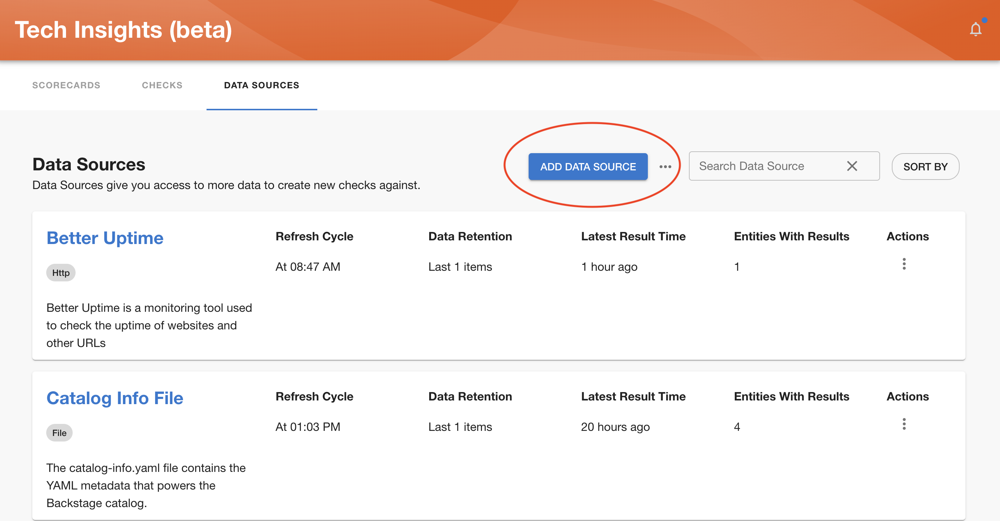
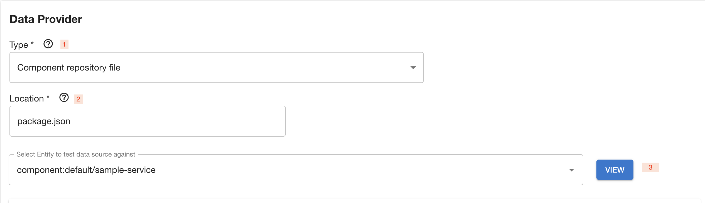
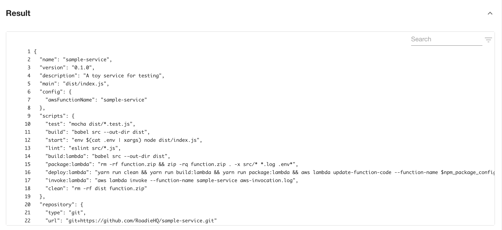
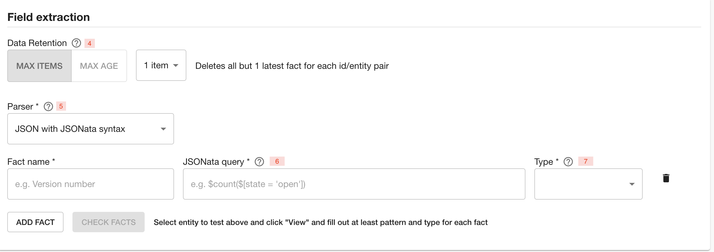
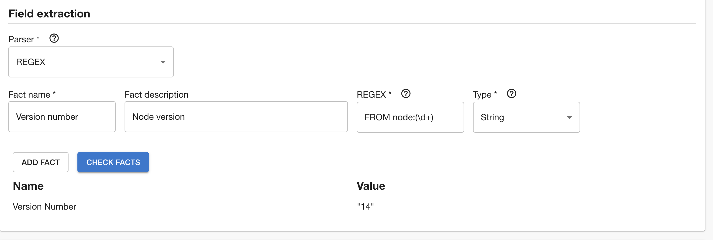
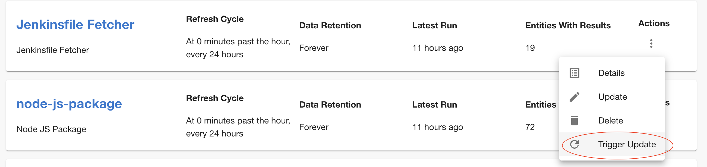

## Introduction

Data Sources periodically collect Facts about your services from third-party vendors or arbitrary APIs. The Facts collected by Data Sources are used for defining Checks. Roadie comes with a handful of built-in Data Sources with predefined Facts that you can use without any setup. You can also define your own Data Sources, which can use external APIs or files in a repository as a source of truth.

To manage Data Sources, go to Tech Insights → Data Sources.

### Using Built-in Data Sources

By default, Roadie includes several (built-in) Data Sources for common vendors such as Datadog, Snyk, and GitHub. All built-in Data Sources have pre-defined Facts you can use for defining your [Checks](../checks/).

To use built-in Data Sources, you don’t need to do any set up. Jump to the [Checks](../checks/) section to learn more about Checks.

### Defining your own Data Source

Roadie Tech Insights lets you define arbitrary Data Sources. Typically, custom Data Sources rely on calling an API or reading a configuration file in a repository. When adding a Data Source, you’ll also specify which Facts are extracted from said source.

To add a Data Source, click on the “Add Data Source” button in the Data Sources page.

To set up a Data Source, you will, firstly, need to enter general information such as name and a description. After that you will be need to define a Data Provider and which fields will be extracted as Facts from the data. Let’s start overviewing the options available for setting up a Data Provider:

1 - You must specify a type for that new Data Source. Roadie provides few different types of data provider configurations:
  1. The _HTTP_ type lets you connect to an external API to pull in data
  2. _Component repository file_ type lets you extract data from a file path in the corresponding repository of a given Component in your Catalog
  3. _Component repository directory_ type allows you to extract a list of files from the repository

2 - Set additional configuration options depending on the type of the data provider
  1. For _HTTP_ type select a proxy from the provided dropdown and append a path extension to configure the URL the HTTP call should be made. The path extension should be input without the preceding slash. 
  2. For _Component repository file_ configure the path to the file you want to extract data from in repositories, starting from the root. This can be anything from JSON files to YAML files.
  3. For _Component repository_ configure the root folder where you want to list files from. To identify the repository root, you can use `.`. 

3 - Try out what would be the response when testing specific entity from the location you have provided. If you were to get the `package.json` from a `sample-service` component, the Data Source would get something like this:

Now that you have data, let’s define what Facts interest you. You’ll do this through the Fields Extraction section.

4 - Choose a parser to extract a Fact from the data obtained before. For the type “Component repository file” this can be either JSON or Regex parser type, while for “HTTP” data provider type, only JSON is supported. Retrieved YAML files are handled as JSON. Repository directory configuration returns a single value of type Set and the only configurable options are the name and description of the field.  

JSON type of parser uses [JSONPath Plus](https://jsonpath-plus.github.io/JSONPath/docs/ts/) syntax to extract data from JSON, while Regex type uses [ECMAScript syntax](https://developer.mozilla.org/en-US/docs/Web/JavaScript/Guide/Regular_Expressions) to extract data from text.

5 - If you’re using the JSON parser, specify a path from the root of the object. For example _“version”,_ or “_scripts.test”_. If you’re using the Regex parser, specify a valid expression with a capture group if extracting values. Please note the Regex does not need slashes at the start or end.

Let's look how we would do it with an example. If we want to retrieve specific line from the following result:

If we wanted to retrieve Node version we could write the following Regex:

6 - Select the type of the parsed value.

7 - 'Check facts' button will run dry run upon data source and newly created check and let you know what would be the result if check was being run against entity you have provided as a test entity.

If you wish to add more facts you can do so by clicking ‘Add fact’.

After successfully adding a fact you will be able to select kind and type of services to which data source should apply and save newly created Data source by clicking ‘Save’ button.

You should be able to see the created Data Source in the overview screen. Newly created Data Sources have a refresh cycle set to 24hours, but you can modify this value in 'Edit' screen, as well as trigger an update manually from the kebab menu.

Note that you can’t trigger manual data updates on built-in Data Sources.

## Next steps

Now that you created the Data Source, you can define [Checks](../checks/) for that Data Source.
