## Introduction

Roadie Tech Insights lets you define arbitrary Data Sources. Typically, custom Data Sources rely on calling an API or reading a configuration file in a repository. When adding a Data Source, you’ll also specify which Facts are extracted from said source.

To add a Data Source, click on the “Add Data Source” button in the Data Sources page.

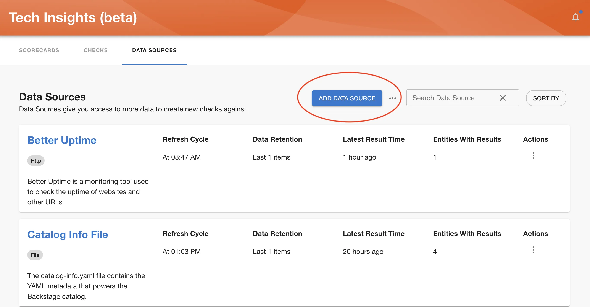

To set up a Data Source, you will, firstly, need to enter general information such as name and a description. After that you will be need to define a Data Provider and which fields will be extracted as Facts from the data. Let’s start overviewing the options available for setting up a Data Provider:

## Setting up data provider

Tech Insights supports multiple different data provider types to retrieve fact data from. You need to select an applicable source depending on what kind of data you want to create checks against. Below are descriptions of different provider types and their configuration options.

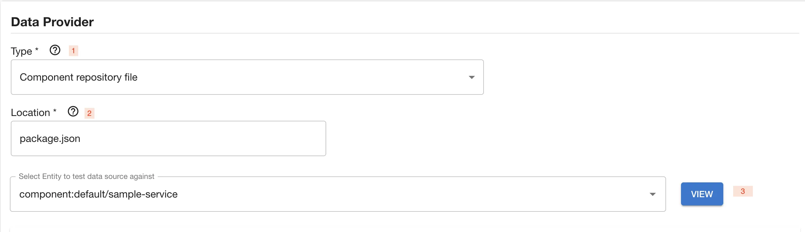

### HTTP via Proxy

For _HTTP_ type select a proxy from the provided dropdown and append a path extension to configure the URL the HTTP call should be made. The path extension should be input without the preceding slash.

This data provider provides connectivity via [Roadie proxies](/docs/custom-plugins/connectivity/proxy/) which allow you to configured URLs, headers and credentials in a secure way to reach to external endpoints.

The supported response types for HTTP data sources are JSON structures.

**Available Metadata** 

HTTP via Proxy Data Provider exposes the following metadata:

| Metadata name | description                             | Example value                            |
|---------------|-----------------------------------------|------------------------------------------|
| status        | HTTP Status code for the API call       | 200                                      |
| headers       | A dictionary of header and their values | `{ "content-type": "application/json" }` |

Example usage: 
* Get response status: `$metadata('status')`
* Get header value for content-type: `$metadata('headers.content-type')`

### GitHub API

_GitHub API_ data source uses the GitHub REST API with the installed GitHub app credentials to fetch any data not already available from the built-in GitHub Data Sources in Roadie.

**Available Metadata**

GitHub API Data Provider exposes the same metadata as HTTP via Proxy Data Provider.

### Component repository file

Component repository file provider reaches out to the source location of an entity for data. This allows you to for example retrieve individual files from the GitHub repository where your entity is located. The supported data types are JSON, YAML as well as other file types. JSON and YAML types allow for well-structured response extraction patterns, whereas other file types can be parsed using regex.

**Available Metadata**

HTTP via Proxy Data Provider exposes the following metadata:

| Metadata name | description                                            | Example values                                                                               | Note                                                                                        |
|---------------|--------------------------------------------------------|----------------------------------------------------------------------------------------------|---------------------------------------------------------------------------------------------|
| error         | Error structure containing information about the error | `{ "name": "NotFoundError", "message": "Attempted to retrieve a file which was not found" }` | The error shape is returned only if the Data Provider is unable to retrieve the wanted file |


Example usage:
* Assert that file was not found: `$metadata('error.name') = 'NotFoundError`

### Entity Definition

Entity definition returns the information on the entity as it is in the catalog. This data source provider can be used to retrieve information that could be for example stored directly in the entity manifest itself, like annotations or links.

### Component repository directory

Component repository directory allows you to retrieve a list of files that are located in the directory of the entity location. The returned data type from this provider is always a set of filenames.

### Spreadsheet

The spreadsheet data provider allows you to create facts from columnar data sources available on the internet, like Google Sheets. The provider requires an integration configured in the Roadie application to be able to access the source data. See configuration options for specific integration targets below.

<details>

<summary>Configuration options for spreadsheet data sources</summary>

#### Google Sheets

Google Sheets data source uses a secret key `GOOGLE_API_SA_KEY` to establish connectivity to Google APIs. You can configure this by generating a key.json against a Google Service Account and setting the contents of that file as a secret to Roadie application.

To use the Google Sheets API, you need a Google Cloud Platform Project with the API enabled, as well as authorization credentials. To get those, follow the steps below:

1. First open the Google Cloud Console in https://console.cloud.google.com, and create a new project.
2. Enable APIs and Services for your account
   - At the top left, click Menu ☰ > APIs and Services > Enabled APIs and Services. Then click on the + Enable APIs and Services button.
3. Create a Service Account
   - On the Credentials tab click the Create Credentials button at the top. Select Service Account in the drop-down menu.
   - Take note of the email address that is assigned to this service account
4. Create API keys for the service account
5. Navigate to the Keys tab and click on the Add Key button. Select the Create New Key option, and then the key type of JSON.
6. Navigate to your Roadie instance Administration > Settings > Secrets section and paste the contents of the JSON file as a value to `GOOGLE_API_SA_KEY` secret.

To be able to expose a specific Google Sheet to your generated Service Account keys, you can click the Share button on a specific Sheet and paste in the email address from step 3 above.

</details>

## Data Extraction

Roadie supports two main types of data extraction methods. These can be categorized into plain text via Regex parsing, and structured data parsing via JSONata. JSONata is supports parsing of JSON, YAML and XML structures.

### JSONata

JSONata is a powerful tool that allows you to do manipulation, arithmetic as well as grouping and other transformations to the returned data. You can see all applicable functions and approaches from the [JSONata documentation site](https://docs.jsonata.org/overview). Sometimes it might be useful to iterate faster by using the [JSONata online editor](https://try.jsonata.org/) to see possible transformations to the returned data.

#### JSONata extensions

Roadie provides few extension functions to standard JSONata functionality that can be used to manipulate the responses.

**$parseYaml**


If you want to parse YAML content from plain strings, for example from an API Entity's `spec.definition` field, you can use the `$parseYaml` function for that purpose. An example query could be like the following (identifying OpenAPI version):
* Data Provider Type: Entity Definition
* Fact Name: OpenAPI Spec Version
* JSONata query: `$parseYaml(spec.definition).openapi`
* Type: String

**$getEntityData**

If you want to get entity information in the JSONata context you can use the `$getEntityData` function. An example query could be like the following:
* Data Provider Type: Entity Definition, HTTP Data Source
* Fact Name: Entities part of entity
* JSONata query: `$getEntityData('relations')[type='partOf']`
* Type: JSON Object

**$metadata**

In case you want to capture status codes or headers from the received response, Roadie Tech Insights includes an extension function for JSONata parser that allows you to read _metadata_ from these responses. Metadata function is supported for a subset of Data Provider types. The supported types and their respective available metadata can be found from the individual [Data Provider](#setting-up-data-provider) section above.

The `$metadata` function takes in a **string** which points to the available metadata key. For example if you want to get metadata information about an error name which happened in a file data source, you would use the following function call `$metadata('error.name')`. Please note that the `'` (quotation) characters are necessary to be included when using this functionality. 


Below are few commonly used recipes that could be helpful.

<details>
<summary><b> Simple HTTP status response example </b></summary>

API response:

```JSON
[
  {
    "id": 1483,
    "user_id": 2977,
    "title": "Stabilis minima turpe conqueror et.",
    "due_on": "2023-01-08T00:00:00.000+05:30",
    "status": "pending"
  },
  {
    "id": 1480,
    "user_id": 2973,
    "title": "Totam bonus quos avarus corrigo annus pecto unde.",
    "due_on": "2023-01-10T00:00:00.000+05:30",
    "status": "completed"
  },
  {
    "id": 1476,
    "user_id": 2968,
    "title": "Torqueo amoveo molestiae depromo adversus texo.",
    "due_on": "2022-12-26T00:00:00.000+05:30",
    "status": "pending"
  }
]
```

Specify a path from the root of the object. For example `[0].user_id`, or `[2].status`.
For complex queries you have the default JSONata functions available. For example for the above data set the following queries would be possible:

- Amount of items with status 'pending': `$count($[status = 'pending'])`
- Amount of items with status not 'pending': `$count($[state != 'pending'])`
- Title of an item that has a user with id 2973: `$[user_id = 2973].title`
- Title of an item that has an id from the entity annotation `tech-insights/random-id-annotation`: `$[id = '{{ metadata.annotations["tech-insights/random-id-annotation"] }}'].title`

</details>

<details>
<summary><b> Mapping entities and using functions</b></summary>

This one is using Tech Insights scorecard as a data source. It is calling the Roadie API using the `/roadie` proxy with an endpoint path `tech-insights/scorecards/entity-results/:scorecardId`.

API response:

```JSON
{
  "results": [
    {
      "entity": "component:default/my-nice-entity",
      "success": 5,
      "failing": 0
    },
    {
      "entity": "component:default/my-bad-entity",
      "success": 1,
      "failing": 4
    },
    {
      "entity": "component:default/my-failure",
      "success": 0,
      "failing": 5
    }
  ]
}
```

- The number of successful checks for entity: `results.$[entity = $lowercase('{{ kind }}:{{metadata.namespace}}/{{metadata.name}}')].success`
- The number of failing checks for entity: `results.$[entity = $lowercase('{{ kind }}:{{metadata.namespace}}/{{metadata.name}}')].failing`
- The percentage of successful checks: `results.$[entity = $lowercase('{{ kind }}:{{metadata.namespace}}/{{metadata.name}}')].success / (results.$[entity = $lowercase('{{ kind }}:{{metadata.namespace}}/{{metadata.name}}')].success + results.$[entity = $lowercase('{{ kind }}:{{metadata.namespace}}/{{metadata.name}}')].failing) * 100`

</details>


### Example configuration steps

1 - You must specify a type for that new Data Source.
2 - Set additional configuration options depending on the type of the data provider

1. For _HTTP_ type select a proxy from the provided dropdown and append a path extension to configure the URL the HTTP call should be made. The path extension should be input without the preceding slash.
   1. _proxy:_ Select a proxy from the provided dropdown
   2. _path extension:_ The path to append to the proxy URL to which the HTTP call should be made. There is basic support for templating entity values into the path. E.g. `etc/{{ metadata.name }}` would insert the name of the entity. The path extension should be input without the preceding slash.
   3. _HTTP Method:_ The HTTP method to use for the request. Mostly this will be `GET` but `POST` is also supported for graphQL and other endpoints which take query params through the request body.
   4. _Body:_ For POST requests you can also send a body. Templating is also supported in the request body in the same way as above.
2. For _HTTP via Integration_ type you only need to set the _path extension_. The path to append to the base URL of the integration to which the HTTP call should be made. There is basic support for templating entity values into the path. E.g. `etc/{{ metadata.name }}` would insert the name of the entity. The path extension should be input without the preceding slash.
3. For _Component repository file_ configure the path to the file you want to extract data from in repositories, starting from the root. This can be anything from JSON files to YAML files.
4. For _Component repository_ configure the root folder where you want to list files from. To identify the repository root, you can use `.`.
5. For _Spreadsheet_, configure the provider, sheet id and a sheet range/tab name of the values you want to retrieve

3 - Try out what would be the response when testing specific entity from the location you have provided. If you were to get the `package.json` from a `sample-service` component, the Data Source would get something like this:

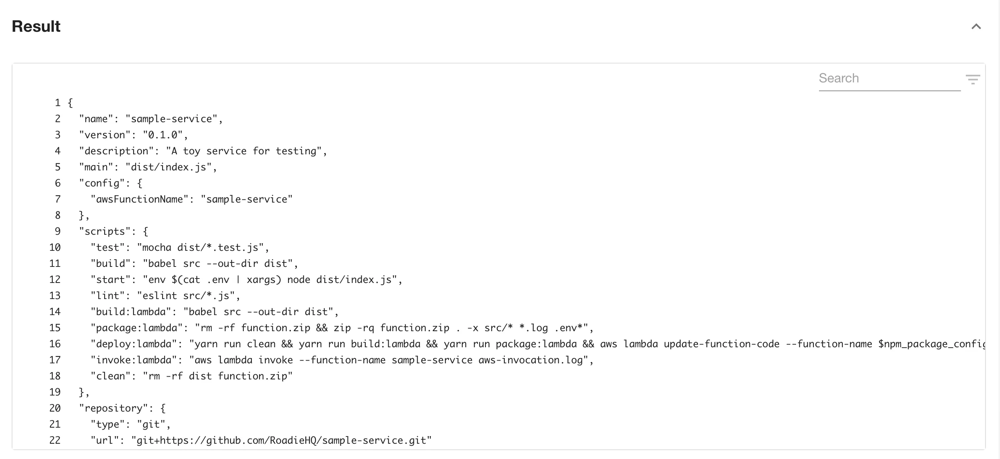

Now that you have data, let’s define what Facts interest you. You’ll do this through the Fields Extraction section.

## Fields extraction

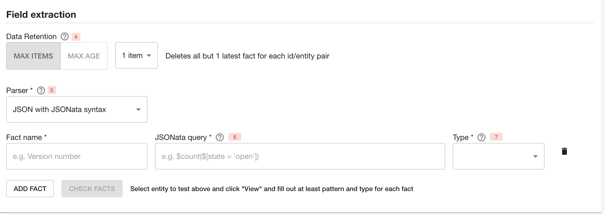

4 - Data retention refers to maximum number of items or duration on how long to keep them before they are automatically removed from the database.

5 - Choose a parser to extract a Fact from the data obtained before. For the type “Component repository file” this can be either JSON or Regex parser type, while for “HTTP” data provider type, only JSON is supported. Retrieved YAML files are handled as JSON. Repository directory configuration returns a single value of type Set and the only configurable options are the name and description of the field. For spreadsheet data provider types, all columnar configuration options are used.

JSON type of parser uses [JSONata query syntax](https://jsonata.org/) to extract data from JSON. Regex type uses [ECMAScript syntax](https://developer.mozilla.org/en-US/docs/Web/JavaScript/Guide/Regular_Expressions) to extract data from text.

6 - If you’re using the JSON parser, specify a path from the root of the object. For example _“version”,_ or “_scripts.test”_. If you’re using the Regex parser, specify a valid expression with a capture group if extracting values. Please note the Regex does not need slashes at the start or the end.

Let's look how we would do it with an example.

Using **Regex parser type** from the following result:

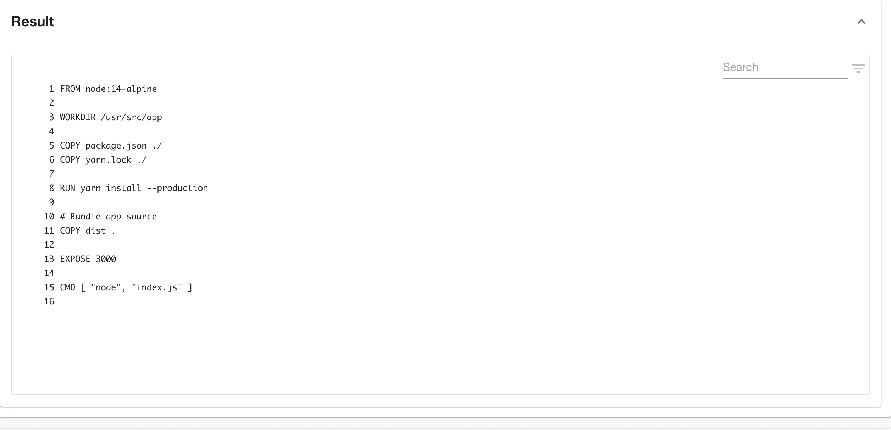

Retrieving Node version we could write the following Regex:

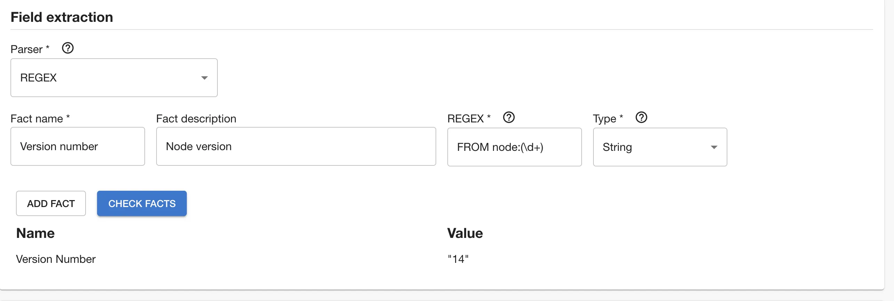

On the other hand, if you were to have the following result:
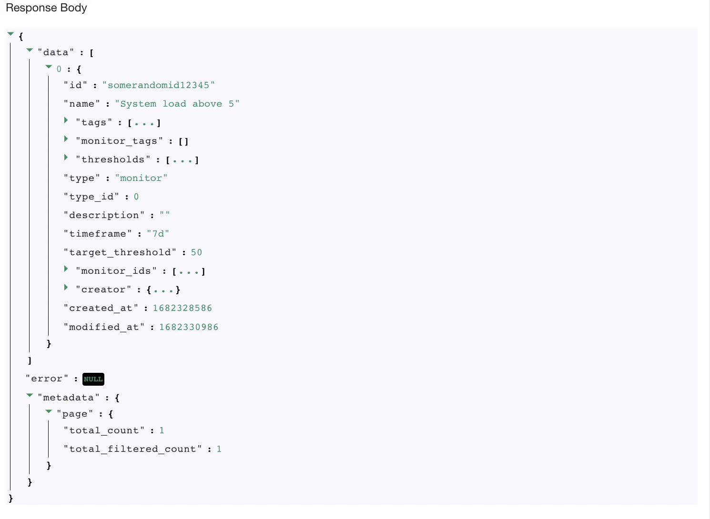

and wanted to obtain total pages number, we could use the following syntax
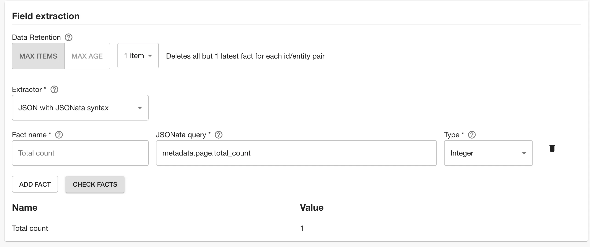

7 - Select the type of the parsed value.
Here you can select among integer, string, boolean, set and datetime types.

'Check facts' button will run dry run upon data source and newly created data source and let you know what would be the result if data source was being run against entity you have provided as a test entity.

If you wish to add more facts you can do so by clicking ‘Add fact’.

After successfully adding a fact you will be able to select kind and type of services to which data source should apply and publish newly created Data source by clicking ‘Save’ button or save a draft, if you are not ready to publish it yet, using 'Save as draft' button.

## Defining targeted entities

You can define filters to target which entities should this data source consider to collect data from.
In the Applies to section you can select which entites will be included in this data source and which entities will be excluded.

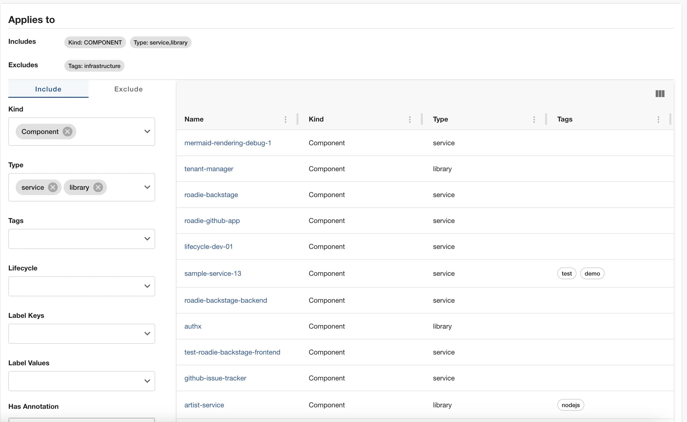

The above configuration means the data source will collect data for all components with type library and service which don't have the infrastructure tag

Providing multiple selection in a single input results in an `OR` relation between the selections.
Selecting from multiple input fields end up with a relation `AND` between the fields.

For example:
Selecting `type: service, tags: infrastructure` will exclude every entity Which has type service `AND` contains an infrastructure tag. However it won't exclude services which does not contain the tag, or components that contain only the tag but they are not services.

You should be able to see the created Data Source in the overview screen. If you decide to create a draft Data Source, you will need to publish it in order for others to see it. This can be achieved using the actions menu.

## Running the data source

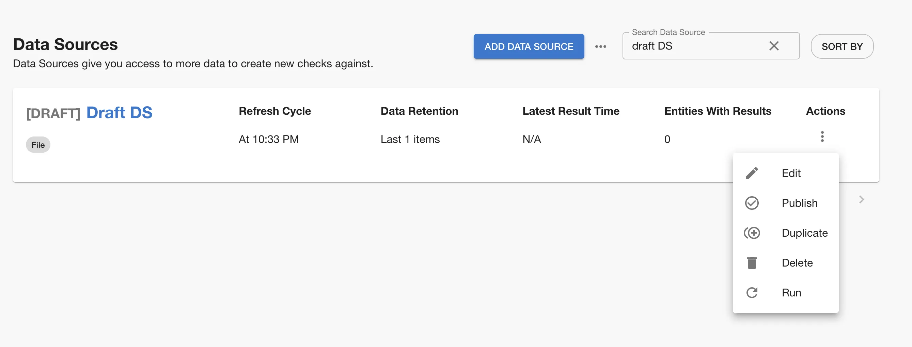

Newly created Data Sources have a refresh cycle set to 24hours, but you can modify this value in 'Edit' screen, as well as trigger an update manually from the kebab menu.

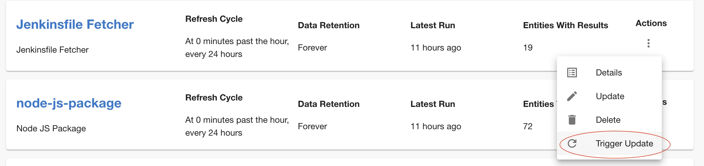

Note that you can’t trigger manual data updates on built-in Data Sources.

## Recipes

Below are few useful recipes that can be helpful when creating custom data sources.

### Proxy usage and the Broker

All Roadie HTTP Tech Insights data source are using Roadie Proxy to connect to third party services. You can configure different proxies [using these instructions](/docs/custom-plugins/connectivity/proxy/). Additionally, if you want to connect to services or endpoints within your own infrastructure, you can also use the Broker connectivity to reach your secure services. To do this, you need to first [set up the broker connection](/docs/integrations/broker/).

Since the endpoints tech insights potentially connects to via the broker are unknown to Roadie beforehand, the user needs to construct their own `accept.json` Broker configuration file to connect to internal endpoints. An example configuration file connecting to a self-hosted metrics server mocked out below.

<details>
<summary><b> A dummy example accept.json configuration </b></summary>

```JSON
{
  "private": [
    {
      "//": "Return metrics from an internal tool",
      "method": "GET",
      "path": "/api/get-my-metrics",
      "origin": "http://metrics-server.internal.our-company.com",
      "auth": {
        "scheme": "bearer",
        "token": "${MY_METRICS_SERVICE_AUTH_TOKEN}"
      }
    }
  ],
  "public": [
    {
      "//": "Get broker connection status",
      "method": "GET",
      "path": "/healthcheck"
    }
  ]
}
```

Where the secret `MY_METRICS_SERVICE_AUTH_TOKEN` is defined by an environment value within the running broker service.

</details>

You can set up the broker connection by using `/broker` proxy configuration and defining an endpoint path like `my-broker-token/api/get-my-metrics`.

With this kind of set up the Tech Insights data source engine uses a broker connection identified by `my-broker-token` and calls an endpoint `/api/get-my-metrics` via the established broker connection. This configuration matches the mock `accept.json` file seen above, meaning that the Tech Insights data source calls an internal service on internal network hosted under address `http://metrics-server.internal.our-company.com/api/get-my-metrics` and returns response from there. This response can then be mapped to more streamlined and easily usable fact data using the JSONata extractor functionality.

### Pushing facts to a Data Source

Roadie also provides and API which can be used to push data to populate Data Source facts. To be able to use this API, you need a Roadie API token and a defined Data Source which provides the _schema_ of the structure of the data to be stored. You can generate an API token from the Administration -> Account page. A Data Source can be either a built-in Data Source or one of the custom-built ones, all of them have a schema defined by default.

Each fact constructed by Roadie or pushed to Roadie needs to contain at least 4 properties of information. These properties are:

- Data Source identifier - The id of the container, and the schema provided by the container that these facts belong to
- Timestamp - The temporal value when these facts were retrieved or produced
- Entity - A reference to an entity in Roadie system that these facts are tied to
- Facts - A collection of the actual fact values that are stored

A common example to prefer a push based model to construct and provide facts is to use the internal CI pipeline to collect, construct or provide fact values that need to be stored against Roadie entities. Some such facts could be items like "Code Coverage", "CodeQL Analysis Result" or "Build Duration".

The API endpoint and documentation on expected parameters and request body shapes can be found from the [Roadie API documentation](/docs/api/techinsights/).
