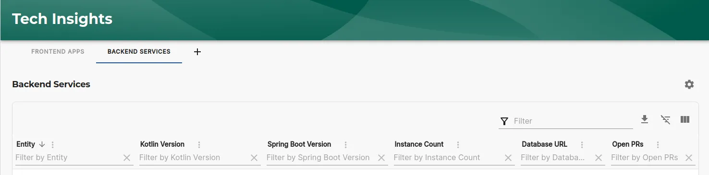
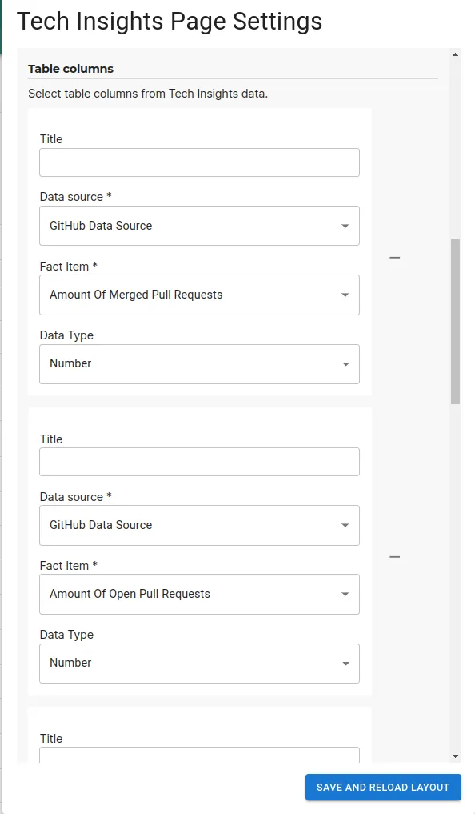
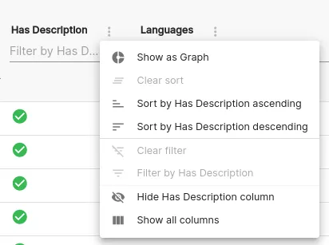
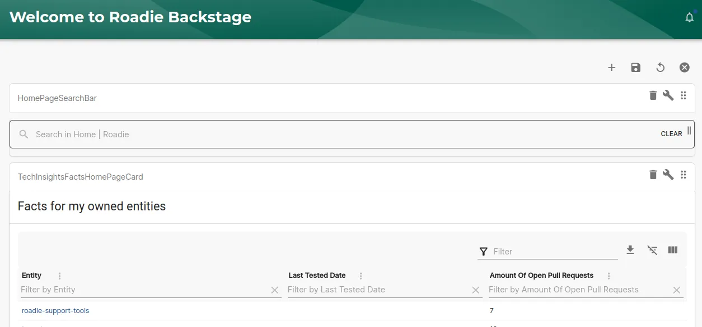
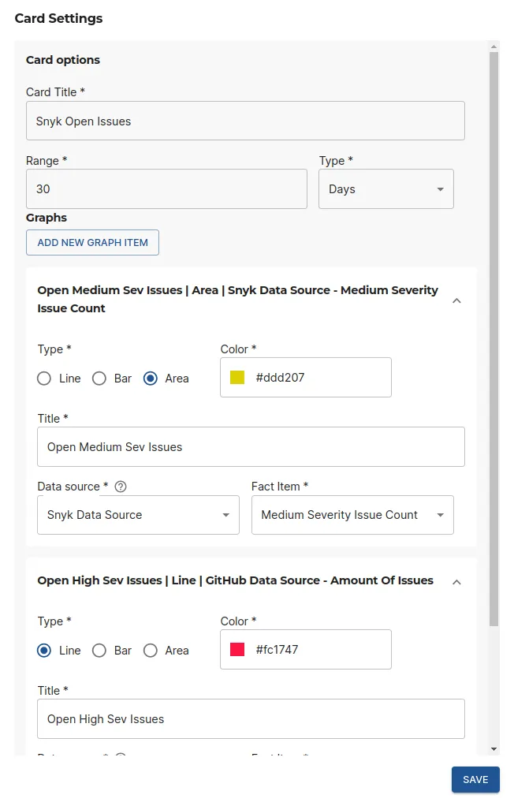
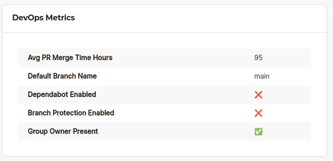
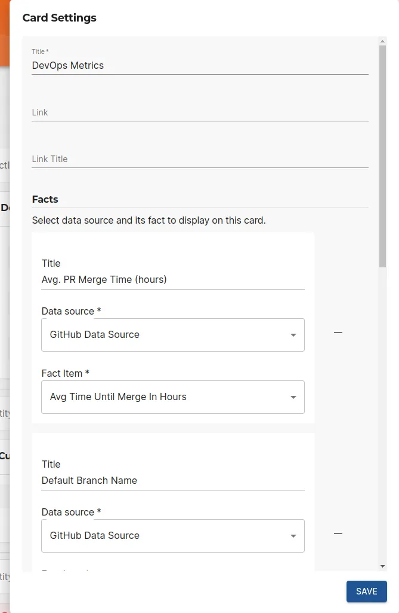

## Introduction

Tech Insights in Roadie provides the capabilities to automatically retrieve and store relevant data about your entity catalog. You can display this data in various ways within your Roadie instance to easily keep track, visualize and display important information for your entities.

## Components

Roadie provides the ability to display various views of fact data from tech insights. These range from table views to more fine-grained widgets.

### Tech Insights Fact Page

The _Tech Insights Fact Page_ allows you to create a tabular view of facts collected to the system. These facts can range across different data sources. You can also define your own entity filtering to select only the relevant entities for this specific view.

You can add the table view as a `Page` component (`TechInsightsFactPage`) into the sidebar of your application. The configuration of the component can be done on either via the JSON options provided on the page add/edit screen, or more easily from within the page itself.

The configuration options include selecting the filtering of entities to display, and wanted columns that should be added to the table.

Additionally, there is the possibility to create bar or pie charts on any column in the table by using the _kebab menu_ and selecting "Show as graph".

### Tech Insights Facts Home Page Card

The _Tech Insights Facts Home Page Card_ is a variant of the above Tech Insights page. It provides the same functionality but automatically limits the displayed entities to the ones that are owned by the current user in the application.

You can add the table view as a `Card` component (`TechInsightsFactsHomePageCard`) into the home page of your Roadie application. The configuration of the component from within the page itself, using the cog icon in the top right corner.

The configuration options for this component contain only the column selection for values to be displayed on the table.

### Fact Data Graph Card

The _Fact Data Graph Card_ allows you to display historical graph of numerical Fact values that have been gathered into the system. This allows you to follow trends on open issues or vulnerability counts or similar.

You can add the table view as a `Card` component (`FactDataGraphCard`) into the entity page of your Roadie application. The configuration of the component from within the page itself, using the cog icon in the top right corner.

The configuration of this card allows you to configure either Bar, Line or Area chart types. It lets you select the color of the graph, what data to display and what date range of data should be displayed.

### Fact Info Card

The _Fact Info Card_ allows you to display individual fact values in a card format on the entity. This lets you highlight the most relevant information and make it visible at a glance.

You can add the table view as a `Card` component (`FactInfoCard`) into the entity page of your Roadie application. The configuration of the component from within the page itself, using the cog icon in the top right corner.

The configuration options for the Fact Info Card expects you to select the facts you want displayed and additionally exposes the possibility to add a link to the card itself to let the user navigate to another location for additional information.

