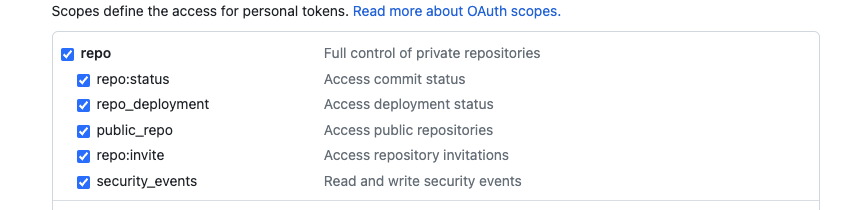
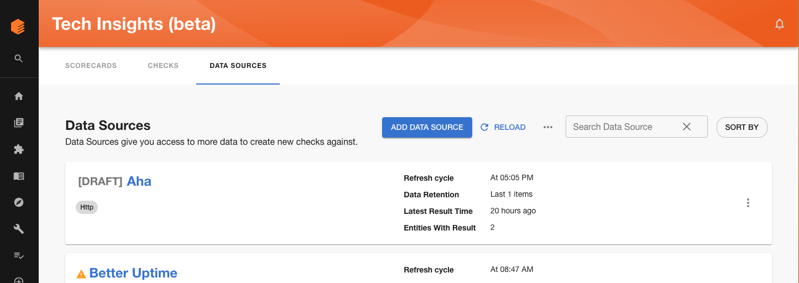
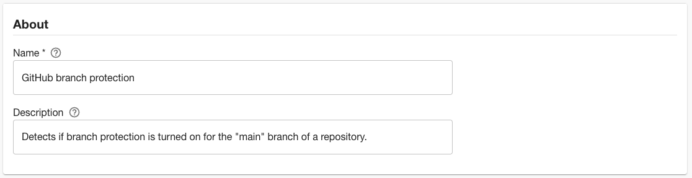
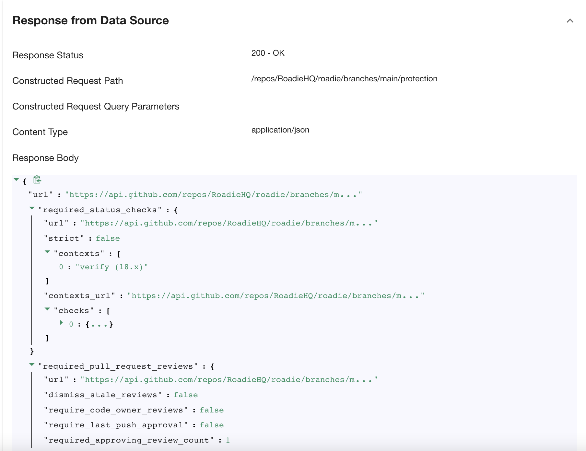
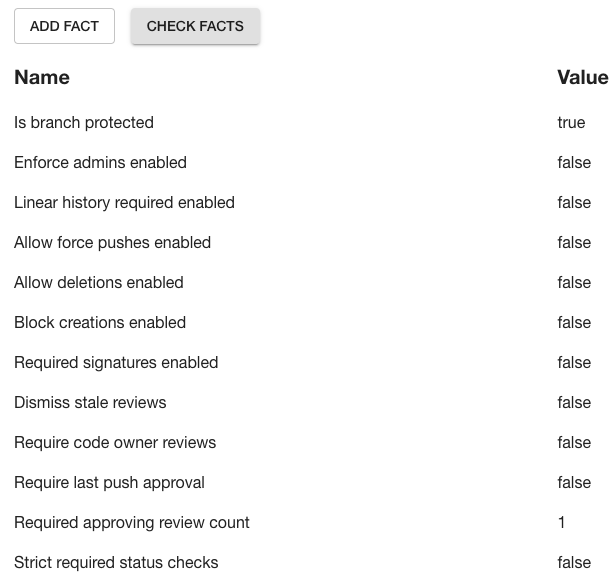
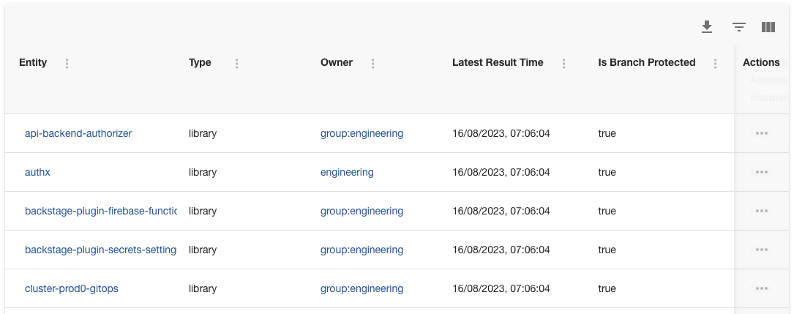
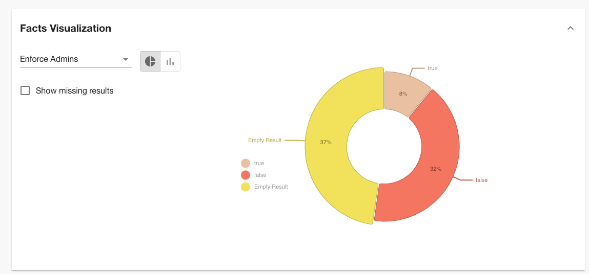

Branch protection can bring an extra layer of security to your organization by ensuring that code must be reviewed and tested before being merged. With Tech Insights, you can ensure teams are using branch protection on their software.

In this tutorial, we’re going to:

1. Automatically scan Components in the Backstage catalog and record whether or not features like branch protection and required reviews are turned on or off for their GitHub repositories.
2. Visualize the percentage of components with branch protection turned on or off.

As we go through this process, you’ll learn how to create Data Sources that interact with the GitHub APIs.

## Prerequisites

1. You must have a Personal Access Token (PAT) for GitHub set in Administration → Settings → Secrets → GITHUB_TOKEN. This PAT must have the “repo” scope enabled.

    We recommend creating the PAT on an account which has admin permissions in GitHub. Tokens associated with regular user accounts will not be able to see the branch protection settings on all repositories. [Learn how to create a PAT in the GitHub docs](https://docs.github.com/en/authentication/keeping-your-account-and-data-secure/managing-your-personal-access-tokens).
    
    

## Create a branch protection Data Source

1. Visit Tech Insights and click into the Data Sources tab. Click the ADD DATA SOURCE button to create a new data source. 

    

2. Name the Data Source “GitHub branch protection” and give it the description “Detects if branch protection is turned on for the main branch of a repository.”
    
    
    
3. In the Data Provider section, select the built-in “/github/api” proxy and enter the Path Extension
    
    ```
    repos/{{ metadata.annotations["github.com/project-slug"] }}/branches/main/protection
    ```
    
4. In the input labelled “Select Entity to test data source against”, choose an Entity in the catalog that has the `github.com/project-slug` annotation set, and has branch protection turned on for the repository the annotation points at. Click the VIEW button and you should see a response from the GitHub API.
    
    
    
5. In the field extraction box, fill out the inputs with the following values.
    
    
    | Fact name | JSONata query | Type |
    | --- | --- | --- |
    | Is branch protected | $exists(url) | Boolean |
    | Enforce admins enabled | enforce_admins.enabled | Boolean |
    | Linear history required enabled | required_linear_history.enabled | Boolean |
    | Allow force pushes enabled | allow_force_pushes.enabled | Boolean |
    | Allow deletions enabled | allow_deletions.enabled | Boolean |
    | Block creations enabled | block_creations.enabled | Boolean |
    | Required signatures enabled | required_signatures.enabled | Boolean |
    | Dismiss stale reviews | required_pull_request_reviews.dismiss_stale_reviews | Boolean |
    | Require code owner reviews | required_pull_request_reviews.require_code_owner_reviews | Boolean |
    | Require last push approval | required_pull_request_reviews.require_last_push_approval | Boolean |
    | Required approving review count | required_pull_request_reviews.required_approving_review_count | Integer |
    | Strict required status checks | required_status_checks.strict | Boolean |

6. Click the CHECK FACTS button and you should see that the facts are successfully extracted from the test response.
    
    
    
7. In the “Applies to” section, set the following filters:
    
    
    | Type | Component |
    | --- | --- |
    | Lifecycle | Production |
    | Has Annotation | github.com/project-slug |

8. Save the Data Source. After a minute or two, you should see results start to come in.
    
    
    

## Visualise the percentage of Components with branch protection

Roadie Data Sources comes with a built-in visualisation panel which lets us get an overview of the Dockerfile base image versions being used. When viewing a Data Source, expand the “Facts visualization” section to see it.



This chart tells us that 81% of Components have branch protection turned on in their repositories.
