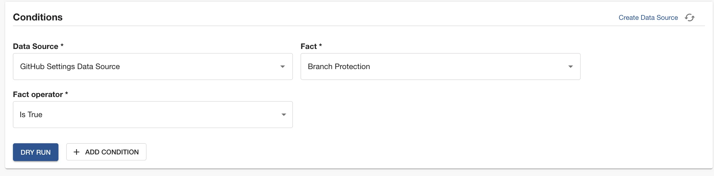

Branch protection can bring an extra layer of security to your organization by ensuring that code must be reviewed and tested before being merged. With Tech Insights, you can ensure teams are using branch protection on their software.

Roadie automatically collects this information and you can view reports or create checks about that data.
In this tutorial, we’re going to:

1. Learn how to create a check which requires GitHub repositories associated with component entities to have branch protection
2. visualize data within an existing Data Source.

## Prerequisites

1. You must have [installed the Roadie GitHub App](../../getting-started/adding-a-catalog-item/).

## Create a branch protection check

1. Visit Tech Insights and click into the Checks tab. Click the ADD CHECK button to create a new check.

   

2. In the About section, name the Check “Require branch protection”. Give it the description such as “Require branch protection to be set on GitHub Repos associated with components.”

3. In the Conditions section, set the check condition to the following values:

   | Input name    | Value                       |
   | ------------- | --------------------------- |
   | Data Source   | GitHub Settings Data Source |
   | Fact          | Branch Protection           |
   | Fact operator | Is True                     |

We now have a condition which passes when a Component has branch protection enabled on the default branch.

You can use the “DRY RUN” button to test these conditions against some Components in your catalog to ensure that they operate in the way you would expect and return the correct pass or fail result.

7. Use the filters to target this check at appropriate Components. For example, you might only want to target components with lifecycle "production".
8. Save the check by clicking “SAVE”. If you’re not quite ready to go live yet, you can use the “SAVE AS DRAFT” button to save the check but ensure only admins can see it.

## Visualise the percentage of Components with branch protection

In order to view the data, you can click Tech Insights > Data Sources > GitHub Settings Data Source

You can then expand the "Fact Visualization" section and select the item that you want to view across your GitHub repositories.

This chart tells us that 81% of Components have branch protection turned on in their repositories.
