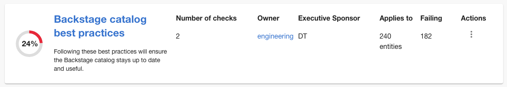
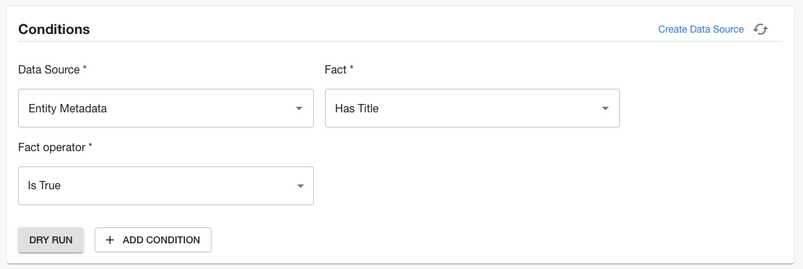
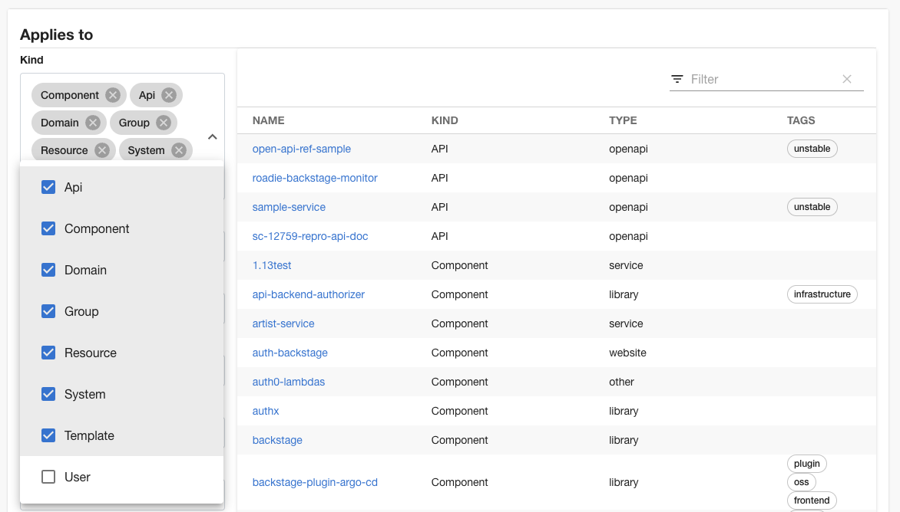
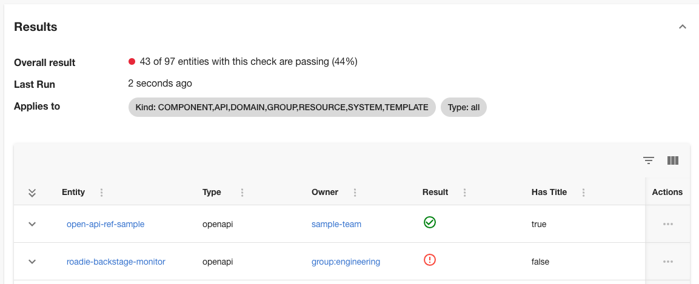

Tech Insights can help to ensure that teams are using the Backstage catalog correctly and getting
the most from it. For example, you may want to ensure that the `metadata.title` is filled in
and that descriptions are being used.



This tutorial explains how to use Tech Insights to help people use Backstage in a sensible way.

## Ensure mandatory Backstage metadata is set

Optional Backstage metadata such as `metadata.title` and `metadata.description` can be quite useful to users of the Backstage catalog.
These values help to make the catalog informative and easy to use. You can use Tech Insights to find components which are not using all Backstage metadata attributes.

```yaml
apiVersion: backstage.io/v1alpha1
kind: Component
metadata:
  name: sample-service
  title: Sample Service # optional but useful
  description: A service for testing Backstage functionality. # optional but useful
spec:
  type: service
  owner: sample-team
  lifecycle: production
```

### Create a check for the metadata title

To find services which are missing the title metadata, create a check that uses the built-in Entity Metadata data source:

| Field | Input |
| --- | --- |
| Name | Ensure titles are present on Backstage entities |
| Description | A title is a human readable name for a Backstage entity. |
| Data source | Entity Metadata |
| Fact | Has Title |
| Fact operator | Is True |



This check makes sense for most entity kinds, so let's apply it to Components, APIs, Domains, Groups, Resources, Systems and Templates.



Save this check, and results should appear. Refresh the page if you don't see any results.



### Create a check for the metadata description

To find services which are missing the description metadata, create another check that uses the built-in Entity Metadata data source:

| Field | Input |
| --- | --- |
| Name | Ensure descriptions are present on Backstage entities |
| Description | A descriptions is a human readable explanation of a Backstage entity. |
| Data source | Entity Metadata |
| Fact | Has Description |
| Fact operator | Is True |

Like the title check, this check makes sense for most entity kinds, so let's apply it all kinds except User.

Visit the checks list page and you should now see the two checks you created.


