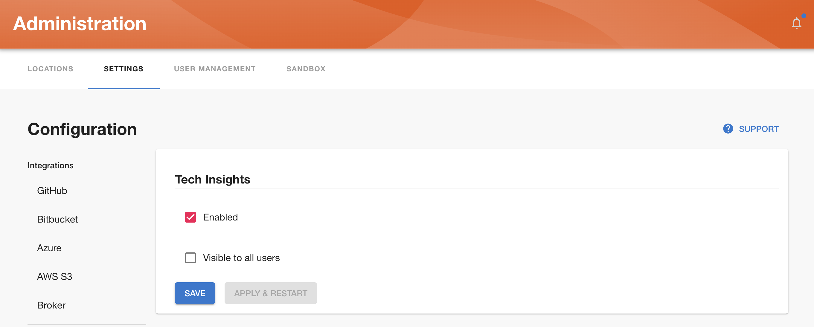

## Introduction

Roadie Tech Insights helps you keep track of all of your software assets and make sure they meet your quality and compliance targets.

Roadie Tech Insights lets you to create Scorecards to track what matters to you about your assets in the Backstage catalog. It does this by ingesting data via Data Sources, and then aggregating Checks on that data.

Therefore, in order to create Scorecards, you will need to add Data Sources and define Checks on such data**.** Roadie provides a UI interface to build all three of these, this page describes how to set each one of them.

## Prerequisites

- Roadie Tech Insights is a paid add-on. If you are not sure about whether or not you have it or would like to include it, please reach out to our sales team.
- You must be an administrator for your Roadie instance to enable and manage Tech Insights.

## Enable Roadie Tech Insights

To enable Roadie Tech Insights, go to Administration → Settings → Plugins → Tech Insights, or navigate to `https://[organisation]/administration/settings/tech-insights` and tick the enabled box as shown below:

Once Roadie Tech Insights is enabled, you’ll find a link in the sidebar as below:

In the Tech Insights page, you’ll be able to create Data Sources, define Check for your Data Sources, and compose Scorecards with said Checks.
