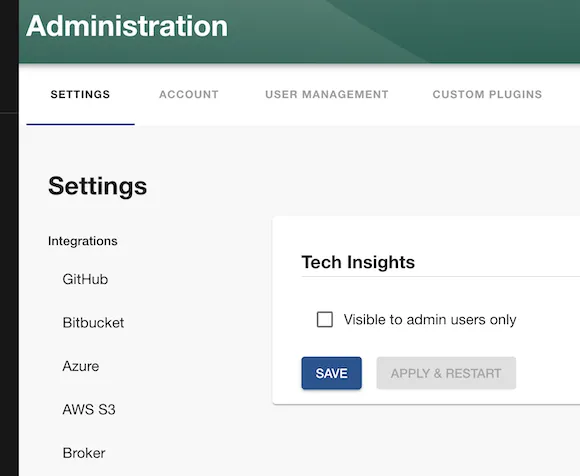

Roadie Tech Insights helps you keep track of all of your software assets and make sure they meet your quality and compliance targets.

You can create Scorecards to track the things that matter about your assets in the Backstage catalog. This is done by ingesting Fact data via various Data Sources, and then aggregating Checks on those Facts.

Therefore, in order to create [Scorecards](../scorecards/index.md), you will need to add [Data Sources](../data-sources/index.md) and define [Checks](../checks//index.md) on such data. Roadie provides a user interface to build all three of these, this page describes how to set each one of them.

## Prerequisites

- Roadie Tech Insights is a paid add-on. If you are not sure about whether or not you have it or would like to include it, please reach out to our sales team.
- You must be an administrator for your Roadie instance to enable and manage Tech Insights. See [access section](#users-access) for more details.

## Read Only Access

By default, all users will be able to see but not edit Tech Insights content.

If you want to hide Tech Insights for non-admin users such as when initially setting it up, you can check 'Admins only' checkbox under Administration → Settings → Plugins → Tech Insights page. This will remove Tech Insights from the sidebar for anyone does not have the permission to administrate tech insights.

## Write Access

Anyone who is assigned the `tech-insights-admin` role in Roadie will have write access to Tech Insights.

## Disabling Roadie Tech Insights

To disable Roadie Tech Insights and remove it from your sidebar, please reach out to Roadie support.

## First steps

You will first want to see what data is available to use already and see how to pull in custom data sets via [Data Sources](../data-sources/). Then you can define [Checks](../checks/) for your Data Sources, and compose [Scorecards](../scorecards/) with the Checks.
