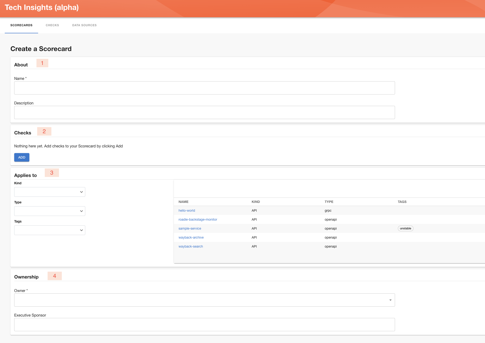
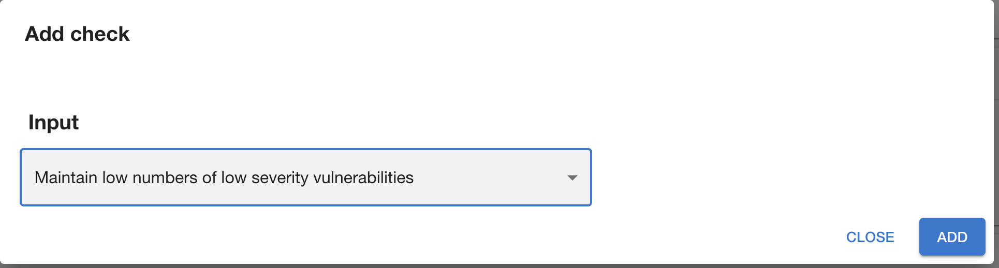
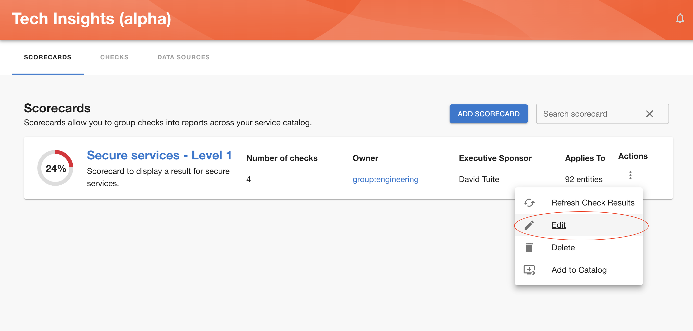

## Adding a Scorecard

Once you click the “Add Scorecard” button, you’ll be prompted to fill in the details about the Scorecard, including the Checks you want to include and to which entities to apply it to, as shown below:

1 - General information about scorecard (Name and Description).

2 - Checks you wish to include in the scorecard. Clicking ‘Add’ button will lead to opening the dialog.

Within the dialog you select all the checks you want to include. In case you want to add or remove some of the checks later you can do it later ‘Edit’ functionality.

3 - Select which kind and type of components this scorecard applies to.

4 - Owner which can be either a user or a group.

Once you are happy with the created scorecard, save it and you should be able to see it in overview screen.

Same as for the [Data Source](../data-sources/) [Checks](../checks/), you can save a scorecard as a draft until you are completely happy with it and certaing you want to publish it. 

** Note that publishing a draft scorecard will publish all draft Checks and Data Source it is based on.**

