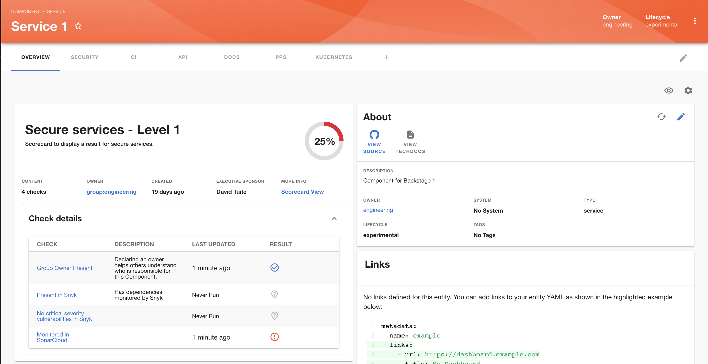

# Managing Scorecards

Scorecards are collections of multiple Checks, which may come from different Data Sources.

In order to manage Scorecards, go to Tech Insights → Scorecards page.

In this page you will get an overview of all existing Scorecards, but also have an ability of creating new Scorecards as well as adding them to the Catalog page, so they’re visible to your team.

Clicking the title of the scorecard will lead to scorecard results in Backstage catalog components.

### Adding a Scorecard

Once you click the “Add Scorecard” button, you’ll be prompted to fill in the details about the Scorecard, including the Checks you want to include and to which entities to apply it to, as shown below:

1 - General information about scorecard (Name and Description).

2 - Checks you wish to include in the scorecard. Clicking ‘Add’ button will lead to opening the dialog.

Within the dialog you select all the checks you want to include. In case you want to add or remove some of the checks later you can do it later ‘Edit’ functionality.

3 - Select which kind and type of components this scorecard applies to.

4 - Owner which can be either a user or a group.

Once you are happy with the created scorecard, save it and you should be able to see it in overview screen.

### Adding a Scorecard to the Catalog

In order to show a Scorecard in the Catalog Entity page, as shown below, you’ll have to define it from the Tech Insights → Scorecards page.

Once you’re in Tech Insights → Scorecards, find a Scorecard you wish to add. From kebab menu select ‘Add to Catalog’

Then select option which best applies to your use case.

Scorecard should now be visible under the layout page you have selected.
