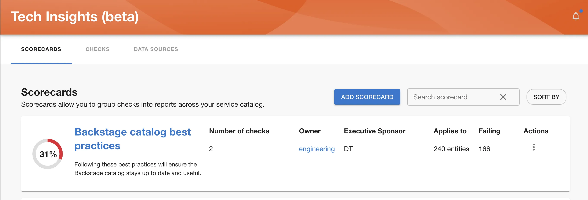
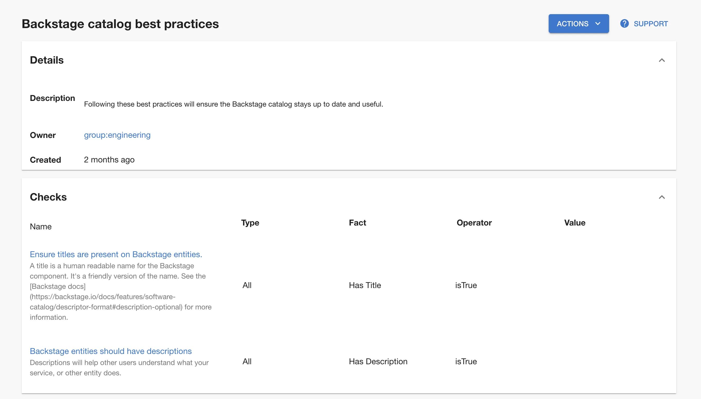
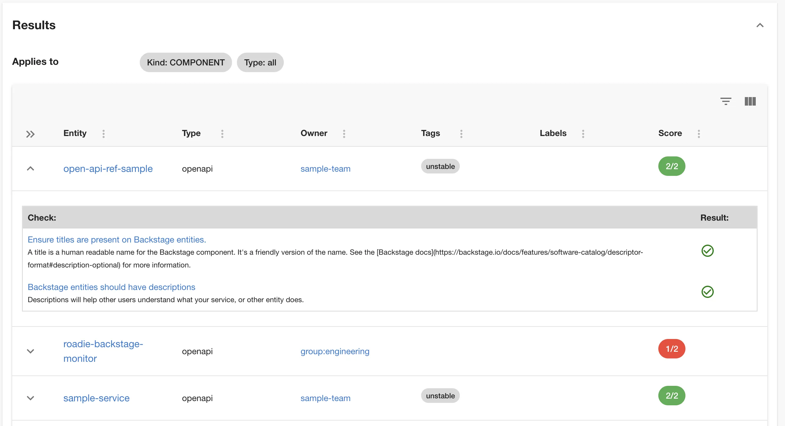

Scorecards are collections of multiple Checks, which may come from different Data Sources.

In order to manage Scorecards, go to Tech Insights → Scorecards page.

In this page you will get an overview of all existing Scorecards, but also have an ability of creating new Scorecards as well as adding them to the Catalog page, so they’re visible to your team.

Clicking the title of the scorecard will lead to scorecard details and results for catalog components.

