TODO: Add intro.

With Roadie’s Tech Insights feature, there’s an easier way. In this tutorial, we’re going to:

1. 

As we go through this process, you’ll learn:

1. How to create Data Sources, Checks and Scorecards with Tech Insights.
2. How to parse files with JSONata in Roadie and extract facts from 

Let’s get started.

## Record the Codecov Reposotory Coverage

TODO: Add sentence explaining what is happening.

### Data Source

1. Visit Tech Insights, select the **Data Sources** tab, and press **ADD DATA SOURCE**.

   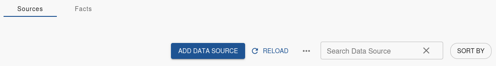

2. Enter a descriptive **Name** and **Description**.

   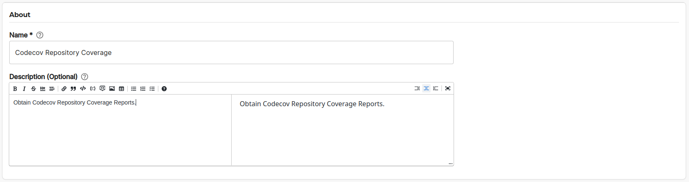

3. Set the Data Provider **Type** to `HTTP`, **Proxy** to `/codecov`, **Path Extension** to `graphql`, **HTTP Method** to `GET`, and **Path Extension** to `github/{{ metadata.annotations['github.com/owner'] }}/repos/{{ metadata.annotations['github.com/repo'] }}`

    Select a value for **Select Entity to test data source against** and press **TEST**.

    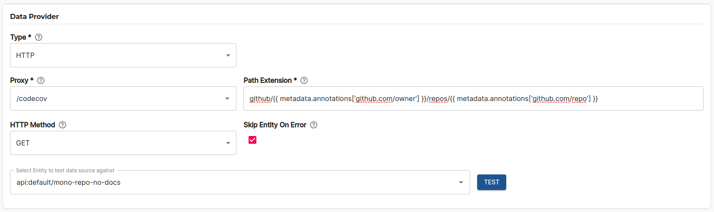

4. Test results are displayed.

    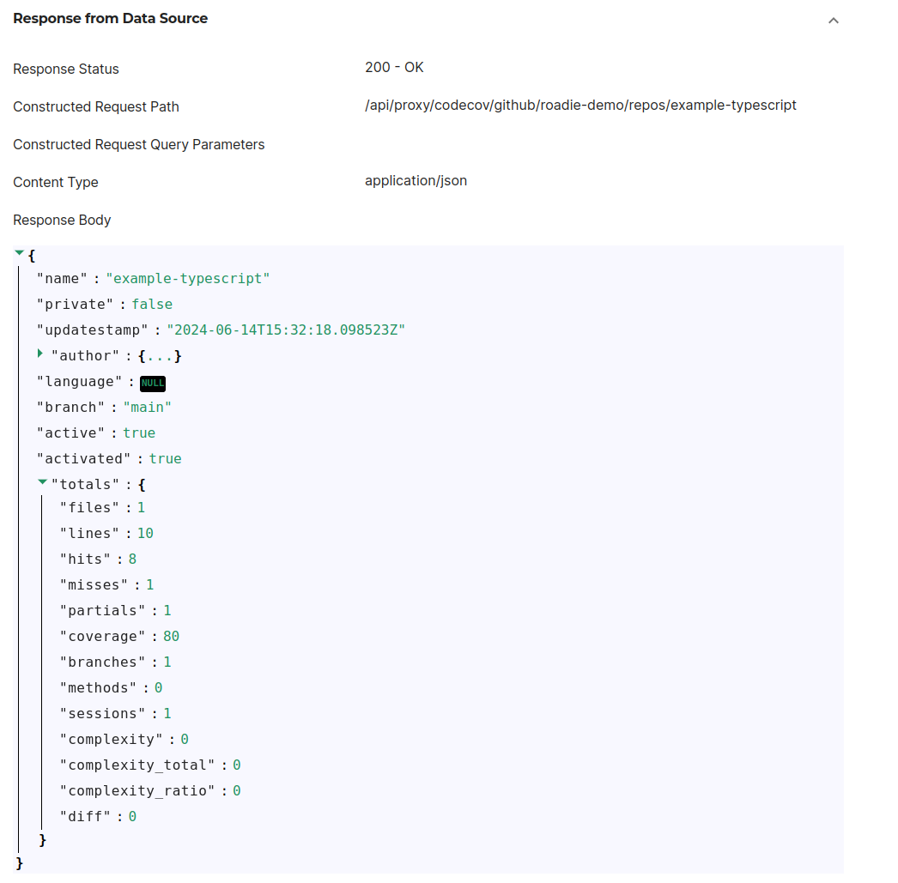

5. Create multiple Facts:
    1. Set **Extractor** to `JSON with JSONata syntax`.
    2. Set the first Fact to:
        | Field Name | Value |
        | --- | --- |
        | Fact Name | Coverage |
        | JSONata query | `$.totals.coverage` |
        | Type | Number |
    3. Set the second Fact to:
        | Field Name | Value |
        | --- | --- |
        | Fact Name | Active |
        | JSONata query | `$.active` |
        | Type | Boolean |
    4. Set the third Fact to:
        | Field Name | Value |
        | --- | --- |
        | Fact Name | Activated |
        | JSONata query | `$.activated` |
        | Type | Boolean |

    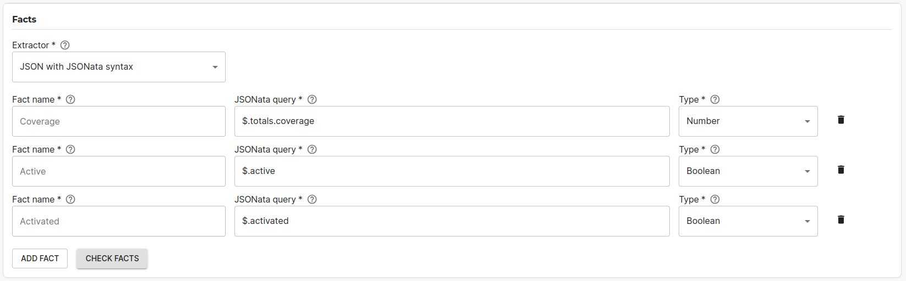

6. Press **CHECK FACTS**.

    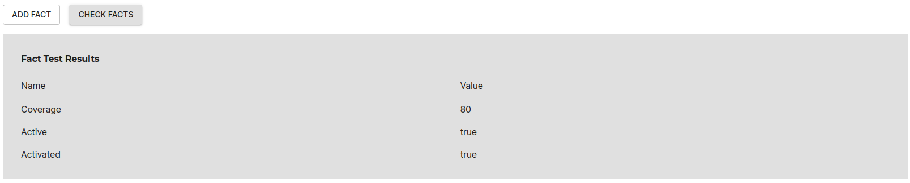

7. Use the **Applies to** filter to target this data source at some components which you expect to have Node.js. We recommend starting with a highly targeted filter for initial experimentation and iteration. You can widen the filter later to capture more results.  

    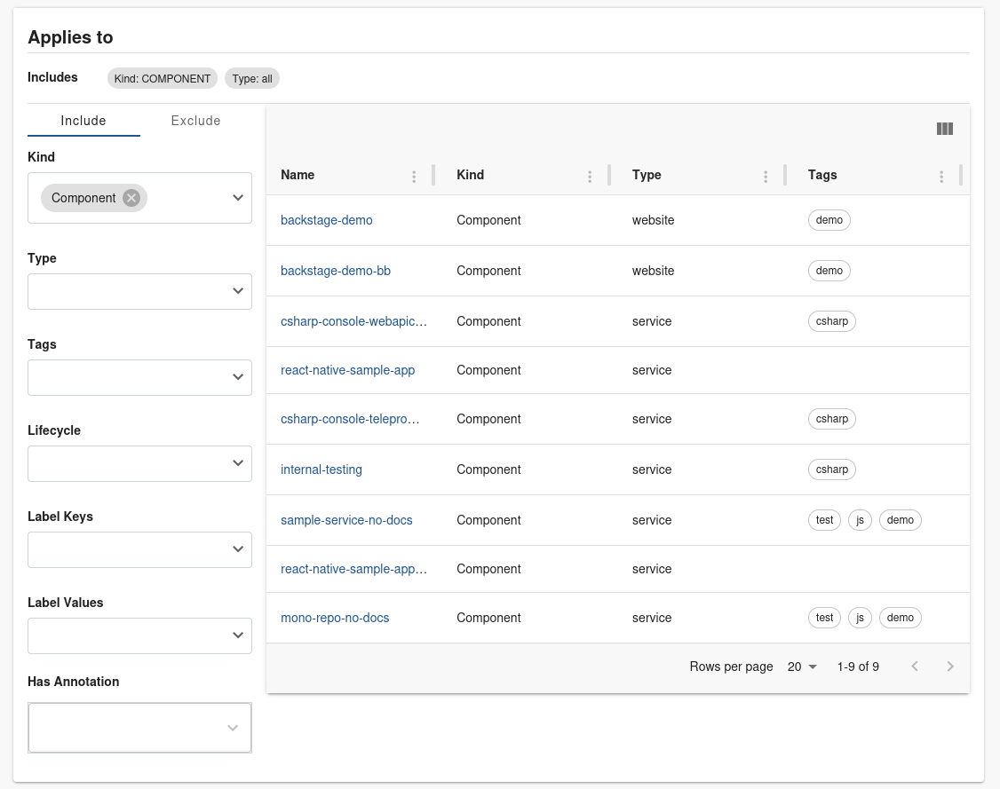

8. Press **SAVE**.

## Create a check that shows Code Coverage is Defined

We have a data source telling us what the coverage is, as well as if it is active and activated, let's create a check to further report.

### Create a Check

1. Visit Tech Insights, select the **Checks** tab, and press **ADD CHECK**.

    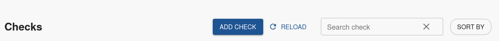

2. Enter a descriptive **Name** and **Description**.

   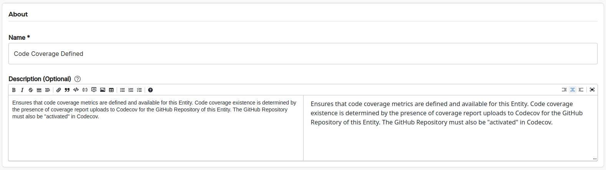

3. Create a check:
    1. Set the first condition to:
        | Field Name | Value |
        | --- | --- |
        | Data Source | Codecov Repository Coverage |
        | Fact | Active |
        | Fact operator | Is True |
    1. Set the second condition to:
        | Field Name | Value |
        | --- | --- |
        | Data Source | Codecov Repository Coverage |
        | Fact | Activated |
        | Fact operator | Is True |

    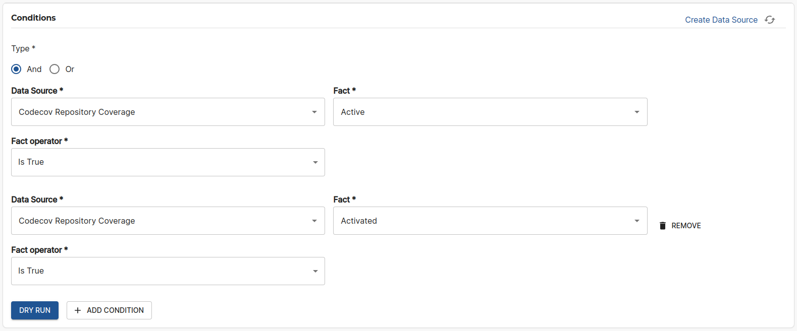

4. Press **DRY RUN**

5. (Optional) Add a URL to documentation outlining the steps to resolve the Codecov configuration.

    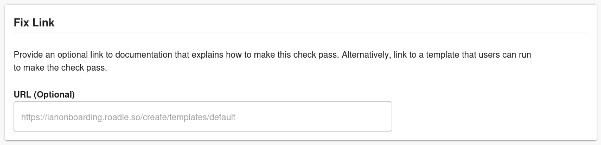

6. Use the **Applies to** filter to target this data source at some components which you expect to have Node.js. We recommend starting with a highly targeted filter for initial experimentation and iteration. You can widen the filter later to capture more results. 

    

7. Press **SAVE**.

### Check Results

The results of this check tell us who we need to reach out to ensure Codecov is configured.

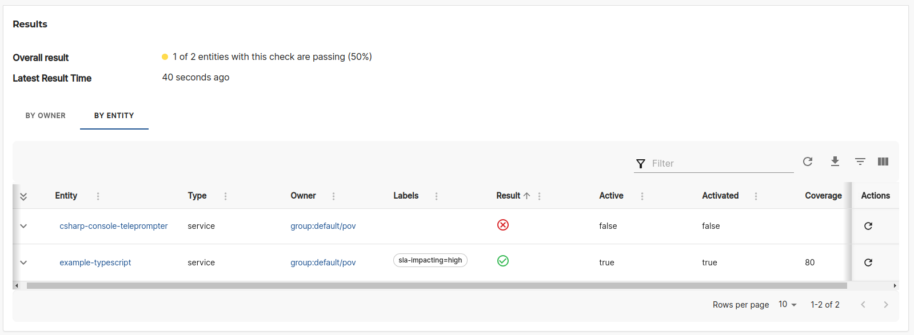

- The `csharp-console-teleprompter` service fails the checks.

Since we already know the owners of these components, it’s easy to reach out and ask them to configure Codecov for their catalog entity.

## Create a Scorecard