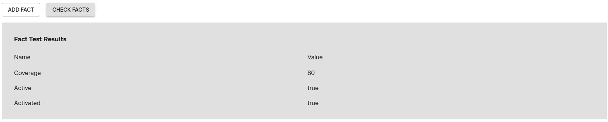

<iframe src="https://www.loom.com/embed/0cdc0a9fbd3d4ae6b22fb324ca801fe5?sid=aedeab6b-25b4-4d06-bd93-ecd00ba38784" frameborder="0" webkitallowfullscreen mozallowfullscreen allowfullscreen style="position: absolute; top: 0; left: 0; width: 100%; height: 100%;"></iframe>

Tracking the code coverage information for catalog entities is crucial in ensuring the software is secure and compliant. It can be difficult to know which components have coverage activated and are meeting minimum standards.

With Roadie’s Tech Insights feature, there’s an easier way. In this tutorial, we’re going to:

1. Automatically scan Components in the Backstage catalog and record which components have Codecov activated, active, and their % of coverage.
1. Create a check that can tell us which software is active and activated.
1. Create a check that can tell us which software is meeting minimum code coverage threshold of 80%.

As we go through this process, you’ll learn:

1. How to create Data Sources, Checks and Scorecards with Tech Insights.
2. How to parse files with JSONata in Roadie and extract facts from the Codecov `Repository Detail` API endpoint.
3. How to detect which catalog entities have code coverage active, activated, and their coverage %.

Let’s get started.

## Prerequisite

### Code Coverage Tool Proxy Configuration

1. A Proxy connection to your code coverage tool of choice must be configured prior to creating the data source to obtain results. In this tutorial, we will be using Codecov.

   

## Record the Codecov Reposotory Coverage

So that we can track our catalog entity code coverage, we must obtain information related to the status (active and activated) and coverage %. We will do this by creating a Data Source to pull the information from Codecov for each entity.

### Data Source

1. Visit Tech Insights, select the **Data Sources** tab, and press **ADD DATA SOURCE**.

   

2. Enter a descriptive **Name** and **Description**.

   

3. Set the Data Provider to:
   | Field Name | Value |
   | --- | --- |
   | Type | HTTP |
   | Proxy | /codecov |
   | Path Extension | `github/{{ metadata.annotations['github.com/owner'] }}/repos/{{ metadata.annotations['github.com/repo'] }}` |
   | HTTP Method | GET |

   Select a value for **Select Entity to test data source against** and press **TEST**.

   

4. Test results are displayed.

   

5. Create multiple Facts:

   1. Set **Extractor** to `JSON with JSONata syntax`.
   2. Set the first Fact to:
      | Field Name | Value |
      | --- | --- |
      | Fact Name | Coverage |
      | JSONata query | `$.totals.coverage` |
      | Type | Number |
   3. Set the second Fact to:
      | Field Name | Value |
      | --- | --- |
      | Fact Name | Active |
      | JSONata query | `$.active` |
      | Type | Boolean |
   4. Set the third Fact to:
      | Field Name | Value |
      | --- | --- |
      | Fact Name | Activated |
      | JSONata query | `$.activated` |
      | Type | Boolean |

   

6. Press **CHECK FACTS**.

   

7. Use the **Applies to** filter to target this data source at some components which you expect to have Node.js. We recommend starting with a highly targeted filter for initial experimentation and iteration. You can widen the filter later to capture more results.

   

8. Press **SAVE**.

## Create a Check that Shows Code Coverage is Defined

We have a data source providing Active and Activated, let's create a check to report which entities are defined.

### Create a Check

1. Visit Tech Insights, select the **Checks** tab, and press **ADD CHECK**.

   

2. Enter a descriptive **Name** and **Description**.

   

3. Create a check:

   1. Set the first condition to:
      | Field Name | Value |
      | --- | --- |
      | Data Source | Codecov Repository Coverage |
      | Fact | Active |
      | Fact operator | Is True |
   1. Set the second condition to:
      | Field Name | Value |
      | --- | --- |
      | Data Source | Codecov Repository Coverage |
      | Fact | Activated |
      | Fact operator | Is True |

   

4. Press **DRY RUN**

5. (Optional) Add a URL to documentation outlining the steps to resolve the Codecov configuration.

   

6. Use the **Applies to** filter to target this data source at some components which you expect to have Code Coverage configured. We recommend starting with a highly targeted filter for initial experimentation and iteration. You can widen the filter later to capture more results.

   

7. Press **SAVE**.

### Check Results

The results of this check tell us who we need to reach out to ensure Codecov is configured.

- The `csharp-console-teleprompter` service fails the checks.

Since we already know the owners of these components, it’s easy to reach out and ask them to configure Codecov for their catalog entity.

## Create a Check that shows Minimum Code Coverage Threshold is Met

We have a data source telling us what the coverage is, let's create a check to ensure minimum coverage is met.

### Create a Check

1. Visit Tech Insights, select the **Checks** tab, and press **ADD CHECK**.

   

2. Enter a descriptive **Name** and **Description**.

   

3. Create a check:

   1. Set the first condition to:
      | Field Name | Value |
      | --- | --- |
      | Data Source | Codecov Repository Coverage |
      | Fact | Coverage |
      | Fact operator | Greater than inclusive |
      | Value | 80 |

   

4. Press **DRY RUN**

5. (Optional) Add a URL to documentation outlining the steps to resolve the Codecov configuration.

   

6. Use the **Applies to** filter to target this data source at some components which you expect to have Code Coverage configured. We recommend starting with a highly targeted filter for initial experimentation and iteration. You can widen the filter later to capture more results.

   

7. Press **SAVE**.

### Check Results

The results of this check tell us who we need to reach out to ensure Codecov is configured.

- The `csharp-console-teleprompter` service fails the checks.

Since we already know the owners of these components, it’s easy to reach out and ask them to configure Codecov for their catalog entity.
