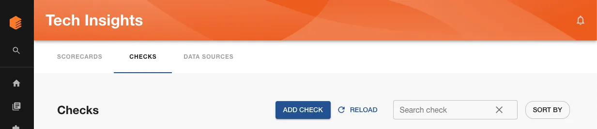
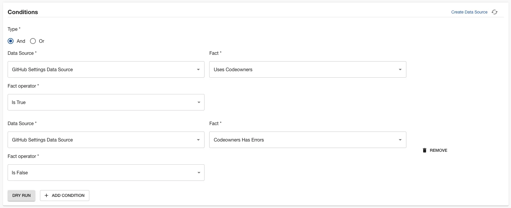

GitHub CODEOWNERS files can be a good way to ensure that code reviews are routed to the correct people. However, not all teams will use CODEOWNERS files in their repositories.

In this tutorial, we’re going to create a Tech Insights check that tracks adoption of CODEOWNERS files amongst Backstage components.

## Prerequisites

1. You must have [intalled the Roadie GitHub App](../../getting-started/adding-a-catalog-item/).

## Create a CODEOWNERS check

1. Visit Tech Insights and click into the Checks tab. Click the ADD CHECK button to create a new check.

   

2. In the About section, name the Check “Production software must have a valid CODEOWNERS file”. Give it the description “A codeowners file will help security route issues to the right people.”

3. In the Conditions section, we’re going to create a compound check which first checks that the Component is using CODEOWNERS, and then checks that the CODEOWNERS file is valid. Click the “ADD CONDITION” button to add a second set of fields in this section. Make sure the boolean logic selector is set to “And”.

   

4. In the first set of condition inputs, use the following values.

   | Input name    | Value                       |
   | ------------- | --------------------------- |
   | Data Source   | GitHub Settings Data Source |
   | Fact          | Uses codeowners             |
   | Fact operator | Is True                     |

5. In the second set of condition inputs, use these values.

   | Input name    | Value                       |
   | ------------- | --------------------------- |
   | Data Source   | GitHub Settings Data Source |
   | Fact          | Codeowners Has Errors       |
   | Fact operator | Is False                    |

   We now have a set of conditions which pass when a Component has a valid CODEOWNERS file, and fail otherwise.

   You can use the “DRY RUN” button to test these conditions against some Components in your catalog, ensure they operate the way you would expect, and return the correct pass or fail result.

   

6. Use the filters to target this check at production Components. You likely don't want to require random experimental repos to have CODEOWNERS files.
7. Save the check by clicking “SAVE”. If you’re not quite ready to go live yet, you can use the “SAVE AS DRAFT” button to save the check but ensure only admins can see it.

## Check results

Once saved, the check will display results showing which components might need to create a new CODEOWNERS file, or fix the existing one.

