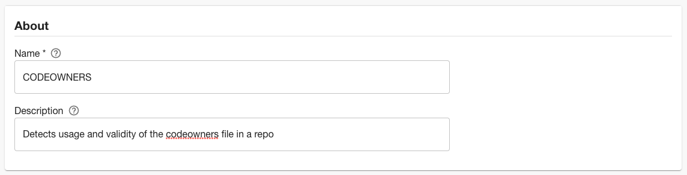
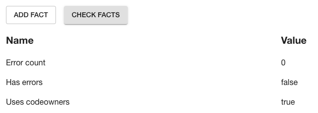
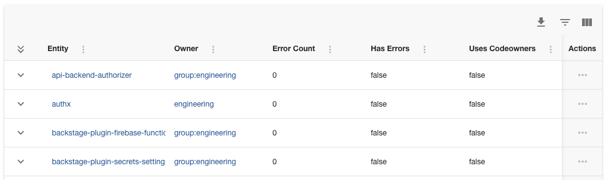
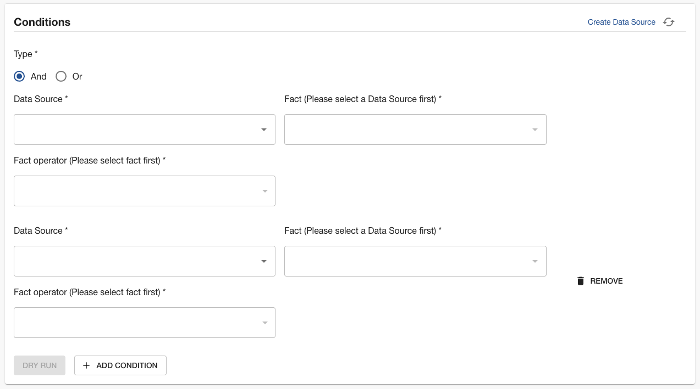
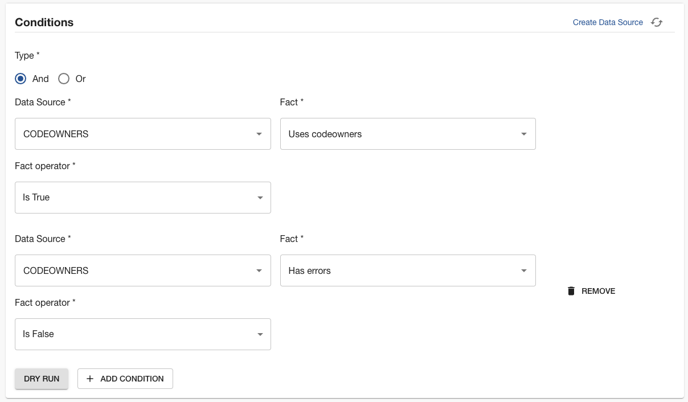
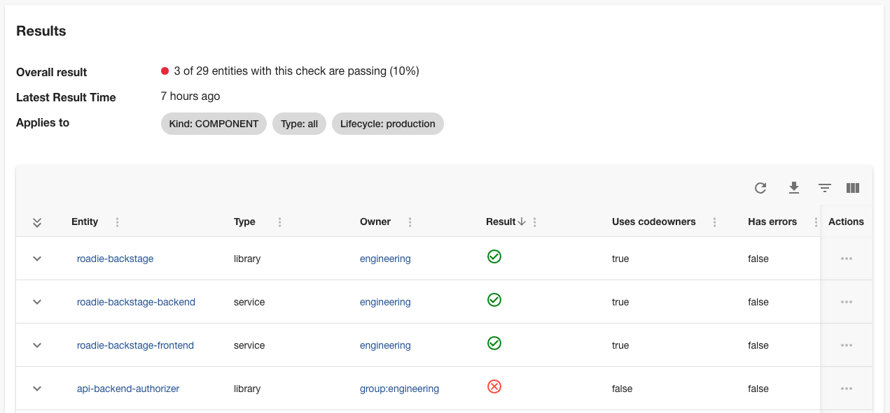

GitHub CODEOWNERS files can be a good way to ensure that code reviews are routed to the correct people. However, not all teams will use CODEOWNERS files in their repositories.

In this tutorial, we’re going to create a Tech Insights check that tracks adoption of CODEOWNERS files amongst Backstage components.

## Prerequisites

1. You must have a Personal Access Token (PAT) for GitHub set in Administration → Settings → Secrets → GITHUB_TOKEN. This PAT must have the “repo” scope enabled.

   We recommend creating the PAT on an account which has admin permissions in GitHub. Tokens associated with regular user accounts will not be able to see the branch protection settings on all repositories. [Learn how to create a PAT in the GitHub docs](https://docs.github.com/en/authentication/keeping-your-account-and-data-secure/managing-your-personal-access-tokens).
    
    
    

## Create a branch protection Data Source


1. Visit Tech Insights and click into the Data Sources tab. Click the ADD DATA SOURCE button to create a new data source.

    

2. Name the Data Source “CODEOWNERS” and give it the description “Detects usage and validity of the codeowners file in a repo.”
    
    
    
3. In the Data Provider section, select the built-in “/github/api” proxy and enter the Path Extension
    
    ```
    repos/{{ metadata.annotations["github.com/project-slug"] }}/codeowners/errors
    ```
    
4. In the input labelled “Select Entity to test data source against”, choose an Entity in the catalog that has the `github.com/project-slug` annotation set, and has a valid CODEOWNERS file the repository the annotation points at. Click the VIEW button and you should see a response from the GitHub API.
    
    
    
5. In the field extraction box, fill out the inputs with the following values.
    
    
    | Fact name | JSONata query | Type |
    | --- | --- | --- |
    | Error count | $count(errors) | Integer |
    | Has errors | $count(errors) != 0 | Boolean |
    | Uses codeowners | $exists(errors) | Boolean |

6. Click the CHECK FACTS button and you should see that the facts are successfully extracted from the test response.
    
    
    
7. In the “Applies to” section, set the following filters:
    
    | Filter name | Value |
    | --- | --- |
    | Type | Component |
    | Has Annotation | github.com/project-slug |

8. Save the Data Source. After a minute or two, you should see results come in.
    
    
    

## Create a CODEOWNERS check

Now that we can gather information about how CODEOWNERS is being used, we can write a check to figure out which components are using it correctly.

1. Visit Tech Insights and click into the Checks tab. Click the ADD CHECK button to create a new check.

    

2. In the About section, name the Check “Production software must have a valid CODEOWNERS file”. Give it the description “A codeowners file will help security route issues to the right people.”

3. In the Conditions section, we’re going to create a compound check which first checks that the Component is using CODEOWNERS, and then checks that the CODEOWNERS file is valid. Click the “ADD CONDITION” button to add a second set of fields in this section. Make sure the boolean logic selector is set to “And”.

    

5. In the first set of condition inputs, use the following values.
    
    
    | Input name | Value |
    | --- | --- |
    | Data Source | CODEOWNERS |
    | Fact | Uses codeowners |
    | Fact operator | Is True |

6. In the second set of condition inputs, use these values.
    
    
    | Input name | Value |
    | --- | --- |
    | Data Source | CODEOWNERS |
    | Fact | Has errors |
    | Fact operator | Is False |
    
    We now have a set of conditions which pass when a Component has a valid CODEOWNERS file, and fail otherwise.
    
    You can use the “DRY RUN” button to test these conditions against some Components in your catalog, ensure they operate the way you would expect, and return the correct pass or fail result.
    
    
    
7. Use the filters to target this check at production Components. You likely don't want to require random experimental repos to have CODEOWNERS files.
8. Save the check by clicking “SAVE”. If you’re not quite ready to go live yet, you can use the “SAVE AS DRAFT” button to save the check but ensure only admins can see it.

## Check results

Once saved, the check will display results showing which components might need to create a new CODEOWNERS file, or fix the existing one.


