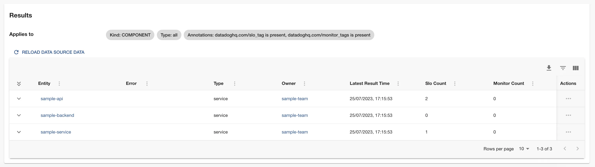
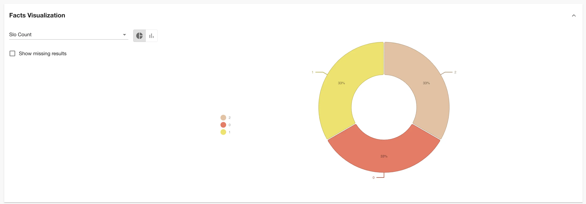
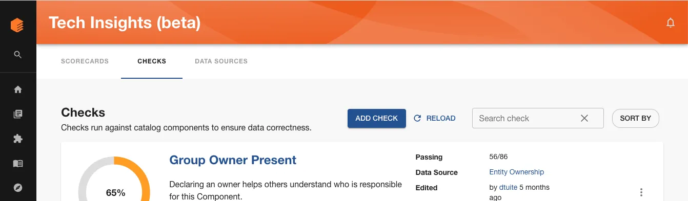
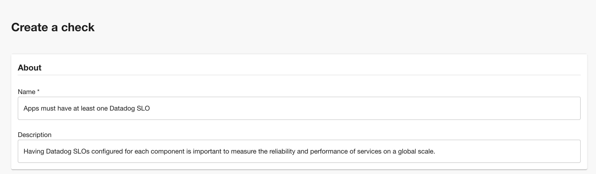
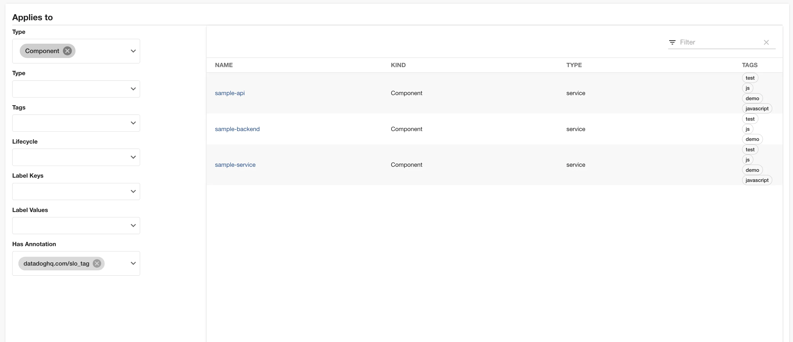
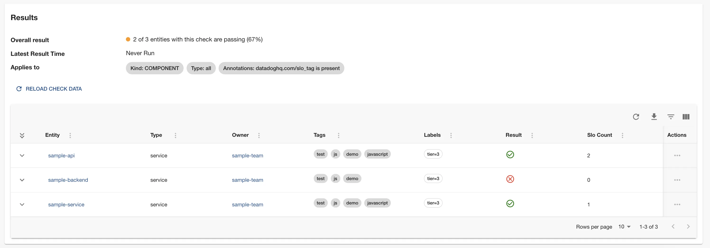

As a platform team, it is important to measure the reliability and performance of services, and Datadog provides powerful tools to monitor and track them. Creating and monitoring Datadog Service Level Objectives (SLOs) is one way to do it. Defining SLOs across multiple components can be an objective as well, and with Tech Insights, your team is now able to manage these.

### **Prerequisites**

Before you begin, make sure you have the following:

- A Datadog account: Sign up for a Datadog account if you don't have one already.
- Access to your system components in Datadog: Ensure you have the necessary permissions to access the components you want to track SLOs from.
- Defined SLOs in at least one of the components in Datadog.
- Annotations configured in your `catalog-info.yaml` file in your repository. These are the annotations used in our Datadog built-in Data Source to track SLOs and Monitors:
  - `datadoghq.com/slo_tag`: The Datadog SLO tag to use for this component. This is the tag that will be used to filter the components that have SLOs defined.
  - `datadoghq.com/monitor_tags`: The Datadog SLO target to use for this component. This are the monitor tags that will be used to filter the components that have Monitors defined in Datadog.

### **What you'll learn**

In this tutorial, we’re going to:

- Set up Datadog integration.
- Automatically scan Components in the Backstage catalog and record how many SLOs are defined for each.
- Visualize the distribution of SLOs defined count.
- Create a check to verify if at least one SLO is defined for each component.

As we go through this process, you’ll learn:

- How to use built-in Data Sources (Datadog) and how to create Checks with Tech Insights.
- How to detect which component has SLO defined with Tech Insights.
- How to use a comparison operator.

Let's get started.

## 1 - Setup Datadog integration

In order to collect the Datadog SLO count from each component, the Datadog integration needs to be set up on Roadie. To do that, follow these steps:

1. Go to _Administration → Settings → Datadog_ and set the hostname of your Datadog app.

2. Go to _Administration → Settings → Secrets_ and set the `Datadog API Token` and `Datadog APP Token` in so your Roadie instance to contact your Datadog app.
   | Key | Token |
   | ------------ | ----------------- |
   | DD_API_TOKEN | Datadog API Token |
   | DD_APP_TOKEN | Datadog APP Token |

## 2 - Record the SLO count for each component

In order to know which software has Datadog SLOs configured, we’re going to use the built-in Datadog Data Source in Roadie Tech Insights. It will run periodically and extract the SLO count fact from each component.

These are the steps to set that up.

1. Visit Tech Insights and click into the Data Sources tab. Search for the Datadog Data Source from the Data Sources list and select it.

   

2. You may need to wait some time for the data source to collect all SLOs and Monitors from Datadog. It must contact the Datadog APIs for each component, which is captured by the already set filter. These counts are then stored as facts for each component.

   

## 3 - Visualize the distribution of SLOs count

Our Data Source details panel comes with a built-in visualization panel that lets us get an overview of the facts (in this case SLOs count) present in each configured and annotated component. When viewing a Data Source, expand the “Facts visualization” section to see it.

This chart tells you:

1. 33% of the Components that this Data Source targets have 1 SLO defined and configured.
2. 33% of the Components that this Data Source targets have 2 SLOs defined and configured.
3. 33% of the Components that this Data Source targets have no SLOs configured.

In the next section, we will create a Check that can compare and verify if each software component has at least one SLO defined in Datadog.

## 4 - Create a check that shows if a software has at least one SLO defined and configured

Now that we can determine how many SLOs are correctly configured in Datadog and that data was extracted using the Datadog Data Source, let’s write a check to verify if each software has at least one SLO defined.

1. Visit Tech Insights and click into the Checks tab. Click the ADD CHECK button to create a new check.

   

2. Give the check a sensible name, like “Apps must have at least one Datadog SLO”, and a description like “Having Datadog SLOs configured for each component is important to measure the reliability and performance of services on a global scale.”

   

3. In the Conditions section, we’re going to create a condition that compares against the Datadog Source facts (in this case SLOs count) retrieved from the data source.
4. In the first set of condition inputs, use the following values.

   | Input name    | Value               |
   | ------------- | ------------------- |
   | Data Source   | Datadog Data Source |
   | Fact          | Slo count           |
   | Fact operator | Greater than        |
   | Value         | 0                   |

   You can use the “DRY RUN” button to test these conditions against some Components in your catalog, ensure they operate the way you would expect, and return the correct pass or fail result.

5. Use the filters to target this check at the same set of components as the Data Sources target.

   

   To filter every software that has Datadog SLO tags configured, you can use the filter "Has annotations: `datadoghq.com/slo_tag`".

6. Save the check by clicking “SAVE”. If you’re not quite ready to go live yet, you can use the “SAVE AS DRAFT” button to save the check but ensure only admins can see it.

### 5 - Check results

The results of this check tell us what software still doesn't have any SLOs configured and whom to reach out to fix it.

- The sample-api and sample-service pass the check; they have at least one SLO configured.
- The sample-backend fails the check as it has no SLO configured.

Since we already know the owners of these components, it’s easy to reach out and ask them to define and configure SLOs.
