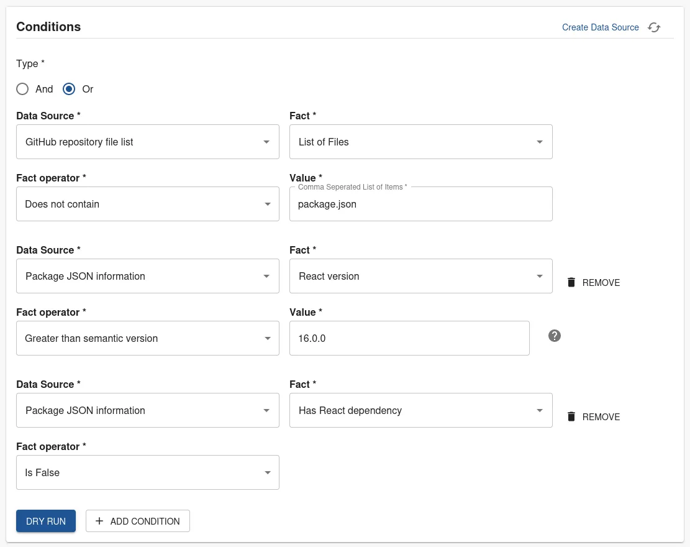
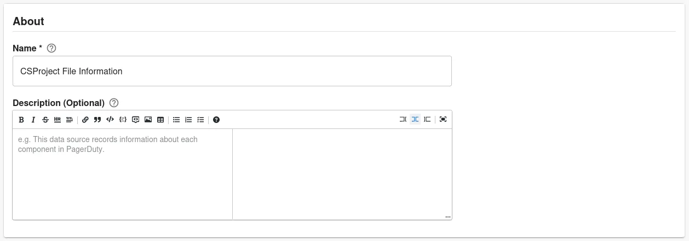
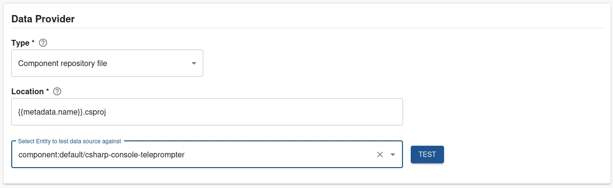
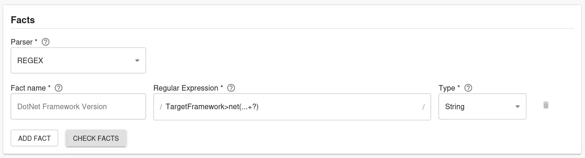

Tracking the dependency version is critical for ensuring your software is secure and compliant. It can be difficult to track which of your software is using a supported version, and which are using an End of Life version.

With Roadie’s Tech Insights feature, there’s an easier way. In this tutorial, we’re going to:

1. Automatically scan Components in the Backstage catalog and record which React version they’re using.
2. Visualise the distribution of React versions being used.
3. Create a check that can tell us which software is not using the supported version.

As we go through this process, you’ll learn:

1. How to create Data Sources, Checks and Scorecards with Tech Insights.
2. How to parse files with JSONata in Roadie and extract facts from those files.
3. How to detect which repositories contain certain files like the package.json with Tech Insights.
4. How to use the “Satisfies semantic version” operator to do comparisons.

Let’s get started.

React Version

## Record the React version automatically

In order to track the React versions used in the catalog, we are going to create a Data Source In Roadie Tech Insights. It will be setup to run on a scheduled basis and extract the React version specified in the package.json file.

### Package.json Data Source

1. Visit Tech Insights, select the **Data Sources** tab, and press **ADD DATA SOURCE**.

   

2. Enter a descriptive **Name** and **Description**.

   

3. Set the Data Provider **Type** to `Component Repository File`, **Location** to `package.json`. Select a value for **Select Entity to test data source against** and press **TEST**.

   

4. Test results are displayed.

   

5. Create multiple Facts:

   1. Set **Parser** to `JSON with JSONata syntax`.
   2. Set the first Fact to:
      | Field Name | Value |
      | --- | --- |
      | Fact Name | React version |
      | JSONata query | $exists(resolutions."@types/react") ? resolutions."@types/react" : $exists(dependencies.react) ? dependencies.react : "" |
      | Type | String |

   3. Press **ADD FACT** and set the second Fact to:
      | Field Name | Value |
      | --- | --- |
      | Fact Name | Has React dependency |
      | JSONata query | $exists(resolutions."@types/react") ? $boolean(resolutions."@types/react") : $exists(dependencies.react) ? $boolean(dependencies.react) : false |
      | Type | Boolean |

   

6. Press **CHECK FACTS**.

   

7. Use the **Applies to** filter to target this data source at some components which you expect to have React versions. We recommend starting with a highly targeted filter for initial experimentation and iteration. You can widen the filter later to capture more results.

   

8. Press **SAVE**.

## Visualise the distribution of React versions being used

Data Source comes with a built-in visualisation panel which lets us get an overview of the React versions being used. When viewing a Data Source, expand the “Facts visualization” section to see it.

This chart tells us:

1. 17% of the Components that this Data Source targets are using version `17.0.59`.
2. 17% are using version `15.4.0`.
3. 67% of Components do not have a React version at all. This is the **Empty Results** section.

In the next section, we will create a Check which can show a pass or fail result to app dev teams to tell them if they need to upgrade their React version.

## Create a check that shows which software is not using a supported React version

We have a data source telling us what React versions are present in our components, but it also includes non-React components in the results. Let's omit the non-React components from the results by creating a check.

### Create a check

The builtin "Repository Files Data Source" gives us all the file paths of a component's repository. We can use this to determine which components are using React. We can also now extract the React version from those files.

Let’s write a check to combine both of these properties.

1. Visit Tech Insights, select the **Checks** tab, and press **ADD CHECK**.

   

2. Enter a descriptive **Name** and **Description**.

   

3. Create a compound check:

   1. Set **Type** to `Or`.
   2. Set the first condition to:
      | Field Name | Value |
      | --- | --- |
      | Data Source | GitHub repository file list |
      | Fact | List of files |
      | Fact operator | Does not contain |
      | Value | package.json |

   3. Press **+ADD CONDITION** and set the second condition to:
      | Field Name | Value |
      | --- | --- |
      | Data Source | Package JSON information |
      | Fact | React version |
      | Fact operator | Greater than semantic version |
      | Value | 16.0.0 |
   4. Press **+ADD CONDITION** and set the third condition to:
      | Field Name | Value |
      | --- | --- |
      | Data Source | Package JSON information |
      | Fact | Has React dependency |
      | Fact operator | Is False |

   

4. Press **DRY RUN**

5. (Optional) Add a URL to documentation outlining the steps to update the React version in the component. You can also add a link to a scaffolder template that automatically achieves this fix.

   

6. Use the **Applies to** filter to target this data source at some components which you expect to have React versions. We recommend starting with a highly targeted filter for initial experimentation and iteration. You can widen the filter later to capture more results.

   

7. Press **SAVE**.

### Check Results

The results of this check tell us who we need to reach out to to ask for a React version upgrade.

- The backstage-demo component passes the check with the version `17.0.59`.
- The react-native-sample-app component fails the check with the version `15.4.0`
- The other components pass the check due to not having a React dependency.

Since we already know the owners of these components, it’s easy to reach out and ask them to upgrade their React version.

.NET Framework Version

## Record the .NET Framework version automatically

In order to track the .NET Framework versions used in the catalog, we are going to create a Data Source In Roadie Tech Insights. It will be setup to run on a scheduled basis and extract the version specified in the CSProj file.

### CSProj Data Source

1. Visit Tech Insights, select the **Data Sources** tab, and press **ADD DATA SOURCE**.

   

2. Enter a descriptive **Name** and **Description**.

   

3. Set the Data Provider **Type** to `Component Repository File`, and **Location** to `{{metadata.name}}.csproj`. Select a value for **Select Entity to test data source against** and press **TEST**.

   

4. Test results are displayed.

   

5. Create multiple Facts:

   1. Set **Parser** to `REGEX`.
   2. Set the first Fact to:
      | Field Name | Value |
      | --- | --- |
      | Fact Name | DotNet Framework version |
      | DotNet Framework Version | TargetFramework>net(...+?) |
      | Type | String |

   

6. Press **CHECK FACTS**.

   

7. Use the **Applies to** filter to target this data source at some components which you expect to have .NET Framework versions. We recommend starting with a highly targeted filter for initial experimentation and iteration. You can widen the filter later to capture more results.

   

8. Press **SAVE**.

## Visualise the distribution of .NET Framework versions being used

Data Source comes with a built-in visualisation panel which lets us get an overview of the .NET Framework versions being used. When viewing a Data Source, expand the "Facts visualization" section to see it.

This chart tells us:

1. 22% of the Components that this Data Source targets are using version `6.0`.
2. 11% are using version `5.0`.
3. 67% of Components do not have a .NET Framework version at all. This is the **Empty Results** section.

In the next section, we will create a Check which can show a pass or fail result to app dev teams to tell them if they need to upgrade their .NET Framework version.

## Create a check that shows which software is not using a supported .NET Framework version

We have a data source telling us what .NET Framework versions are present in our components, but it also includes non-.NET components in the results. Let's omit the non-.NET components from the results by creating a check.

### Create a check

The builtin "Repository Files Data Source" gives us all the file paths of a component's repository. We can use this to determine which components are using .NET. We can also now extract the .NET Framework version from those files.

Let’s write a check to combine both of these properties.

1. Visit Tech Insights, select the **Checks** tab, and press **ADD CHECK**.

   

2. Enter a descriptive **Name** and **Description**.

   

3. Create a check:

   1. Set the first condition to:
      | Field Name | Value |
      | --- | --- |
      | Data Source | CSProject File Information |
      | Fact | DotNet Framework Version |
      | Fact operator | Greater than semantic version |
      | Value | ^6.0 |

   

4. Press **DRY RUN**

5. (Optional) Add a URL to documentation outlining the steps to update the .NET Framework version in the component.

   

6. Use the **Applies to** filter to target this data source at some components which you expect to have .NET Framework versions. We recommend starting with a highly targeted filter for initial experimentation and iteration. You can widen the filter later to capture more results.

   

7. Press **SAVE**.

### Check Results

The results of this check tell us who we need to reach out to ask for a .NET Framework version upgrade.

- The csharp-console-teleprompter component passes the check with the version `6.0`.
- The csharp-console-webapiclient component fails the check with the version `5.0`

Since we already know the owners of these components, it’s easy to reach out and ask them to upgrade their .NET Framework version.

