Tracking deprecated actions and commands is critical for ensuring your software is secure and compliant. It can be difficult to track which of your software is using a supported action, and which are using an deprecated.

With Roadie’s Tech Insights feature, there’s an easier way. In this tutorial, we’re going to:

1. Automatically scan Components in the Backstage catalog and record which components have been identified by GitHub as using a deprecated action or command.
2. Visualise the distribution of deprecated actions or commands.
3. Create a check that can tell us which software is using deprecated actions or commands.

As we go through this process, you’ll learn:

1. How to create Data Sources, Checks and Scorecards with Tech Insights.
2. How to parse files with JSONata in Roadie and extract facts from those GraphQL queries.
3. How to detect which repositories have GitHub deprecation notices with Tech Insights.
4. How to use the “Does not contain RegExp” operator to do comparisons.

Let’s get started.

## Record the deprecation notices automatically

In order to track the deprecation notices from GitHub, we are going to create a Data Source In Roadie Tech Insights. It will be setup to run on a scheduled basis and extract the notices.

### Data Source

1. Visit Tech Insights, select the **Data Sources** tab, and press **ADD DATA SOURCE**.

   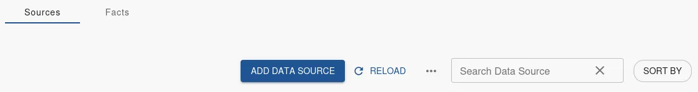

2. Enter a descriptive **Name** and **Description**.

   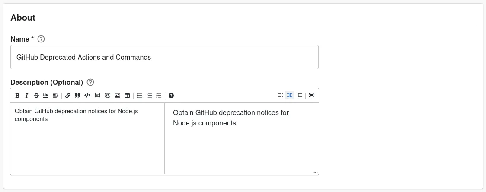

3. Set the Data Provider **Type** to `HTTP`, **Proxy** to `/github/api`, **Path Extension** to `graphql`, **HTTP Method** to POST, and **Body** to the below.

   ```
   {"query": "query ChecksQuery ($owner: String!, $repo: String!) { repository(owner: $owner, name: $repo) { pullRequests(orderBy: {field: UPDATED_AT, direction: DESC}, first: 3) { nodes { number mergeCommit { message checkSuites(first: 10) { nodes { id checkRuns(first: 15, filterBy: {checkType: LATEST}) { nodes { id name annotations(first: 15) { nodes { message } } } } } } } } } } }",
   "operationName": "ChecksQuery",
   "variables": {"owner": "{{ metadata.annotations['github.com/owner'] }}", "repo": "{{ metadata.annotations['github.com/repo'] }}"}
   }
   ```

   Select a value for **Select Entity to test data source against** and press **TEST**.

   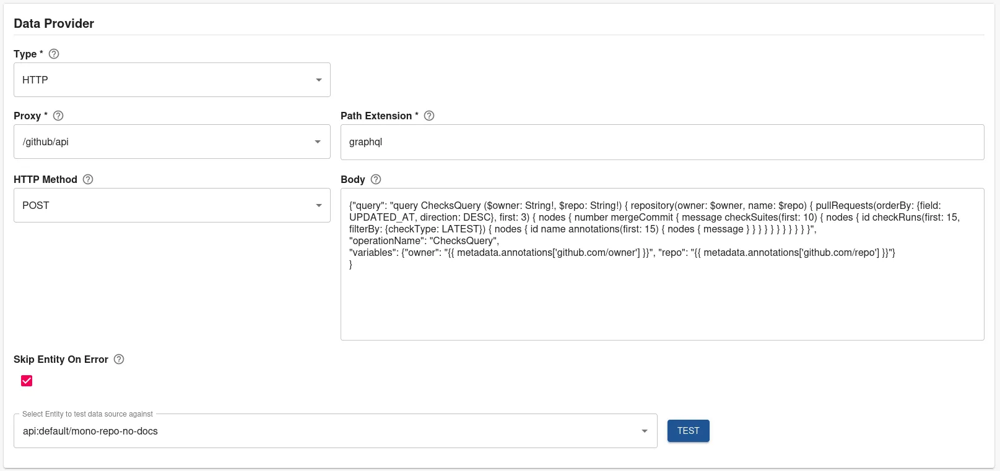

4. Test results are displayed.

   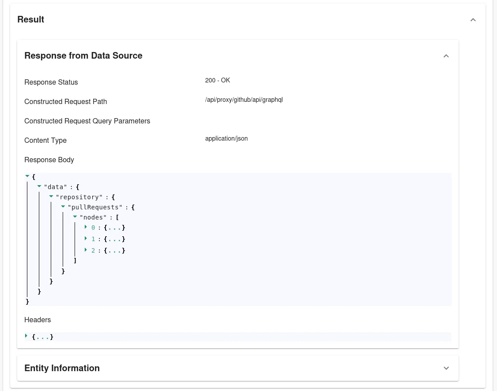

5. Create multiple Facts:

   1. Set **Extractor** to `JSON with JSONata syntax`.
   2. Set the first Fact to:
      | Field Name | Value |
      | --- | --- |
      | Fact Name | Node Deprecated Actions |
      | JSONata query | `$distinct($reduce($map($filter(data.repository.pullRequests.nodes.mergeCommit.checkSuites.nodes.checkRuns.nodes.annotations.nodes.message, function($v, $i, $a) { $contains($v, "Please update the following actions to use Node.js")}), function($v) { $split($split($split($v, ": ", 2)[1], ". For")[0], ", ")}), $append))` |
      | Type | Set |
   3. Set the second Fact to:
      | Field Name | Value |
      | --- | --- |
      | Fact Name | Node Past Deprecated Actions |
      | JSONata query | `$distinct($reduce($map($filter(data.repository.pullRequests.nodes.mergeCommit.checkSuites.nodes.checkRuns.nodes.annotations.nodes.message, function($v, $i, $a) { $contains($v, "deprecated and will be forced to run")}), function($v) { $split($split($split($v, ": ", 2)[1], ". For")[0], ", ")}), $append))` |
      | Type | Set |
   4. Set the third Fact to:
      | Field Name | Value |
      | --- | --- |
      | Fact Name | Deprecated Command |
      | JSONata query | `$distinct($reduce($filter(data.repository.pullRequests.nodes.mergeCommit.checkSuites.nodes.checkRuns.nodes.annotations.nodes.message, function($v) { $contains($v, "command is deprecated")}), $append))` |
      | Type | Set |

   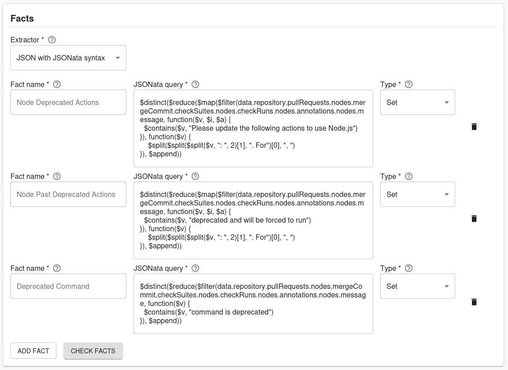

6. Press **CHECK FACTS**.

   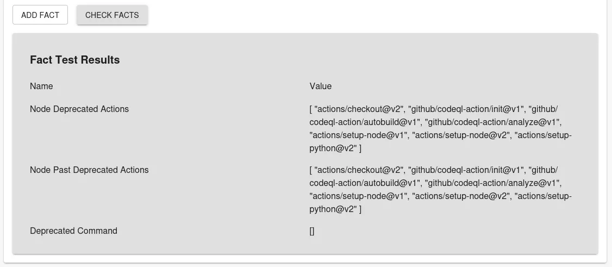

7. Use the **Applies to** filter to target this data source at some components which you expect to have Node.js. We recommend starting with a highly targeted filter for initial experimentation and iteration. You can widen the filter later to capture more results.

   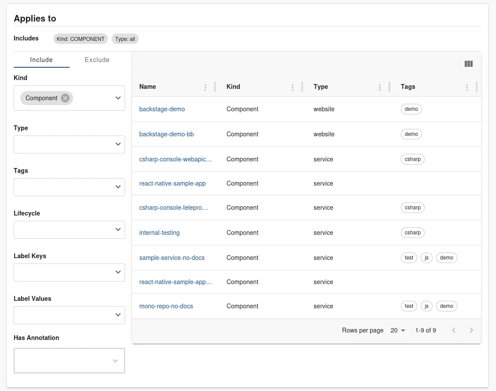

8. Press **SAVE**.

## Create a check that shows which software has a deprecation notice

We have a data source telling us what deprecation actions and commands are present in our components, let's create a check to further report.

### Create a check

1. Visit Tech Insights, select the **Checks** tab, and press **ADD CHECK**.

   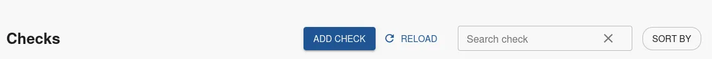

2. Enter a descriptive **Name** and **Description**.

   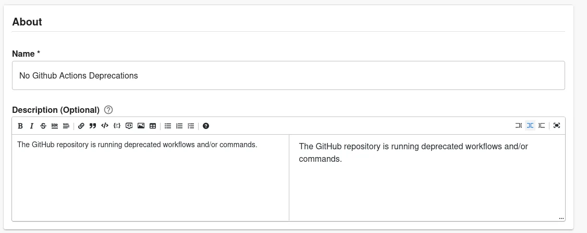

3. Create a check:

   1. Set the first condition to:
      | Field Name | Value |
      | --- | --- |
      | Data Source | GitHub Deprecated Actions and Commands |
      | Fact | Node Deprecated Actions |
      | Fact operator | Does not contain RegExp |
      | Value | .+ |
   1. Set the second condition to:
      | Field Name | Value |
      | --- | --- |
      | Data Source | GitHub Deprecated Actions and Commands |
      | Fact | Node Past Deprecated Actions |
      | Fact operator | Does not contain RegExp |
      | Value | .+ |
   1. Set the third condition to:
      | Field Name | Value |
      | --- | --- |
      | Data Source | GitHub Deprecated Actions and Commands |
      | Fact | Deprecated Command |
      | Fact operator | Does not contain RegExp |
      | Value | command is deprecated |

   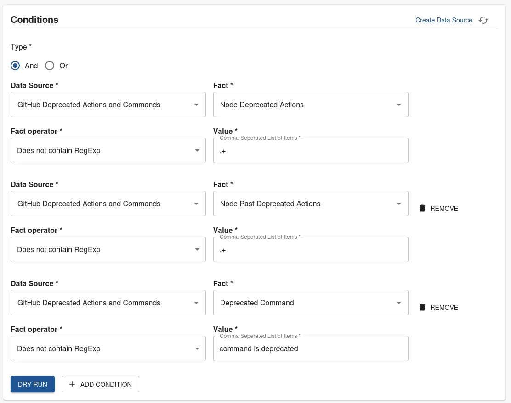

4. Press **DRY RUN**

5. (Optional) Add a URL to documentation outlining the steps to resolve the deprecated action or command in the component.

   

6. Use the **Applies to** filter to target this data source at some components which you expect to have Node.js. We recommend starting with a highly targeted filter for initial experimentation and iteration. You can widen the filter later to capture more results.

   

7. Press **SAVE**.

### Check Results

The results of this check tell us who we need to reach out to resolve the deprecation notice.

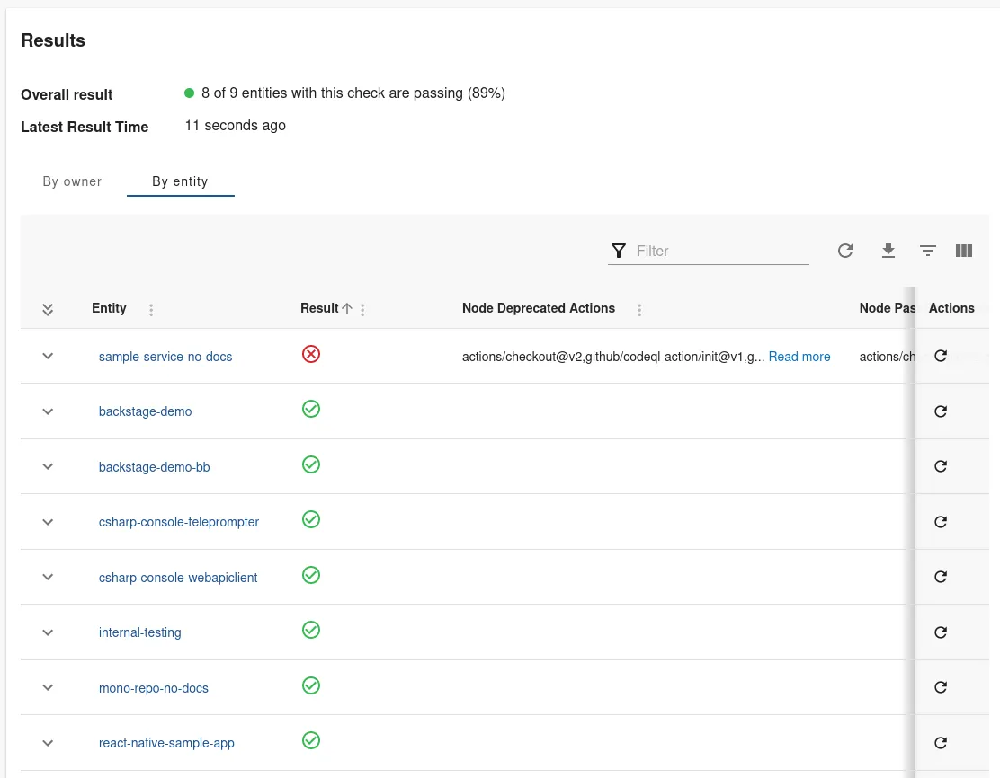

- The sample-service-no-docs fails the check with the **Node deprecated Actions** of `actions/checkout@v2,github/codeql-action/init@v1,github/codeql-action/autobuild@v1,github/codeql-action/analyze@v1,actions/setup-node@v1,actions/setup-node@v2,actions/setup-python@v2`

Since we already know the owners of these components, it’s easy to reach out and ask them to resolve the Node.js deprecated actionsd.
