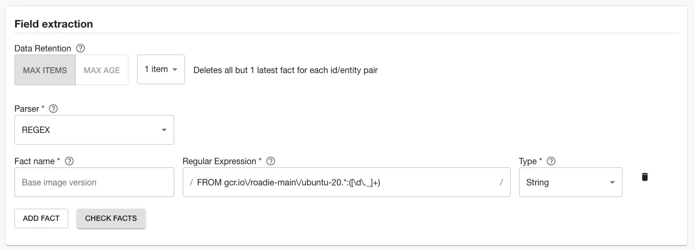
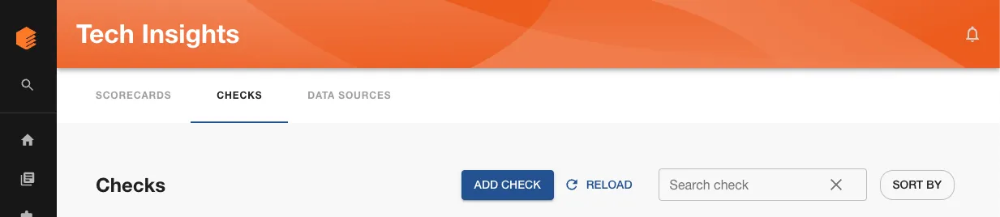

One of the best things a platform team can do for application developers (app devs) is give them a stable and secure foundation to build containers off. Many companies do this by providing a Docker base image for teams to work with.

Application developers specify this base image at top of their `Dockerfile` and know that they can benefit from frequent updates the platform team will roll out. These updated base image versions will likely contain important security and performance fixes for production software, and it’s critical that teams uptake them in a timely manner.

```docker
FROM gcr.io/roadie-main/ubuntu-20:0.9.8 AS production

# Rest of Dockerfile goes here...
```

When a new base image version is released, the platform team must work with the app dev teams to uptake it. In some cases, this may mean working with 50 or more teams to get them to specify the new base image version at the top of their `Dockerfile`.

If you’ve ever tried to run one of these migrations, you’ve probably created a big spreadsheet, opened a bunch of Jira tickets, maybe opened some automated pull requests, and spent hours each week checking in on the status of the migration.

With Roadie’s Tech Insights feature, there’s an easier way. In this tutorial, we’re going to:

1. Automatically scan Components in the Backstage catalog and record which base image version they’re using.
2. Visualise the distribution of Docker base images being used.
3. Create a check that can tell us which software is not using the latest base image.

As we go through this process, you’ll learn:

1. How to create Data Sources, Checks and Scorecards with Tech Insights.
2. How to parse files with Regex in Roadie and extract facts from those files.
3. How to detect which repositories contain certain files like the Dockerfile with Tech Insights.
4. How to use the “Satisfies semantic version” operator to do comparisons.

Let’s get started.

## Record the Docker base image version automatically

In order to know which software has been migrated to the new base image version, we’re going to create a Data Source in Roadie Tech Insights. It will run periodically and extract the base image version from each `Dockerfile`.

These are the steps to set that up.

1. Visit Tech Insights and click into the Data Sources tab. Click the ADD DATA SOURCE button to create a new data source.

   

2. Give the data source a sensible name, like “Dockerfile facts”, and a description like “Captures various facts about Dockerfiles at the root of each repo”.

   

3. In the Data Provider section, choose the type Component repository file, and set the location to “Dockerfile”.
4. In the field labelled “Select entity to test data source against”, choose a Backstage component which you know has the `github.com/project-slug` entity set on it’s `catalog-info.yaml` file, and which you know has a `Dockerfile` at it’s root.
5. Click VIEW. The Dockerfile will be fetched from the repository and displayed. We can use the contents of this Dockerfile to write & test queries which will extract facts from the Dockerfile.

   

6. We’re going to use the REGEX parser to extract the base image version from the Dockerfile.

   

   To do that, add a fact with the name “Base image version”, and a regular expression which captures the image version with a capture group. Save this fact as a string type.

   In the example above, the base image comes from a directory called `roadie-main` in the Google Cloud Artifact Registry (gcr.io). It’s based on ubuntu 20. Any digits and underscores after the colon are the part we want to record.

   ```
   FROM gcr.io\/roadie-main\/ubuntu-20.*:([\d\._]+)
   ```

   This regular expression will successfully match a base image version directive in a Dockerfile.

   ```
   FROM gcr.io/roadie-main/ubuntu-20:0.9.8
   ```

   You will need to tweak the regular expression to successfully capture your base image version. We recommend iterating on your regular expression in a third-party tool like [RegExr](https://regexr.com/).

7. Once you feel like you have the right regular expression, you can test it against the Dockerfile you fetched earlier. Click the CHECK FACTS button.

   

8. Use the “Applies to” filter to target this data source at some components which you expect to have Dockerfiles. We recommend starting with a highly targeted filter for initial experimentation and iteration. You can widen the filter later to capture more results. We’re using a “demo” tag to accomplish this.

   

9. Save the data source by clicking SAVE.
10. You should now have a Data Source called Dockerfile facts. You may need to wait some time for the data source to collect all of the Dockerfile base image versions. It must contact the GitHub APIs for each component which is captured by the filter.

    

    You may see some errors in the results. For example, in the case above, our Applies to settings filtered in a Component which does not have a Dockerfile. This results in a 404 from the GitHub APIs when Tech Insights attempts to fetch the file contents. We will deal with this a little later in the tutorial.

## Visualise the distribution of Docker base images being used

Our Data Source comes with a built-in visualisation panel which lets us get an overview of the Dockerfile base image versions being used. When viewing a Data Source, expand the “Facts visualization” section to see it.


This chart tells us:

1. 40% of the Components that this Data Source targets are using version `0.9.8`.
2. 20% are using version `1.0.0`.
3. 20% of Components do have a Dockerfile, but are not using any base image version. This is the “Empty Result” section.
4. 20% of Components don’t have a Dockerfile at all. This is the “No Result” section.

In the next section, we will create a Check which can show a pass or fail result to app dev teams to tell them if they need to upgrade their base image version.

## Create a check that shows which software is not using the latest base image

There’s not much sense telling teams who don’t use Docker that they need to uptake the latest Docker base image that the platform team has released. To omit non-Docker from the results, we need to first determine which software has a Dockerfile in it’s repository.

### Create a check

The builtin "Repository Files Data Source" gives us all the file paths of a component's repository. We can use this to determine which components are using Dockerfiles. We can also now extract the base image version from those files.

Let’s write a check to combine both of these properties.

1. Visit Tech Insights and click into the Checks tab. Click the ADD CHECK button to create a new check.

   

2. Give the check a sensible name, like “Apps must use latest Docker base image version”, and a description like “Using the latest Docker base image version ensures you have the best performance and security fixes from the platform team.”

   

3. In the Conditions section, we’re going to create a compound check which combines both the List of files in each GitHub repository Data Source and the Dockerfile facts repository. Click the “ADD CONDITION” button to add a second set of fields in this section. Set the boolean logic selector to “OR”.

   

4. In the first set of condition inputs, use the following values.

   | Input name    | Value                        |
   | ------------- | ---------------------------- |
   | Data Source   | Repository Files Data Source |
   | Fact          | List of files                |
   | Fact operator | Does not contain             |
   | Value         | Dockerfile                   |

5. In the second set of condition inputs, use these values.

   | Input name    | Value                      |
   | ------------- | -------------------------- |
   | Data Source   | Dockerfile facts           |
   | Fact          | Base image version         |
   | Fact operator | Satisfies semantic version |
   | Value         | 1.0.0                      |

   We now have a set of conditions which pass when a component is using the latest base image (`1.0.0`), and fail when they are not.

   

   You can use the “DRY RUN” button to test these conditions against some Components in your catalog, ensure they operate the way you would expect, and return the correct pass or fail result.

6. Use the filters to target this check at the same set of components as the Data Sources target.

   

7. Save the check by clicking “SAVE”. If you’re not quite ready to go live yet, you can use the “SAVE AS DRAFT” button to save the check but ensure only admins can see it.

### Check results

The results of this check tell us who we need to reach out to to ask for a base image upgrade.


- The marketing-site website passes the check because it doesn’t have a Dockerfile.
- The sample-service passes because it has a Dockerfile, but it doesn’t match the REGEX we created.
- The sample-service-12 passes because it is on the latest version at `1.0.0`.
- The sample-service-11 and sample-service-13 both fail because they’re using the outdated `0.9.8`.

Since we already know the owners of these components, it’s easy to reach out and ask them to upgrade their Docker base image version.
